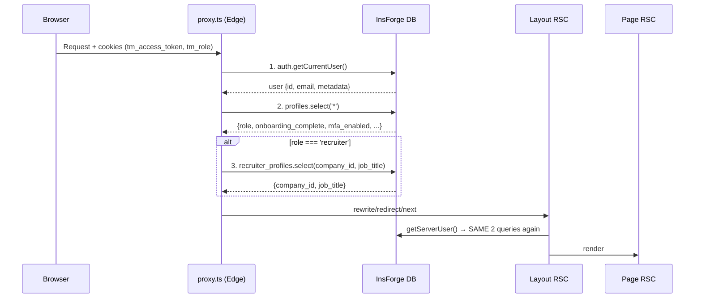

# Proxy.ts Performance Refactoring Plan

## Background

The audit report correctly identifies that [proxy.ts](../../proxy.ts) makes **up to 3 sequential network calls** on every matched request:

1. `insforge.auth.getCurrentUser()` — JWT verification (line 120)
2. `adminDb.database.from('profiles').select('*')` — full profile fetch (lines 136–140)
3. `insforge.database.from('recruiter_profiles').select(...)` — recruiter-specific fetch (lines 159–163)

These run **before** the page route even begins rendering, directly inflating TTFB.

After deep-diving the codebase, here's the complete data-flow picture and a practical refactoring plan.

---

## Current Architecture (Data Flow Map)



> [!WARNING]
> The same `profiles` query runs **twice** per request — once in `proxy.ts` and again in [getServerUser()](../../lib/server-auth.ts#L9-L71) called from layout RSCs like [dashboard/layout.tsx](../../app/dashboard/layout.tsx#L50), [recruiter/layout.tsx](../../app/dashboard/recruiter/layout.tsx#L50), and [candidate/layout.tsx](../../app/dashboard/candidate/layout.tsx#L49).

---

## What the Proxy Actually Needs (Field Analysis)

The proxy uses these DB fields for routing decisions:

| Field | Source | Used For |
|:---|:---|:---|
| `role` | `profiles.role` | Role-based redirect/rewrite routing |
| `completed_onboarding` | `profiles.completed_onboarding` | Onboarding redirect gate |
| `mfa_enabled` | `profiles.mfa_enabled` | MFA verification gate |
| `company_id` | `recruiter_profiles.company_id` | Recruiter rewrite path segment |
| `job_title` | `recruiter_profiles.job_title` | Recruiter onboarding completeness |

> [!NOTE]
> `is_active` (suspended user detection) is deliberately **excluded** from the proxy. Suspension is an **authorization decision**, not a routing decision. It is handled in `getServerUser()` within the layout layer, which validates the JWT and checks the latest profile state from the database.

> [!IMPORTANT]
> The `tm_role` cookie is **already set at login** via [/api/auth/session](../../app/api/auth/session/route.ts#L52-L54) and [admin-auth-login](../../insforge/functions/admin-auth-login/index.ts#L95). The proxy reads it on line 113 but then **overwrites it** with DB data — meaning the cookie is wasted.

---

## Proposed Changes

### Strategy: Enrich cookies at login/refresh → read cookies in proxy → move business logic to layouts

---

### Phase 1 — Enrich Session Cookies at Auth Boundaries

Set additional cookies (`tm_onboarding`, `tm_mfa`, `tm_company`) during login, signup, OAuth exchange, and token refresh. These are the **only** points where DB queries for this data are justified.

#### [MODIFY] [session/route.ts](../../app/api/auth/session/route.ts)

Accept and set additional cookie fields: `onboardingComplete`, `mfaEnabled`, `companyId`.

#### [MODIFY] [refresh/route.ts](../../app/api/auth/refresh/route.ts)

After successful refresh, query the profile **once** (this already happens server-side) and set the enriched cookies alongside the new access token.

#### [MODIFY] [verify/route.ts](../../app/api/auth/verify/route.ts)

Set enriched session cookies after OTP verification.

#### [MODIFY] [oauth/exchange/route.ts](../../app/api/auth/oauth/exchange/route.ts)

Set enriched session cookies after OAuth token exchange.

### Phase 1.5 — Refresh Cookies on Profile State Changes

Since the proxy will rely on enriched cookies for routing, those cookies must be updated not only during login and token refresh, but also whenever profile state changes. This keeps routing metadata reasonably fresh while preserving the layout as the authoritative source for authorization.

Update cookies in response handlers for:
- **Onboarding completion** — set `tm_onboarding=true`
- **MFA enable/disable** — update `tm_mfa`
- **Role changes** — update `tm_role`
- **Company assignment** — update `tm_company`

---

### Phase 2 — Make Proxy Stateless (Cookie-Only)

#### [MODIFY] [proxy.ts](../../proxy.ts)

**Remove all database queries.** Replace with cookie reads:

```typescript
// BEFORE (3 network calls):
const insforge = createServerSessionClient(token);
const res = await insforge.auth.getCurrentUser();
const { data: profile } = await adminDb.database.from('profiles').select('*')...
const { data: recProfile } = await insforge.database.from('recruiter_profiles')...

// AFTER (0 network calls):
const role = request.cookies.get('tm_role')?.value;
const completedOnboarding = request.cookies.get('tm_onboarding')?.value === 'true';
const mfaEnabled = request.cookies.get('tm_mfa')?.value === 'true';
const companyId = request.cookies.get('tm_company')?.value;
const isAuthenticated = !!request.cookies.get('tm_access_token')?.value;
```

JWT validation is **deferred** to the layout/page layer (which already does it via `getServerUser()`). The proxy uses server-issued cookies as routing metadata — the layouts enforce actual authorization.

> [!NOTE]
> This is secure because:
> - All `tm_*` cookies are server-issued `HttpOnly` cookies. They are treated only as routing metadata and never as an authorization source.
> - The authoritative user state is always determined by validating the JWT and loading the latest profile in `getServerUser()`.
> - The proxy only handles **routing** (which path to render), not **authorization** (whether the user is allowed).

---

### Phase 3 — Move Business Logic to Layout Guards

#### [MODIFY] [dashboard/layout.tsx](../../app/dashboard/layout.tsx)

Add onboarding redirect logic here (currently duplicated in proxy):
- If `!completedOnboarding` → redirect to `/onboarding/{role}`
- If `mfaEnabled && !mfaVerified` → redirect to `/auth/mfa-verify`
- If `!is_active` → force logout and redirect to `/auth/login` (suspension enforcement moved here from proxy)

#### [MODIFY] [recruiter/layout.tsx](../../app/dashboard/recruiter/layout.tsx)

Already has role guard + approval check. Add onboarding guard.

#### [MODIFY] [candidate/layout.tsx](../../app/dashboard/candidate/layout.tsx)

Add role guard + onboarding guard (currently missing — proxy handles it).

---

## Resolved Design Decisions

> [!NOTE]
> **Q1: Stale cookie risk — eventual consistency is acceptable.**
> The enriched `tm_*` cookies are used as **routing hints only**, not as the source of truth for authorization. All security-critical validation (JWT verification, role validation, account status, MFA enforcement, authorization) continues to happen in `getServerUser()` within protected layouts/pages. Cookies are refreshed on login, token refresh, onboarding completion, MFA changes, and role changes to minimize stale routing information.

> [!NOTE]
> **Q2: Standardize on `completed_onboarding`.**
> The canonical database column is `profiles.completed_onboarding`. The other names (`onboarding_complete`, `onboarding_completed`, `is_onboarded`) are legacy compatibility aliases in TypeScript types and middleware. We will standardize the application on `completed_onboarding` and gradually remove compatibility fallbacks. No database migration required.

> [!NOTE]
> **Q3: Coming-soon rewrite is intentional.**
> The rewrite is currently intentional while the recruiter portal is under development. It should eventually be replaced with a feature flag rather than a hardcoded proxy rewrite, so it can be enabled/disabled without modifying routing logic. For this refactoring, we preserve it as-is.

> [!NOTE]
> **Q4: JWT validation stays in layouts, not the proxy.**
> The proxy will **not** perform any JWT signature or expiry validation. It remains fully stateless (cookie-parse only) for maximum Edge performance. Users with expired tokens will hit the layout before being redirected — this is an accepted tradeoff. All JWT validation and authorization is performed by `getServerUser()` in the layout layer.

---

## Performance Impact Estimate

| Metric | Current | After Refactoring |
|:---|:---|:---|
| Proxy DB queries per request | 2–3 | **0** |
| Proxy network latency | ~150–300ms | **~0ms** (cookie parse only) |
| Duplicate profile queries | 2× (proxy + layout) | **1×** (layout only, RSC-cached) |
| Expected TTFB improvement | — | **Up to ~200–400ms** on routes that currently execute all proxy database queries. Actual improvement depends on network latency and database response times. |

---

## Verification Plan

### Automated Tests
- `npx playwright test` — run existing E2E suite to verify auth flows, redirects, and dashboard access
- Specifically verify: login → dashboard redirect, onboarding gate, MFA gate, admin guard, role-based routing

### Manual Verification
- Test all auth entry points: email login, OAuth, OTP verify, token refresh
- Verify cookies are correctly set with `tm_role`, `tm_onboarding`, `tm_mfa`, `tm_company`
- Verify proxy no longer queries DB (add console.time logging temporarily)
- Test subdomain routing (jobs.*, app.*, admin.*) if applicable
- Test edge cases: suspended user, incomplete onboarding, MFA-enabled admin

### Auth Edge Cases
- Expired JWT (access token past TTL) — verify layout redirects to login
- Missing cookies (cleared browser, incognito) — verify proxy falls through gracefully
- Invalid/tampered cookies (manually altered values) — verify layout rejects and redirects
- Revoked account (admin-suspended mid-session) — verify layout enforces logout on next request
