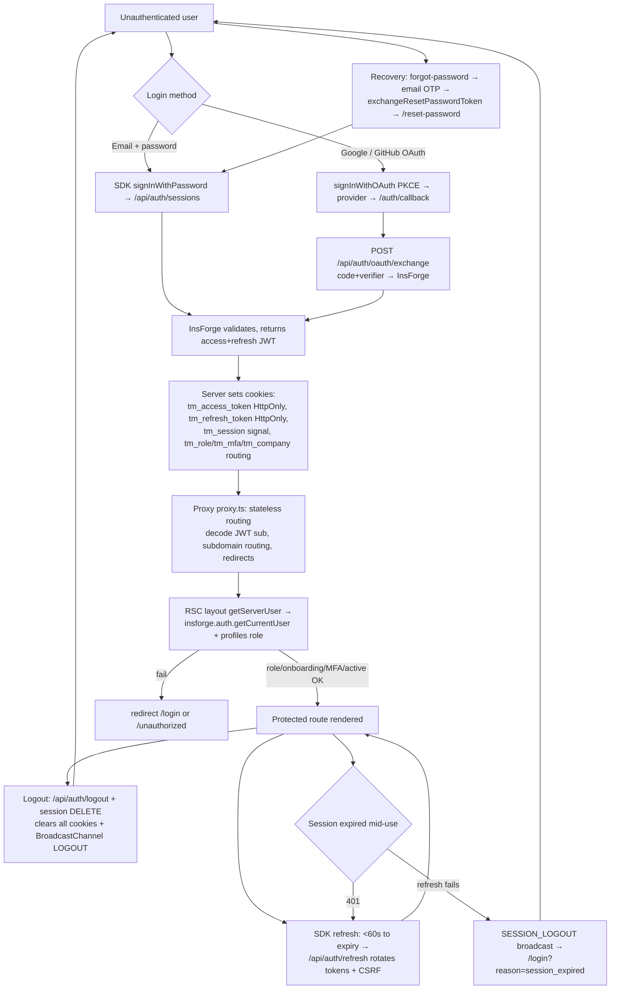

# TalentMesh — Authentication Architecture Audit

**Audit type:** Production-readiness security audit of authentication, authorization, session, OAuth, cookies, middleware, multi-tenant isolation, and InsForge integration.
**Target:** `Talentmesh-demo` — Next.js 16 (App Router, "Proxy") + InsForge BaaS (Postgres + RLS + Deno edge functions).
**Date:** 2026-07-16
**Methodology:** Every finding validated against the actual implementation (files read directly). Backend/RLS claims validated against the **live InsForge database** via read-only SQL (`pg_class`, `pg_policy`, `pg_proc`, `information_schema`, trigger bodies). Documentation in `/docs` compared against code and the live DB; mismatches reported. Confidence is stated per finding. Nothing is asserted that could not be proven from the implementation — unprovable items are labeled.

> **Scope note:** `docs/toaudit/thingsToAudit.md` (§1–§14) defines scope. This report follows its mandated output format. Each finding carries **Severity · Evidence · Code Location · Explanation · Recommended Fix · Confidence.**

---

## Executive Summary

TalentMesh implements a deliberate, modern auth model: a **stateless proxy/middleware** (`proxy.ts`) that treats cookies as *routing metadata only*, with **authoritative authorization pushed into React Server Component layouts** (`getServerUser()`) and **Postgres RLS**. Many controls are genuinely well-built — server-side token validation, RLS tenant isolation keyed on `auth.uid()`, CSRF/rate-limit/payload guards on the SDK proxy, a strong HTTP security-header set, audit-logged read-only impersonation, and refresh-token rotation.

However, the audit found **four Critical issues that make the platform unsafe to deploy as-is**, the most severe being a **live, single-request privilege escalation to super-admin available to any authenticated user** (verified directly against the production database), and an **unguarded hard-coded admin backdoor token** in the server auth resolver that backs the admin layout.

Encouragingly, the blockers described in the older `docs/live_backend_security_audit.md` (RLS disabled on `profiles`/`admin_users`, anon-executable `exec_sql`) have since been **remediated** — confirmed live. That doc is now stale.

**Verdict: NOT production-ready. Do not deploy until the four Critical findings are fixed.** Estimated remediation for the blockers is small (RLS `WITH CHECK` + column `REVOKE`, delete/gate two code paths, add in-handler authz). See the Deployment Checklist.

### Severity summary

| Severity | Count | Headline items |
|---|---|---|
| 🔴 Critical | 4 | Live privilege escalation via `profiles` self-update; ungated mock-admin backdoor; unauthenticated admin API; `jobs` service-key RLS bypass |
| 🟠 High | 4 | Raw jobs read via service key; MFA bypass; weak OAuth CSRF; access token exposed to JS |
| 🟡 Medium | 5 | `@talentmesh.com` auto-promotion; client-supplied tenant IDs; SameSite=None+partial CSRF; in-memory rate limiting; migration drift |
| 🔵 Low | 3 | Duplicate session fetches (perf); divergent auth resolvers; CSRF origin-absent bypass |

---

## Architecture Overview

**Layers (request path):**

1. **Client SDK** (`lib/insforge.ts`, `lib/auth/AuthContext.tsx`) — `@insforge/sdk`, anon key. All backend calls tunnel through the Next.js proxy `app/api/v1/remote/[...path]/route.ts`, which injects InsForge keys and upgrades the anon key to the user JWT from the `tm_access_token` cookie.
2. **Proxy / middleware** (`proxy.ts`) — Next.js 16 "Proxy" (renamed middleware; no `middleware.ts`). **Stateless**: reads cookies as routing metadata, base64-decodes the JWT for `sub` (no signature check), performs subdomain routing (`jobs.`/`app.`/`admin.`) and redirects. Explicitly delegates authorization to layouts (`proxy.ts:58-64`).
3. **Server auth resolver** (`lib/server-auth.ts` `getServerUser()`) — the real security boundary. Calls `insforge.auth.getCurrentUser()` (authoritative token validation) and loads the DB profile for the role.
4. **RSC layouts** (`app/dashboard/**/layout.tsx`) — call `getServerUser()`, enforce role/onboarding/MFA/suspension, redirect on failure.
5. **InsForge backend** — Postgres with RLS, Deno edge functions (`insforge/functions/*`). Tenant = "company" (`company_id`).

**Design assessment:** The "proxy-routes / layout-authorizes / RLS-enforces" split is a sound, defensible pattern for the App Router (see §Architecture Review). Its safety depends entirely on two invariants: (a) every protected surface re-validates via `getServerUser()` or RLS, never trusting the routing cookies; and (b) RLS correctly constrains what an authenticated principal can write. **Both invariants are currently violated** — see Critical #1 (RLS write scope) and Critical #2/#3 (surfaces trusting the proxy/backdoor).

---

## Authentication Flow

**Confidence:** High — every node traced to source (`app/(auth)/login/page.tsx`, `app/auth/callback/page.tsx`, `app/api/auth/*`, `proxy.ts`, `app/dashboard/**/layout.tsx`, `lib/auth/AuthContext.tsx`).

---

## Session Lifecycle

| Aspect | Implementation | Assessment |
|---|---|---|
| Creation | `/api/auth/sessions` POST (login) and `/api/auth/oauth/exchange` set `tm_access_token` (HttpOnly), `tm_refresh_token` (HttpOnly, 30d), `tm_session` (signal). | OK |
| Refresh + rotation | `/api/auth/refresh` proxies to InsForge, **rotates** access+refresh tokens, sets new cookies, sends `X-CSRF-Token`. Client refreshes when <60s remain (`lib/insforge.ts`), dedup lock prevents races. | Good |
| Idle timeout | Role-based, client-enforced: admin ~2h, recruiter ~4h, candidate ~7d, via `localStorage['tm_last_active_time']` + cross-tab countdown (`AuthContext.tsx:680-808`). | Client-side only — see note |
| Absolute timeout | Not enforced server-side. Access-token cookie Max-Age is **7 days** in `/api/auth/session` (line 30) while JWT `exp` is ~1h. | Gap — long cookie envelope |
| Invalidation / logout | `/api/auth/logout` + session `DELETE` clear all cookies; `BroadcastChannel` LOGOUT signs out other tabs; InsForge backend logout called best-effort. | Good |
| Multi-device / concurrent | Session records tracked in `user_sessions` via `auth-session` edge function; password change fires `trg_handle_password_change_invalidation` (verified trigger exists). | Reasonable |
| Session fixation | Tokens are issued by InsForge post-authentication (not client-fixable); rotation on refresh. | Low risk (Medium confidence — backend issuance not directly inspected) |
| Remember-me | No explicit toggle; 30-day refresh cookie is the de-facto persistence. | Documented gap |

**Note (idle timeout):** Idle/absolute timeout is enforced in client JS only. Since access tokens expire server-side (~1h) and refresh is gated by the backend, this is acceptable for UX but **must not be treated as a security control** — an attacker holding a stolen token ignores the client timer until token expiry.

---

## OAuth Lifecycle (Google & LinkedIn)

**Initiation** (`app/(auth)/login/page.tsx:571-607`): `directInsforge.auth.signInWithOAuth({ provider, redirectTo, skipBrowserRedirect:true })`. **PKCE** code verifier is generated by the SDK and stored in `sessionStorage['insforge_pkce_verifier']`. A `state` value is generated with `Math.random()` and stored in `sessionStorage`.

**Callback** (`app/auth/callback/page.tsx`): validates `state` (soft — see High #3), then POSTs `{code, code_verifier}` to `/api/auth/oauth/exchange`, which forwards to InsForge server-side and sets HttpOnly cookies. Single-use code is **not retried** (correct — avoids "code already consumed").

**Provider status:**
- **Google** — active/configured.
- **LinkedIn** — **not configured** in the backend per `docs/auth.md §3`; the login page still renders a LinkedIn button. Clicking it will error. (Medium confidence the backend lacks it — asserted by docs, not independently probed against the provider config.)

| OAuth control | Status |
|---|---|
| PKCE | ✅ present |
| `state` (CSRF) | ⚠ weak — `Math.random()`, `sessionStorage`, soft-fail (High #3) |
| `nonce` (OIDC replay) | Not present in app code (delegated to InsForge; unverifiable here — **stated, not assumed**) |
| redirect_uri validation | Delegated to InsForge/provider allow-list; `redirectTo` built from `window.location.origin` client-side. Not enforced in app code. |
| Callback code exchange | ✅ server-side, single-use, no retry |
| Privilege-escalation guard | ✅ new OAuth accounts forced to `candidate` (`callback:272-275`) |
| Provider token verification | Delegated to InsForge (no app-code verification) |
| Account linking / duplicate accounts / provider switching | **Could not be proven from app code** — handled inside InsForge. Confidence: Low. Flagged for backend review. |
| Open redirect | `redirectTo` is same-origin-derived; no obvious open-redirect in app code (Medium confidence). |

---

## Cookie Analysis

Cookie flags verified across `app/api/auth/{session,sessions,refresh,oauth/exchange,logout}/route.ts` and `lib/cookies.ts`.

| Cookie | HttpOnly | Secure (prod) | SameSite | Domain | Purpose | Notes |
|---|---|---|---|---|---|---|
| `tm_access_token` | ✅ | ✅ | `None` (session route) / `Lax` (sessions/refresh) | parent domain (`.example.com`) | Access JWT | **SameSite inconsistent across routes.** Also duplicated into non-HttpOnly `document.cookie` client-side (High #4). 7-day Max-Age in session route. |
| `tm_refresh_token` | ✅ | ✅ | `Lax` | parent | Refresh JWT (30d) | Also set at `path=/api/auth` to limit exposure. |
| `insforge_refresh_token` | ✅ | ✅ | `Lax` | parent | Backend refresh | Managed at `/api/auth` path. |
| `insforge_csrf_token` | ❌ (by design) | ✅ | `Lax` | parent | CSRF token for refresh | Must be JS-readable. |
| `tm_session` | ❌ (by design) | ✅ | matches auth | parent | Cross-subdomain "logged-in" signal | No sensitive data. |
| `tm_role`, `tm_admin_access`, `tm_onboarding`, `tm_mfa`, `tm_company` | ✅ | ✅ | matches | parent | **Routing metadata** | HttpOnly but **values are set from the client request body** (`/api/auth/session` POST) — see Critical #3. |
| `mfa_verified` | (set by edge fn) | — | — | — | MFA gate | HMAC-signed; validated in proxy but only *presence*-checked in layout (High #2). |
| impersonation cookies | ✅ | ✅ | **`Strict`** | — | Admin impersonation | Strongest config in the codebase — good. |

**Cross-subdomain:** `getRawCookieDomain()` (`lib/cookies.ts`) sets cookies on the registrable parent domain so they are shared across `jobs.`/`app.`/`admin.` subdomains, with correct handling for public suffixes (`.vercel.app`, etc.) and `co.uk`-style SLDs. This is deliberate and correct for the multi-portal model.

**Local vs prod:** Dev strips `Secure`/downgrades `SameSite=None`→`Lax` so cookies store over HTTP localhost. Reasonable.

**Leakage vectors:** (1) access token duplicated into non-HttpOnly `document.cookie` (High #4); (2) token passed in URL `?token=` on subdomain handoff, scrubbed via `history.replaceState` but exposed to referrer/history/logs momentarily; (3) `console.error` in `/api/auth/refresh` logs CSRF token value on error (`refresh/route.ts:82-88`) — sensitive-logging concern (Low).

---

## Authorization Review

**RBAC roles:** `candidate | recruiter | admin | super_admin`. `lib/permissions.ts` holds a client-side matrix — **advisory UI only**, not a server control.

**Enforcement points:**
- **Layouts (server, authoritative):** `app/dashboard/layout.tsx`, `.../admin/layout.tsx`, `app/portals/admin/dashboard/layout.tsx` call `getServerUser()` and enforce role/onboarding/MFA/`is_active`. ✅
- **Edge functions (server):** `admin-*` functions re-verify JWT via `getCurrentUser()` then re-check `profiles.role` with the service-key client. ✅ Good pattern.
- **API routes:** `lib/api/handler.ts` `withApi({ allowedRoles })` centralizes authn/authz — but it is **only used by some routes**, and the one `/api/admin` route does not use it (Critical #3).
- **RLS:** self-scoped `id = auth.uid()` policies; recruiter→candidate access via job-ownership join keyed on `auth.uid()` (migration 028) — tenant derived from session, not client. ✅
- **Proxy:** role checks exist but are **cookie-trust only** and must not be relied on (they aren't, by design — except the `/api/admin` 403, which is wrongly relied upon by Critical #3).

**Privilege escalation:** See Critical #1 (RLS self-update) and Medium #9 (`@talentmesh.com`). **Impersonation:** admin-gated, `SameSite=Strict` + HttpOnly, audit-logged, mutations blocked while impersonating (`app/api/impersonate/route.ts`, `lib/insforge.ts:205-218`). ✅

---

## Middleware Review (`proxy.ts`)

| Check | Finding |
|---|---|
| Authentication | `isAuthenticated = !!token` — presence only, no verification (by design; layouts verify). |
| Authorization | Cookie-derived (`tm_role`, `tm_admin_access`); **not** authoritative. The `/api/admin` 403 (line 529) is the one place this is wrongly load-bearing (Critical #3). |
| JWT | base64 decode of `sub` only (lines 99-112) — no signature check (by design). |
| MFA | HMAC-SHA256 signature validated with `crypto.timingSafeEqual` + 24h window (lines 9-38) — the one cryptographically sound check in the proxy. But bypassable because the layout doesn't re-validate the signature (High #2), and the proxy MFA gate keys off client-settable `tm_mfa`. |
| Redirect loops | Guarded by `x-redirect-depth` counter with a 403 escape hatch at depth>3 (layouts). Reasonable. |
| Matcher | `['/((?!_next/static|_next/image|favicon.ico|...images).*)']` — runs on all routes incl. `/api/*`. Broad but intentional. |
| Header forwarding | Sets `x-pathname`, `x-access-token`. OK. |
| Route bypasses | Localhost skips cross-subdomain redirects; RSC requests (`_rsc`) skip some redirects — intentional, no auth bypass found (auth is in layouts). |
| Edge-runtime / performance | Uses `crypto` (Node) — runs in Node runtime; no DB calls in proxy (good for latency). |

---

## InsForge Review

**Live-DB verified (read-only SQL, 2026-07-16):**

| Check | Result |
|---|---|
| RLS on `profiles` | ✅ **enabled** (was reported disabled in stale doc) |
| RLS on `admin_users` | ✅ **enabled + forced** |
| RLS on `ai_suggestion_cache` | ✅ **enabled + forced** |
| RLS on `applications`, `jobs`, `candidate_profiles`, `recruiter_profiles`, `company_profiles`, `user_sessions` | ✅ enabled |
| `exec_sql(text)` / `query_json(text)` anon/authenticated EXECUTE | ✅ **revoked** (both `false`) |
| `profiles` anon table grants | ⚠ anon still holds SELECT/INSERT/UPDATE/DELETE grants, but **RLS blocks anon** (no policy matches `auth.uid() IS NULL`). Defense-in-depth: revoke anyway. |
| `profiles` authenticated column UPDATE on `role`,`is_active`,`mfa_enabled` | 🔴 **granted** — root of Critical #1 |
| `profiles.status` | plain `text default 'pending'` — **not** a generated column (contradicts `auth.md §11`) |

**JWT verification:** authoritative validation is via `insforge.auth.getCurrentUser()` server-side (`lib/server-auth.ts:45`, `lib/auth/server-auth.ts:140`). The proxy and various routes only base64-decode — acceptable given the authoritative layer, **except** where a surface trusts the decode/cookie without calling `getCurrentUser()` (Critical #2/#3).

**Service-role usage:** `INSFORGE_SERVICE_KEY` is server-only (not `NEXT_PUBLIC_`), guarded against client import by `lib/insforge-admin.ts`. ✅ But the SDK proxy injects `x-insforge-service-key` on **every** request (`app/api/v1/remote/[...path]/route.ts:93-95`), and two paths misuse it to bypass RLS (Critical #4, High #5).

---

## Next.js Best Practices

| Practice | Assessment |
|---|---|
| Auth checks in layouts | ✅ Present and authoritative (`getServerUser()` in RSC layouts). |
| Auth checks in pages | Candidate/recruiter route gating is partly **client-side** (`useAuth` in `useEffect`) — acceptable only because RLS/edge functions enforce data access, not the layout. |
| Server vs Client components | Clear split; `server-only` import guards `lib/server-auth.ts`. ✅ |
| Route handlers | Used for the auth/proxy layer. `withApi` wrapper is good but inconsistently applied (Critical #3). |
| Server Actions | Not the primary mutation path (SDK-through-proxy is). No Server-Action-specific auth gaps found. |
| Caching / request memoization | ❌ **`getServerUser()` is not wrapped in React `cache()`** and is called by nested layouts → duplicate per-request session fetches (Low/Perf #14). |
| Dynamic rendering | Auth pages are dynamic (cookies) — correct. |
| Edge-runtime compat | Proxy uses Node `crypto`; runs in Node runtime. Fine. |

---

## Security Findings

### 🔴 Critical

#### C-1. Live privilege escalation to super-admin via `profiles` self-update
- **Severity:** Critical
- **Evidence (live SQL):** `profiles` policy `profiles_self` = `ALL`, `USING/ WITH CHECK (id = (SELECT auth.uid()))`, **no column restriction**. `information_schema.column_privileges` shows role `authenticated` has `UPDATE` on `profiles.role`, `is_active`, `mfa_enabled`, `completed_onboarding`. Trigger `trg_sync_admin_users` → `sync_admin_users()` (`SECURITY DEFINER`) body: `IF NEW.role IN ('admin','super_admin') AND NEW.is_active THEN INSERT INTO admin_users(user_id) VALUES(NEW.id) ON CONFLICT DO NOTHING`.
- **Code Location:** DB objects (policy `profiles_self`, trigger `sync_admin_users`); reachable via `app/api/v1/remote/[...path]/route.ts` → `PATCH /api/database/records/profiles`.
- **Explanation:** Any authenticated user (e.g. a candidate) can `PATCH` **their own** profile row setting `role = 'super_admin'`. RLS permits it (own row, no column guard); the column grant permits writing `role`; the `SECURITY DEFINER` trigger then auto-enrolls them in `admin_users`, which `authz.is_admin()` trusts across all RLS. `getServerUser()` subsequently reads `role = super_admin` from the profile. **Result: full platform takeover from any account, in a single request.**
- **Recommended Fix:** (a) `REVOKE UPDATE (role, is_active) ON public.profiles FROM authenticated, anon;` and route role/status changes through a service-key edge function with proper authz; **or** (b) split policies so the self-`UPDATE` policy has `WITH CHECK (id = auth.uid() AND role = (SELECT role FROM profiles WHERE id = auth.uid()) AND is_active = ...)` pinning privileged columns; **and** (c) add a `BEFORE UPDATE` trigger that raises if `role`/`is_active` changes without an admin/service context. Verify `admin_users` cannot be written by non-service roles.
- **Confidence:** High (policy, grant, and trigger body all read directly from the live DB).

#### C-2. Ungated hard-coded mock-admin backdoor in the production auth resolver
- **Severity:** Critical
- **Evidence:** `lib/server-auth.ts:16-36` returns a Super-Admin `User` for `token === 'mock-admin-token'` (and a candidate for `'fake-token'`) with **no environment guard**. This resolver is imported by the admin layout (`app/dashboard/admin/layout.tsx:3`, `app/dashboard/layout.tsx:3`) and by `lib/api/handler.ts:3` (`withApi`). Additionally `app/api/auth/refresh/route.ts:19-33` mints `mock-admin-token`/`fake-token` sessions with no env gate and sets the resulting cookies **without HttpOnly/Secure**.
- **Code Location:** `lib/server-auth.ts:16-36`; `app/api/auth/refresh/route.ts:19-33`.
- **Explanation:** Setting `Cookie: tm_access_token=mock-admin-token` yields a full admin session in **any** environment, including production. The sibling implementation `lib/auth/server-auth.ts:93` gates the identical feature correctly (`NODE_ENV !== 'production' && ENABLE_MOCK_AUTH === 'true'`) — proving the safe pattern exists but is not used by the load-bearing resolver.
- **Recommended Fix:** Delete the mock branches from `lib/server-auth.ts` and `app/api/auth/refresh/route.ts`, or gate both behind `process.env.NODE_ENV !== 'production' && process.env.ENABLE_MOCK_AUTH === 'true'`. Consolidate onto one resolver (see Low #15).
- **Confidence:** High.

#### C-3. Unauthenticated admin API — relies on forgeable proxy cookie
- **Severity:** Critical
- **Evidence:** `app/api/admin/send-proposal/route.ts` performs **no** `getServerUser()`/role check; it inserts into `custom_proposals` and sends email using `INSFORGE_SERVICE_KEY` (lines 15-32). Its only gate is `proxy.ts:529` (`/api/admin` → 403 unless `isAdmin || hasAdminAccessCookie`), where both values come from cookies **set directly from the client request body** in `app/api/auth/session/route.ts:19,42-48`.
- **Code Location:** `app/api/admin/send-proposal/route.ts`; `proxy.ts:528-531`; `app/api/auth/session/route.ts:19,42-48`.
- **Explanation:** A user POSTs `{token:<own valid token>, role:'admin', adminAccess:true}` to `/api/auth/session`, receiving `tm_admin_access=true`. The proxy then lets them reach `/api/admin/send-proposal`, which runs with the service key and no identity check — arbitrary proposal writes + outbound email as the platform.
- **Recommended Fix:** Wrap the handler in `withApi({ allowedRoles:['admin','super_admin'] })` (after fixing C-2) so it validates the token authoritatively; stop trusting `role`/`adminAccess` from the request body in `/api/auth/session` — derive them from the validated token/profile only.
- **Confidence:** High.

#### C-4. `jobs` edge function POST — service-key RLS bypass + client-controlled owner/tenant
- **Severity:** Critical
- **Evidence:** `insforge/functions/jobs/index.ts:127-160` checks only Authorization **presence** (no role/identity check), builds a client with the injected service key (`x-insforge-service-key`), and inserts a job using `company_id`/`recruiter_id` taken straight from the request body (validated only as UUIDs).
- **Code Location:** `insforge/functions/jobs/index.ts:127-160`; key injection at `app/api/v1/remote/[...path]/route.ts:93-95`.
- **Explanation:** Any authenticated user (including a candidate) can create jobs attributed to **any** company/recruiter. Because the insert uses the service key, RLS policy `jobs_insert_own` (`WITH CHECK auth.uid() = recruiter_id`) is bypassed. Impact is partly limited by forced `is_approved:false`, but it is a cross-tenant write / owner-spoofing / authorization bypass.
- **Recommended Fix:** In the function, verify the caller's JWT and role, and derive `recruiter_id`/`company_id` from the authenticated profile — never the body. Prefer inserting under the user JWT so RLS applies.
- **Confidence:** High.

### 🟠 High

#### H-5. Raw `GET /api/database/records/jobs` served with the service key
- **Severity:** High
- **Evidence:** `app/api/v1/remote/[...path]/route.ts:113-126` — `isPublicGet` swaps the service key into the bearer for `GET .../records/jobs` and `.../records/blog`, bypassing RLS on reads.
- **Explanation:** The public/approved filter lives only inside the `functions/jobs` handler, not on the raw records path. An unauthenticated `GET` on the raw jobs table can return drafts/unapproved/other-tenant jobs.
- **Recommended Fix:** Serve public job listings only via the filtered function or a dedicated view exposing approved/active rows; do not service-key the raw records endpoint.
- **Confidence:** High (Medium on exact leaked columns — depends on live table shape).

#### H-6. MFA is bypassable at the authoritative layer
- **Severity:** High
- **Evidence:** `app/dashboard/layout.tsx:75-85` — the MFA gate redirects only when the `mfa_verified` cookie is **absent**; it does **not** validate the HMAC signature. The proxy validates the signature (`proxy.ts:9-38`) but its MFA gate is entered only when `tm_mfa` (client-settable, unsigned cookie) is `'true'`.
- **Explanation:** A user with MFA enabled sets `tm_mfa=false` (skips the proxy gate) and sets `mfa_verified=<anything>` (satisfies the presence-only layout check) → MFA fully bypassed. The cryptographic validation in the proxy is defeated because the authoritative layer doesn't re-check it.
- **Recommended Fix:** In the layout, re-run the same HMAC validation used in `proxy.ts` (share the function) against `mfa_verified`, keyed on the validated access token — never presence-only. Derive `mfa_enabled` from the DB profile (already available in `getServerUser()`), not the `tm_mfa` cookie.
- **Confidence:** High.

#### H-7. Weak OAuth CSRF (`state`)
- **Severity:** High
- **Evidence:** `app/(auth)/login/page.tsx:577` generates `state` with `Math.random()`; stored in `sessionStorage`. `app/auth/callback/page.tsx:73-77` **proceeds with the PKCE exchange even when `state` does not match**, if a verifier is present.
- **Explanation:** Non-cryptographic, JS-readable state plus soft-fail undermines the CSRF/login-CSRF guarantee `state` is meant to provide.
- **Recommended Fix:** Generate `state` with `crypto.getRandomValues`, bind it in an HttpOnly cookie, and **fail closed** on mismatch.
- **Confidence:** High.

#### H-8. Access token exposed to JavaScript
- **Severity:** High
- **Evidence:** Raw JWT stored in `sessionStorage['tm_token']` (`AuthContext.tsx:123,565`; `lib/insforge.ts`) and written into a **non-HttpOnly** `document.cookie` (`AuthContext.tsx:511,570`), plus passed in URL `?token=` on subdomain handoff (`AuthContext.tsx:561-576`). CSP allows `script-src 'unsafe-inline' 'unsafe-eval'` (`next.config.ts:13`).
- **Explanation:** Any XSS steals a live access token; the permissive CSP raises XSS likelihood. The server's HttpOnly protection on `tm_access_token` is undone by the client-side duplicate.
- **Recommended Fix:** Keep the access token out of `sessionStorage`/`document.cookie`; rely on the HttpOnly cookie + server proxy for auth. If the SDK needs a JS token, minimize its lifetime and tighten CSP (drop `unsafe-inline`/`unsafe-eval`, adopt nonces).
- **Confidence:** High.

### 🟡 Medium

- **M-9. `@talentmesh.com` → super_admin auto-promotion.** `insforge/functions/admin-auth-login/index.ts:9-15` `normalizeRole()` returns `super_admin` for null-role users whose email ends `@talentmesh.com`. Role should come from the DB only. **Fix:** remove domain-based elevation. **Confidence:** High (from agent-read source; recommend a direct re-read before fix).
- **M-10. Client-supplied tenant IDs.** `insforge/functions/upload-logo/index.ts:17-32` writes to `${companyId}/…` with no ownership check; `insforge/functions/dashboard/index.ts:14` trusts `companyId`/`candidateId` (RLS-mitigated). **Fix:** derive IDs from the session. **Confidence:** Medium.
- **M-11. `SameSite=None` auth cookies + partial CSRF.** `/api/auth/session` sets auth cookies `SameSite=None` in prod and has **no** CSRF check; `/api/impersonate` relies on `SameSite=Strict` only. CSRF token is enforced only on `/api/auth/refresh`. **Fix:** add origin/CSRF checks to all mutating auth routes; prefer `SameSite=Lax` where cross-site sending isn't required. **Confidence:** High.
- **M-12. Rate limiting is in-memory, per-instance.** `app/api/v1/remote/[...path]/route.ts:7-37` uses a module-level `Map`. On serverless/multi-region it doesn't share state and resets on cold start; the key IP comes from spoofable `x-forwarded-for`. **Fix:** use a shared store (InsForge/Redis) and trust only the platform-provided client IP. **Confidence:** High.
- **M-13. Migration numbering drift.** Duplicate sequence numbers (two `010_`…`013_`, `035_`) and a parallel `migrations/` folder risk divergence between reviewed SQL and live DB. (Live state was spot-verified for the critical tables.) **Fix:** linearize migrations; add a CI check that asserts live RLS matches repo. **Confidence:** Medium.

### 🔵 Low

- **L-14. Duplicate session fetches (performance).** `getServerUser()` performs 2 network round-trips (`getCurrentUser` + `profiles` select) per RSC render and is invoked by **both** nested layouts (`app/dashboard/layout.tsx` and `.../admin/layout.tsx`) with no React `cache()` memoization → 4 auth round-trips per admin page load. **Fix:** wrap in `cache()` (per-request memoization). **Confidence:** High.
- **L-15. Two divergent auth resolvers.** `lib/server-auth.ts` (ungated backdoor) vs `lib/auth/server-auth.ts` (gated). Security + maintainability debt. **Fix:** consolidate to one. **Confidence:** High.
- **L-16. CSRF origin-check skipped when Origin *and* Referer are both absent.** `app/api/v1/remote/[...path]/route.ts:194` only rejects when a present origin/referer mismatches; a request with neither (but with an `Authorization` header) passes. **Fix:** require same-origin proof for state-changing requests. **Confidence:** High.

### Security controls verified present (good)

- Strong HTTP headers (`next.config.ts:59-91`): HSTS (2y, includeSubDomains), `X-Frame-Options: DENY`, `X-Content-Type-Options: nosniff`, `Referrer-Policy: strict-origin-when-cross-origin`, `Permissions-Policy`, CSP with `frame-ancestors 'none'` (clickjacking covered). CSP weakness noted in H-8.
- CSRF (origin + custom-header) + 10 MB payload streaming guard on all mutations (`app/api/v1/remote/[...path]/route.ts:175-264`).
- Rate limiting on login/OTP/signup/reset/resume (present but see M-12).
- Password reset requires email-OTP before issuing a reset token (`app/(auth)/forgot-password/page.tsx:99-134`) — not leaked on request. Reset rate-limited 3/hr.
- Secrets: `INSFORGE_SERVICE_KEY` server-only; `lib/insforge-admin.ts` throws on client import.
- Impersonation: admin-gated, `SameSite=Strict`+HttpOnly, audit-logged, mutation-blocked.

---

## Performance Findings

| Item | Finding | Severity |
|---|---|---|
| Repeated auth queries | `getServerUser()` = 2 network calls, no `cache()`, called by nested layouts → duplicated per request (L-14). | Low |
| Duplicate session fetches | Admin page = up to 4 auth round-trips (parent + admin layout). | Low |
| Middleware work | Proxy makes **no** DB calls (good); pure cookie/string work + one HMAC. Low latency. | ✅ |
| OAuth latency | Exchange has a generous 30 s timeout, no retry (correct for single-use codes). | ✅ |
| Cold start | In-memory rate-limit map + `setInterval` cleanup resets on cold start (M-12). | Medium |
| Hydration / re-render | `AuthContext` runs cross-tab timers + `BroadcastChannel`; heavy but scoped. No obvious hydration mismatch found. | Info |
| Caching opportunity | Add `cache()` to `getServerUser()`; consider caching public job listings. | Low |

---

## Edge Cases (attacker mindset)

| Scenario | Behavior / Risk | Confidence |
|---|---|---|
| Mid-session role change / downgrade | Layout re-reads role from DB each navigation (no `cache()` persistence across requests), so downgrade takes effect on next request. Client idle timer unaffected. | High |
| Session expires during request | 401 → client dedup refresh → retry; if refresh fails, `SESSION_LOGOUT` broadcast → `/login`. | High |
| Multiple tabs / cross-tab logout | `BroadcastChannel` LOGOUT/SESSION_REFRESHED syncs tabs. | High |
| Expired refresh token | `/api/auth/refresh` returns 401 early when no refresh token → treated as logged out. | High |
| OAuth callback replay / duplicate | Code is single-use, not retried; InsForge rejects reused codes. | High |
| Suspended account (`is_active=false`) | `app/dashboard/layout.tsx:57` redirects to `/login?reason=suspended`. | High |
| Deleted/removed recruiter / company suspended | Enforced via RLS + profile flags; **cross-tenant `jobs` write (C-4) undermines this** for job creation. | Medium |
| Same email, different provider / account linking | Handled inside InsForge — **not provable from app code**. Flag for backend review. | Low |
| Clock skew | `isTokenExpired` allows 5 s skew (`route.ts:76`); MFA window 24 h. Acceptable. | High |
| Concurrent login / session fixation | Tokens backend-issued + rotated; no client-fixable session id. | Medium |
| Provider email change / deleted provider account | Depends on InsForge identity mapping — not provable here. | Low |

---

## Code Quality & Architecture

**Architecture review:** The proxy-routes / layout-authorizes / RLS-enforces model is a legitimate and scalable App-Router pattern — no redesign recommended. Its correctness hinges on two invariants (every surface re-validates; RLS constrains writes), both currently broken (C-1, C-3, C-4). Once fixed, the architecture is sound. One structural smell: **authorization logic is split across proxy cookies, layouts, `withApi`, edge functions, and RLS** — powerful but easy to get inconsistently applied (exactly how C-3 arose). Recommend documenting a single rule: *"routing may read cookies; authorization must call `getServerUser()` or rely on RLS — never a cookie."*

**Code quality:**
- 🔴 **Two divergent auth resolvers** (`lib/server-auth.ts` vs `lib/auth/server-auth.ts`) with different security posture — consolidate (L-15).
- Duplicated cookie-enrichment logic across `session`/`sessions`/`refresh` routes (copy-paste drift risk).
- Migration numbering collisions + parallel folders (M-13).
- Repo hygiene: many scratch/debug artifacts at project root (`curl_output.txt`, `test-*.ts`, `check-user-scratch.*`, multiple `fix-*.sql`) — should not ship.
- Positives: `server-only` guards, Zod validation in `withApi`, clear separation of client/server SDK clients, typed `User`.

---

## Production Readiness Score

**Score: 4 / 10 — Not production-ready.**

- **Would I personally deploy this today?** No.
- **Why not:** Four Critical issues, one of which (C-1) is a live, trivially exploitable full-takeover from any account.
- **Blockers (must fix before deploy):** C-1, C-2, C-3, C-4.
- **Major risks:** H-5, H-6, H-7, H-8.
- **Minor risks:** M-9…M-13.
- **Technical debt:** divergent resolvers, migration drift, duplicated cookie logic, repo scratch files.
- **Positive baseline:** the hard backend blockers from the June audit are remediated; the security scaffolding (headers, CSRF, RLS, impersonation) is above average for a product at this stage.

---

## Recommended Improvements (post-blocker)

1. Consolidate to a single, gated server-auth resolver; wrap in `cache()`.
2. Move all privileged column writes behind service-key edge functions with authz; `REVOKE` privileged column grants from `authenticated`/`anon`.
3. Re-validate MFA HMAC in the layout; source `mfa_enabled` from the profile.
4. Harden OAuth: crypto `state` in HttpOnly cookie, fail-closed; confirm nonce/redirect-uri allow-list in InsForge.
5. Stop exposing the access token to JS; tighten CSP (nonces, drop `unsafe-*`).
6. Shared-store rate limiting; trust platform client IP.
7. Linearize migrations + CI drift check (assert live RLS == repo).
8. Add CSRF/origin checks to all mutating auth routes.
9. Remove root scratch/debug files.

---

## Deployment Checklist

- [ ] **C-1** `REVOKE UPDATE (role, is_active, mfa_enabled) ON profiles FROM authenticated, anon`; pin privileged columns in `profiles_self` `WITH CHECK`; verify `admin_users` writes are service-only; add role-change guard trigger.
- [ ] **C-2** Delete/gate mock tokens in `lib/server-auth.ts` and `app/api/auth/refresh/route.ts`.
- [ ] **C-3** Add `withApi({ allowedRoles })` to `app/api/admin/send-proposal`; stop trusting `role`/`adminAccess` from `/api/auth/session` body.
- [ ] **C-4** `jobs` function: verify role, derive `recruiter_id`/`company_id` from session, insert under user JWT.
- [ ] **H-5** Remove service-key from raw `GET records/jobs`; serve via filtered view/function.
- [ ] **H-6** Re-validate `mfa_verified` HMAC in the layout; source `mfa_enabled` from DB.
- [ ] **H-7** Crypto `state`, HttpOnly-cookie-bound, fail-closed.
- [ ] **H-8** Remove JS-readable access token; tighten CSP.
- [ ] **M-9…M-13, L-14…L-16** per findings.
- [ ] Re-run this audit's live-SQL checks post-fix to confirm.
- [ ] Update/retire `docs/live_backend_security_audit.md` (stale) and reconcile `docs/auth.md` claims (MFA, `profiles.status`, token storage).

---

## Final Verdict

**NOT SAFE TO DEPLOY** in the current state. The backend hardening since June is real and commendable, and the overall architecture is sound — but **C-1 alone (any authenticated user → super-admin in one request, verified live)** is a hard blocker, compounded by an ungated admin backdoor (C-2), an unauthenticated admin API (C-3), and a cross-tenant service-key write (C-4). All four are small, well-scoped fixes. After remediating the Criticals and Highs and re-running the live-SQL verification, this platform can reach a deployable state.

*Findings marked Low/Medium confidence, and OAuth account-linking / provider-mapping / nonce behavior handled inside InsForge, could not be fully proven from the application code and are flagged as such rather than asserted — per the audit rule "never invent, never assume."*
