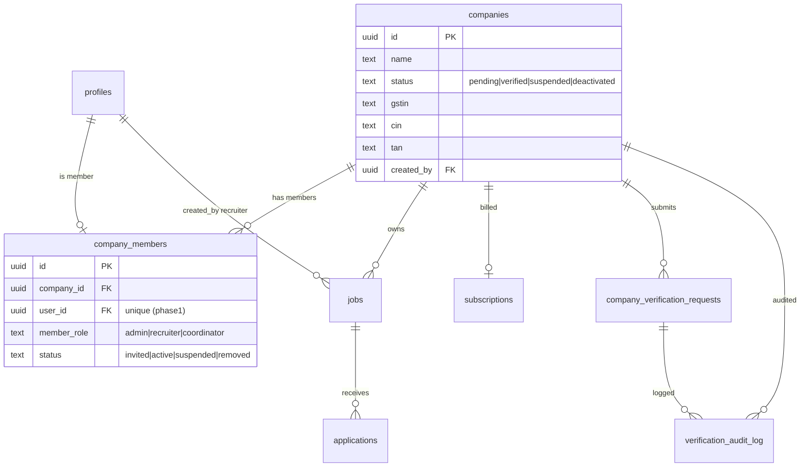

# 02 — Schema & Database Design (Company-First Migration)

**Status:** Draft for review
**Owner:** Platform / Backend
**Version:** 1.1 — **migration strategy corrected against the live database (2026-07-16).** The original plan renamed `company_profiles → companies`; live inspection (MCP `get-table-schema`) shows `companies` **already exists and is the live table** (6 rows, FK target of `jobs.company_id`), while `company_profiles` is an **empty vestige**. Migration 046 now **alters `companies` in place**. See revised §Background and §Migration 046.
**Last Updated:** 2026-07-16

Cross-refs: `01_Auth_Security_Audit_Report.md` (P0 fixes woven in), `04_State_Machines_And_Business_Logic.md` (lifecycles these tables encode), `03_API_Routes_And_Endpoints.md` (RPCs), `07_Company_Management_Architecture.md`.

---

# Purpose

Design the database changes that turn today's **recruiter-owned** schema into the **Company-First** model the architecture requires (`docs/RecruiterAndCompanyRoughIdea.md` §1): the company is the root business entity; recruiters are *members* of a company; jobs, candidates, billing all belong to the company and survive a recruiter leaving.

All new DDL ships as **numbered migrations starting at `046`** in `insforge/migrations/`, following existing house style.

---

# Background — Current State (verified against the LIVE database, 2026-07-16)

> ⚠️ **The git migrations and `docs/database_schema.md` are STALE.** They describe `company_profiles` as the company table. The live database disagrees. What follows is the live truth (MCP `get-table-schema`), which is what migration 046 must target.

- **`companies` — THE LIVE COMPANY TABLE (6 rows), created out-of-band; in no git migration.** Columns: `id, name, logo_url, website, industry, size, description, location, is_verified (bool, default false), is_active (bool, default true), created_at, gstin, tan, kyc_documents (jsonb)`. **No `recruiter_id`, no `created_by`, no `updated_at`, no FK.** Only index is the pkey. This is the FK target of `jobs.company_id` (`jobs_company_id_fkey → companies`).
  - ~~Live RLS is dangerous: policy `"Recruiters manage company"` is `FOR ALL TO public USING (caller is any recruiter)` — **any recruiter can edit/delete any company** (finding L-1 in `01`).~~ **RESOLVED (re-verified live 2026-07-16):** that policy is **absent** from the live DB — dropped out-of-band. Live `public.companies` now carries exactly `"Public view active companies"` (SELECT where `is_active`), `admin_bypass` (ALL, `{project_admin}`), and `project_admin_policy` (ALL, `{project_admin}`), with RLS enabled and **no non-admin write policy**. See L-1 in `01`.
- **`company_profiles` — EMPTY VESTIGE (0 rows).** This is the table `001_schema_and_rls.sql` created: `recruiter_id UUID → profiles(id)`, `about`, `updated_at` (+trigger). Live RLS has **only** `project_admin_policy` + `admin_bypass` (no recruiter access). Nothing writes to it. It must be archived-then-dropped, NOT renamed.
- `recruiter_profiles` — `user_id → profiles(id)`, denormalized `company_name`, `recruiter_role` (admin/recruiter/coordinator, added in `028`), `status` (pending/approved/rejected/suspended). PK is a random uuid, **not** `auth.uid()`.
- `profiles` — `role`, `company_id UUID` (unconstrained), `is_active`, `status text default 'pending'`. **This is the only existing link from recruiters to companies** — use it (plus `jobs.recruiter_id`) for the 049 backfill, since live `companies` has no `recruiter_id`.
- `jobs` — `recruiter_id → profiles`, `company_id → companies` (live FK confirmed). Status `active/paused/closed/draft`, `is_approved`. **Live RLS carries 16 overlapping policies** including blanket `jobs_update_own` / `"Recruiters can update own jobs"` that defeat the stricter approved/unapproved pair (finding L-2) — migration 050 must DROP these by their exact live names.
- `subscriptions` (live-only, **no git DDL, 0 rows**) — verify its actual columns (`plan`, `status`) exist live before 049/050 FK it; the entitlement join in `create_job`/`enforce_active_job_limit` assumes them.
- **Resolution:** the `companies`-vs-`company_profiles` question is settled — `companies` is real and canonical. Migration 046 **alters `companies` in place**; there is no rename.

## RLS house rules (MANDATORY for every policy below)

Verified from `025`, `028`, `035/036`, `037`, `042`:

1. Use `(SELECT auth.uid())`, **never bare `auth.uid()`** (per-statement eval — the "88 advisor warnings" fix). *Note: migration 001 uses bare `auth.uid()`; new code must not.*
2. Every table: `ALTER TABLE t ENABLE ROW LEVEL SECURITY;` + `CREATE POLICY admin_bypass ON t TO project_admin USING (true) WITH CHECK (true);`
3. Role checks go through helper functions in the private `authz` schema: `authz.is_admin()`, `authz.is_recruiter()`. Add `authz.company_role(company_id)` here.
4. To avoid RLS recursion on `profiles`, role/membership lookups read **flat lookup tables** with RLS disabled or self-only (pattern: `admin_users`, `recruiter_users`). We add `authz` functions that read `company_members` (which itself must not recurse into `profiles`).
5. Every column used in a policy `USING`/`WITH CHECK` filter gets a covering **index**.
6. Sensitive state transitions go through `SECURITY DEFINER` RPCs, not direct UPDATE (pattern from `022/023/027/034` application-status lockdown).

---

# Goals / Non-Goals

**Goals:** company as root entity; `company_members` join (recruiter↔company + role + status); verification workflow tables + audit; repoint jobs/subscriptions ownership to company; DB-enforced free-plan entitlement (1 active job); close the C-1/C-4 RLS holes from `01`.

**Non-Goals (Phase 1):** permission-based RBAC (Phase 2 — roles stay fixed labels), automated GST/domain verification, Talent Pool tables (flagged off), multi-company-per-recruiter (Phase 1 = one active company per recruiter, enforced by unique index).

---

# Target Data Model



Ownership rule encoded: **`jobs.company_id` and `subscriptions.company_id` are the source of truth; `jobs.recruiter_id` is only the creator/owner-within-company.** A recruiter row in `company_members` can go `removed` without touching the company's jobs.

---

# Migrations

> Naming: next free number is **046**. Apply in order. Each migration is idempotent (`IF NOT EXISTS` / `DROP POLICY IF EXISTS`) to match house style. Rollback notes at the end of each.

## Migration 046 — Alter the live `companies` table in place; add lifecycle + KYC fields; fix RLS

> **CHANGED from v1.0:** there is **no rename**. Live `companies` already exists and is the FK target. This migration alters it in place, maps the live `is_verified` boolean onto the new `status`, and drops the dangerous live RLS policy (finding L-1). The empty `company_profiles` is archived-then-dropped (guarded — abort if it has rows).

**Server-side changes:** add status/verification/KYC/billing columns to `companies`, backfill `status` from `is_verified`, replace RLS, drop the empty `company_profiles`. `companies` has **no `recruiter_id`** — `created_by` is backfilled in 049 from `jobs.recruiter_id`.

```sql
-- 046_company_first_companies.sql
-- NOTE: `companies` already exists live (6 rows). NO RENAME. Alter in place.

-- 0. Safety: the vestigial company_profiles must be empty before we touch anything.
DO $$
BEGIN
  IF to_regclass('public.company_profiles') IS NOT NULL
     AND EXISTS (SELECT 1 FROM public.company_profiles LIMIT 1) THEN
    RAISE EXCEPTION 'company_profiles is NOT empty — reconcile its rows into companies before migrating';
  END IF;
END $$;

-- 1. Lifecycle + verification metadata on the LIVE companies table
ALTER TABLE public.companies
  ADD COLUMN IF NOT EXISTS status TEXT NOT NULL DEFAULT 'pending'
    CHECK (status IN ('pending','verified','suspended','deactivated')),
  ADD COLUMN IF NOT EXISTS verified_at   TIMESTAMPTZ,
  ADD COLUMN IF NOT EXISTS verified_by   UUID REFERENCES public.profiles(id) ON DELETE SET NULL,
  ADD COLUMN IF NOT EXISTS created_by    UUID REFERENCES public.profiles(id) ON DELETE SET NULL,
  ADD COLUMN IF NOT EXISTS updated_at    TIMESTAMPTZ NOT NULL DEFAULT now(), -- live companies lacks this
  -- India KYC (see also GSTIN/CIN validation in 03 API layer)
  ADD COLUMN IF NOT EXISTS cin           TEXT,   -- Corporate Identification Number (21 char)
  ADD COLUMN IF NOT EXISTS pan           TEXT,   -- company PAN (10 char) — store, never expose to recruiters
  ADD COLUMN IF NOT EXISTS registered_email_domain TEXT,
  ADD COLUMN IF NOT EXISTS country_code  TEXT NOT NULL DEFAULT 'IN', -- international-ready
  ADD COLUMN IF NOT EXISTS slug          TEXT;   -- public profile URL segment
-- gstin, tan, logo_url, website, industry, size, description, location, is_verified, is_active already exist live.
-- (Live has `description`, NOT `about` — 05/07 UI must bind `description`.)

-- 2. Map the existing verification signal onto the new lifecycle.
--    Live has 6 companies with is_verified true/false; DEFAULT 'pending' above would wrongly reset verified ones.
UPDATE public.companies
   SET status = CASE
                  WHEN is_active = false THEN 'deactivated'
                  WHEN is_verified = true THEN 'verified'
                  ELSE 'pending'
                END,
       verified_at = CASE WHEN is_verified = true THEN COALESCE(verified_at, created_at, now()) END;
-- Keep is_verified/is_active as legacy read columns for now; a later migration can drop them once
-- all readers use `status`. Do NOT drop them here (public read policy still references is_active).

-- 3. Uniqueness: one company record per organization (soft — GSTIN is the strong key in IN)
-- Live-data delta (2026-07-17): 3 live rows have gstin = '' (empty string) — normalize to NULL
-- first or the partial unique index fails on duplicate ''.
UPDATE public.companies SET gstin = NULL WHERE gstin = '';
CREATE UNIQUE INDEX IF NOT EXISTS companies_gstin_key ON public.companies (gstin) WHERE gstin IS NOT NULL;
CREATE UNIQUE INDEX IF NOT EXISTS companies_slug_key  ON public.companies (slug)  WHERE slug IS NOT NULL;
CREATE INDEX IF NOT EXISTS companies_status_idx ON public.companies (status);
CREATE INDEX IF NOT EXISTS companies_created_by_idx ON public.companies (created_by);

-- 4. updated_at trigger (reuse the existing house function used elsewhere)
DROP TRIGGER IF EXISTS trigger_set_updated_at ON public.companies;
CREATE TRIGGER trigger_set_updated_at BEFORE UPDATE ON public.companies
  FOR EACH ROW EXECUTE FUNCTION set_current_timestamp_updated_at();

-- 5. FIX finding L-1: drop the "any recruiter edits any company" policy.
--    Interim ownership uses created_by until 047's company_members lands; 050 replaces this with membership scope.
DROP POLICY IF EXISTS "Recruiters manage company" ON public.companies;
DROP POLICY IF EXISTS admin_bypass ON public.companies;
CREATE POLICY admin_bypass ON public.companies TO project_admin USING (true) WITH CHECK (true);
-- public read stays (adjust to status once readers migrate off is_active)
DROP POLICY IF EXISTS "Public view active companies" ON public.companies;
CREATE POLICY companies_public_read ON public.companies FOR SELECT TO public
  USING (is_active = true AND status <> 'deactivated');
-- interim owner write (superseded by 050 jobs/members scoping)
CREATE POLICY companies_owner_write ON public.companies FOR UPDATE
  USING (created_by = (SELECT auth.uid())) WITH CHECK (created_by = (SELECT auth.uid()));

-- 6. Retire the empty vestige (guarded above).
DROP TABLE IF EXISTS public.company_profiles;
```

**Impact if changed:** the live `companies` table gains a real lifecycle + India KYC identity **without** the collision/backfill failure the rename plan would have caused; the live cross-tenant write hole (L-1) is closed; the empty duplicate table is removed. **Impact if not changed:** rename plan errors ("relation companies already exists"), the 6 live companies get reset to `pending`, and any recruiter keeps write access to every company. **Reason:** Company-First on the *actual* live schema; audit L-1. **Deploy priority:** P0.

**Rollback:** `DROP COLUMN` the added columns; restore `"Public view active companies"` from the live-state snapshot captured in the runbook (`09` T1). **Do not attempt to restore `"Recruiters manage company"`** — it is already absent from the live DB (L-1 resolved out-of-band), its `DROP` here is a no-op, and no verified `CREATE POLICY` for it was ever captured; re-creating it from this document's prose would reintroduce the original cross-tenant write hole. `company_profiles` drop is not auto-reversible — its pre-drop `CREATE TABLE` DDL must be captured in T1 before running.

---

## Migration 047 — `company_members` (the ownership inversion) + `authz` helpers + `profiles` hardening

```sql
-- 047_company_members_and_authz.sql
CREATE TABLE IF NOT EXISTS public.company_members (
  id           UUID PRIMARY KEY DEFAULT gen_random_uuid(),
  company_id   UUID NOT NULL REFERENCES public.companies(id) ON DELETE CASCADE,
  user_id      UUID NOT NULL REFERENCES public.profiles(id)  ON DELETE CASCADE,
  member_role  TEXT NOT NULL DEFAULT 'recruiter'
               CHECK (member_role IN ('admin','recruiter','coordinator')),
  status       TEXT NOT NULL DEFAULT 'invited'
               CHECK (status IN ('invited','active','suspended','removed')),
  invited_by   UUID REFERENCES public.profiles(id) ON DELETE SET NULL,
  joined_at    TIMESTAMPTZ,
  created_at   TIMESTAMPTZ DEFAULT now(),
  updated_at   TIMESTAMPTZ DEFAULT now()
);

-- Phase 1: one ACTIVE company membership per user (a recruiter belongs to exactly one company)
CREATE UNIQUE INDEX IF NOT EXISTS company_members_one_active_per_user
  ON public.company_members (user_id) WHERE status IN ('invited','active','suspended');
CREATE INDEX IF NOT EXISTS company_members_company_idx ON public.company_members (company_id);
CREATE INDEX IF NOT EXISTS company_members_user_idx    ON public.company_members (user_id);
CREATE INDEX IF NOT EXISTS company_members_lookup_idx  ON public.company_members (user_id, company_id, status);

ALTER TABLE public.company_members ENABLE ROW LEVEL SECURITY;

-- authz helpers (private schema; not exposed as PostgREST RPC). Read company_members ONLY (no profiles recursion).
CREATE OR REPLACE FUNCTION authz.company_id_of(uid UUID)
RETURNS UUID LANGUAGE sql STABLE SECURITY DEFINER SET search_path = public, pg_temp AS $$
  SELECT company_id FROM public.company_members
  WHERE user_id = uid AND status = 'active' LIMIT 1;
$$;

CREATE OR REPLACE FUNCTION authz.company_role(uid UUID, cid UUID)
RETURNS TEXT LANGUAGE sql STABLE SECURITY DEFINER SET search_path = public, pg_temp AS $$
  SELECT member_role FROM public.company_members
  WHERE user_id = uid AND company_id = cid AND status = 'active' LIMIT 1;
$$;

CREATE OR REPLACE FUNCTION authz.is_company_admin(uid UUID, cid UUID)
RETURNS BOOLEAN LANGUAGE sql STABLE SECURITY DEFINER SET search_path = public, pg_temp AS $$
  SELECT EXISTS (
    SELECT 1 FROM public.company_members
    WHERE user_id = uid AND company_id = cid AND member_role = 'admin' AND status = 'active'
  );
$$;

REVOKE ALL ON SCHEMA authz FROM PUBLIC;
GRANT USAGE ON SCHEMA authz TO authenticated, project_admin;

-- company_members RLS
DROP POLICY IF EXISTS admin_bypass ON public.company_members;
CREATE POLICY admin_bypass ON public.company_members TO project_admin USING (true) WITH CHECK (true);

-- A member can read the roster of their own active company
DROP POLICY IF EXISTS company_members_read_own_company ON public.company_members;
CREATE POLICY company_members_read_own_company ON public.company_members FOR SELECT
  USING (company_id = authz.company_id_of((SELECT auth.uid())));

-- Only a company admin may write membership rows (invite/role/status); go through RPCs (049) for lifecycle.
DROP POLICY IF EXISTS company_members_admin_write ON public.company_members;
CREATE POLICY company_members_admin_write ON public.company_members FOR ALL
  USING (authz.is_company_admin((SELECT auth.uid()), company_id))
  WITH CHECK (authz.is_company_admin((SELECT auth.uid()), company_id));

-- P0-5 (finding C-1): forbid self-mutation of privileged profile columns
CREATE OR REPLACE FUNCTION public.guard_profile_privileged_cols()
RETURNS TRIGGER LANGUAGE plpgsql SET search_path = public, pg_temp AS $$
BEGIN
  IF current_user IN ('postgres', 'project_admin') THEN RETURN NEW; END IF;  -- service-key/admin-console paths (no JWT uid) — T10 delta 2026-07-17
  IF authz.is_admin() THEN RETURN NEW; END IF;           -- admins may change roles
  IF NEW.role IS DISTINCT FROM OLD.role
     OR NEW.is_active IS DISTINCT FROM OLD.is_active
     OR NEW.company_id IS DISTINCT FROM OLD.company_id
     OR NEW.status IS DISTINCT FROM OLD.status THEN
    RAISE EXCEPTION 'privileged profile columns may only be changed by an admin';
  END IF;
  RETURN NEW;
END; $$;

DROP TRIGGER IF EXISTS trg_guard_profile_cols ON public.profiles;
CREATE TRIGGER trg_guard_profile_cols BEFORE UPDATE ON public.profiles
  FOR EACH ROW EXECUTE FUNCTION public.guard_profile_privileged_cols();
```

**Impact if changed:** recruiter↔company ownership is now a first-class row with role + lifecycle; the C-1 self-escalation hole is closed at the DB. **Impact if not changed:** ownership stays denormalized in `recruiter_profiles.company_name`/`profiles.company_id` (unreliable), and any user can still self-promote. **Reason:** Company-First + Least Privilege + audit finding C-1. **Deploy priority:** P0.

**Rollback:** `DROP TRIGGER trg_guard_profile_cols; DROP TABLE company_members CASCADE; DROP FUNCTION authz.company_id_of, authz.company_role, authz.is_company_admin, public.guard_profile_privileged_cols;`

---

## Migration 048 — Verification workflow + audit tables

```sql
-- 048_verification_workflow.sql
CREATE TABLE IF NOT EXISTS public.company_verification_requests (
  id            UUID PRIMARY KEY DEFAULT gen_random_uuid(),
  company_id    UUID NOT NULL REFERENCES public.companies(id) ON DELETE CASCADE,
  submitted_by  UUID REFERENCES public.profiles(id)  ON DELETE SET NULL, -- nullable: NOT NULL contradicts SET NULL (review delta 2026-07-17)
  channel       TEXT NOT NULL DEFAULT 'gmail_kyc' CHECK (channel IN ('gmail_kyc','upload_portal')),
  status        TEXT NOT NULL DEFAULT 'submitted'
                CHECK (status IN ('submitted','under_review','approved','rejected','needs_more_info')),
  kyc_documents JSONB,                     -- refs to emailed/uploaded docs (no raw PII in Phase 1)
  reviewer_id   UUID REFERENCES public.profiles(id) ON DELETE SET NULL,
  review_notes  TEXT,
  decided_at    TIMESTAMPTZ,
  created_at    TIMESTAMPTZ DEFAULT now(),
  updated_at    TIMESTAMPTZ DEFAULT now()
);
CREATE INDEX IF NOT EXISTS cvr_company_idx ON public.company_verification_requests (company_id);
CREATE INDEX IF NOT EXISTS cvr_status_idx  ON public.company_verification_requests (status);

-- Append-only audit of every important admin action (rough-idea §8 "Audit Everything")
CREATE TABLE IF NOT EXISTS public.verification_audit_log (
  id           UUID PRIMARY KEY DEFAULT gen_random_uuid(),
  company_id   UUID REFERENCES public.companies(id) ON DELETE SET NULL,
  request_id   UUID REFERENCES public.company_verification_requests(id) ON DELETE SET NULL,
  actor_id     UUID REFERENCES public.profiles(id) ON DELETE SET NULL,
  action       TEXT NOT NULL,             -- company_created|verification_submitted|approved|rejected|
                                          -- member_invited|member_removed|role_changed|company_suspended
  from_state   TEXT,
  to_state     TEXT,
  metadata     JSONB,
  created_at   TIMESTAMPTZ DEFAULT now()
);
CREATE INDEX IF NOT EXISTS val_company_idx ON public.verification_audit_log (company_id);
CREATE INDEX IF NOT EXISTS val_actor_idx   ON public.verification_audit_log (actor_id);

ALTER TABLE public.company_verification_requests ENABLE ROW LEVEL SECURITY;
ALTER TABLE public.verification_audit_log        ENABLE ROW LEVEL SECURITY;

DROP POLICY IF EXISTS admin_bypass ON public.company_verification_requests;
CREATE POLICY admin_bypass ON public.company_verification_requests TO project_admin USING (true) WITH CHECK (true);
DROP POLICY IF EXISTS admin_bypass ON public.verification_audit_log;
CREATE POLICY admin_bypass ON public.verification_audit_log TO project_admin USING (true) WITH CHECK (true);

-- Company admins may read their own company's verification requests + submit
DROP POLICY IF EXISTS cvr_read_own ON public.company_verification_requests;
CREATE POLICY cvr_read_own ON public.company_verification_requests FOR SELECT
  USING (company_id = authz.company_id_of((SELECT auth.uid())));
DROP POLICY IF EXISTS cvr_insert_own ON public.company_verification_requests;
CREATE POLICY cvr_insert_own ON public.company_verification_requests FOR INSERT
  WITH CHECK (company_id = authz.company_id_of((SELECT auth.uid()))
              AND submitted_by = (SELECT auth.uid()));
-- Decisions (approve/reject) are admin-only → handled by admin_bypass + RPC (049); no recruiter UPDATE policy.

-- Audit log is append-only for members (read own company), write via RPC/trigger only.
DROP POLICY IF EXISTS val_read_own ON public.verification_audit_log;
CREATE POLICY val_read_own ON public.verification_audit_log FOR SELECT
  USING (company_id = authz.company_id_of((SELECT auth.uid())));
-- No member INSERT/UPDATE/DELETE policy → only project_admin (bypass) / SECURITY DEFINER RPCs write.
```

**Impact if changed:** the manual Gmail-KYC verification (rough-idea Phase 1) has a real backing store + tamper-resistant audit trail. **Impact if not changed:** verification is untracked; no compliance/support history. **Reason:** rough-idea §8, §5; IT Act record-keeping. **Deploy priority:** P0.

**Rollback:** `DROP TABLE verification_audit_log, company_verification_requests CASCADE;`

---

## Migration 049 — Repoint ownership FKs + backfill + lifecycle RPCs

```sql
-- 049_repoint_ownership_and_rpcs.sql
-- NOTE (v1.1): live `companies` has NO recruiter_id. Ownership is derived from jobs.recruiter_id
-- (the recruiter who posted the company's earliest job) and from profiles.company_id.

-- 0. Backfill companies.created_by from the earliest job's recruiter per company.
--    Companies with zero jobs get created_by = NULL and surface as an admin-console task (see 07).
UPDATE public.companies c
   SET created_by = j.recruiter_id
  FROM (
    SELECT DISTINCT ON (company_id) company_id, recruiter_id
    FROM public.jobs
    WHERE recruiter_id IS NOT NULL
    ORDER BY company_id, created_at ASC
  ) j
 WHERE j.company_id = c.id AND c.created_by IS NULL;

-- 1. The company creator (if resolved) becomes the admin member.
INSERT INTO public.company_members (company_id, user_id, member_role, status, joined_at)
SELECT c.id, c.created_by, 'admin', 'active', now()
FROM public.companies c
WHERE c.created_by IS NOT NULL
ON CONFLICT DO NOTHING;

-- Other recruiters linked only via profiles.company_id → active recruiter members
INSERT INTO public.company_members (company_id, user_id, member_role, status, joined_at)
SELECT p.company_id, p.id, 'recruiter', 'active', now()
FROM public.profiles p
WHERE p.role = 'recruiter' AND p.company_id IS NOT NULL
  AND EXISTS (SELECT 1 FROM public.companies c WHERE c.id = p.company_id)  -- FK-safe: skip dangling company_id
  AND NOT EXISTS (SELECT 1 FROM public.company_members m WHERE m.user_id = p.id)
ON CONFLICT DO NOTHING;

-- Any recruiter who posted a job but isn't linked via profiles.company_id → recruiter member of that company
INSERT INTO public.company_members (company_id, user_id, member_role, status, joined_at)
SELECT DISTINCT j.company_id, j.recruiter_id, 'recruiter', 'active', now()
FROM public.jobs j
WHERE j.recruiter_id IS NOT NULL
  AND NOT EXISTS (SELECT 1 FROM public.company_members m WHERE m.user_id = j.recruiter_id)
ON CONFLICT DO NOTHING;

-- Verification status is already mapped in 046 (from is_verified). Do NOT blanket-verify here.

-- 2. (No recruiter_id column to drop on companies — it never existed live.)

-- 3. jobs.company_id already → companies (live FK); ensure FK + creator semantics
ALTER TABLE public.jobs
  DROP CONSTRAINT IF EXISTS jobs_company_id_fkey,
  ADD  CONSTRAINT jobs_company_id_fkey FOREIGN KEY (company_id)
       REFERENCES public.companies(id) ON DELETE CASCADE;
-- jobs.recruiter_id stays as creator/owner-within-company (nullable-safe on member removal)
ALTER TABLE public.jobs
  DROP CONSTRAINT IF EXISTS jobs_recruiter_id_fkey,
  ADD  CONSTRAINT jobs_recruiter_id_fkey FOREIGN KEY (recruiter_id)
       REFERENCES public.profiles(id) ON DELETE SET NULL;

-- 4. subscriptions.company_id → companies (already logically, enforce FK)
ALTER TABLE public.subscriptions
  DROP CONSTRAINT IF EXISTS subscriptions_company_id_fkey,
  ADD  CONSTRAINT subscriptions_company_id_fkey FOREIGN KEY (company_id)
       REFERENCES public.companies(id) ON DELETE CASCADE;

-- 5. Lifecycle RPCs (SECURITY DEFINER; admin/company-admin gated inside). See 03 for API surface.
CREATE OR REPLACE FUNCTION public.approve_company_verification(p_request_id UUID, p_notes TEXT)
RETURNS VOID LANGUAGE plpgsql SECURITY DEFINER SET search_path = public, pg_temp AS $$
DECLARE v_company UUID;
BEGIN
  IF NOT authz.is_admin() THEN RAISE EXCEPTION 'admin only'; END IF;
  UPDATE public.company_verification_requests
     SET status='approved', reviewer_id=(SELECT auth.uid()), review_notes=p_notes, decided_at=now()
   WHERE id=p_request_id AND status IN ('submitted','under_review')  -- state guard (review delta 2026-07-17)
   RETURNING company_id INTO v_company;
  IF v_company IS NULL THEN
    RAISE EXCEPTION 'verification request not found or already decided';
  END IF;
  UPDATE public.companies SET status='verified', verified_at=now(), verified_by=(SELECT auth.uid())
   WHERE id=v_company;
  UPDATE public.company_members SET status='active', joined_at=COALESCE(joined_at, now())
   WHERE company_id=v_company AND status='invited';
  INSERT INTO public.verification_audit_log(company_id, request_id, actor_id, action, to_state, metadata)
  VALUES (v_company, p_request_id, (SELECT auth.uid()), 'approved', 'verified', jsonb_build_object('notes', p_notes));
END; $$;

CREATE OR REPLACE FUNCTION public.create_job(p_payload JSONB)
RETURNS public.jobs LANGUAGE plpgsql SECURITY DEFINER SET search_path = public, pg_temp AS $$
DECLARE v_company UUID; v_uid UUID := (SELECT auth.uid()); v_active INT; v_limit INT; v_row public.jobs;
BEGIN
  v_company := authz.company_id_of(v_uid);
  IF v_company IS NULL THEN RAISE EXCEPTION 'no active company membership'; END IF;
  IF authz.company_role(v_uid, v_company) NOT IN ('admin','recruiter')
     THEN RAISE EXCEPTION 'coordinators cannot post jobs'; END IF;

  -- Free-plan entitlement (finding: enforce in DB, not frontend). See plan_limits (050).
  SELECT COALESCE((SELECT max_active_jobs FROM public.plan_limits pl
                   JOIN public.subscriptions s ON s.plan = pl.plan AND s.company_id = v_company
                   AND s.status IN ('trialing','active') LIMIT 1), 1) INTO v_limit;
  SELECT count(*) INTO v_active FROM public.jobs
   WHERE company_id = v_company AND status = 'active';
  IF (p_payload->>'status') = 'active' AND v_active >= v_limit THEN
    RAISE EXCEPTION 'active job limit reached (%). Close an active job to post another.', v_limit
      USING ERRCODE = 'check_violation';
  END IF;

  INSERT INTO public.jobs (company_id, recruiter_id, title, description, requirements, skills_required,
                           location, type, department, salary_min, salary_max, currency,
                           experience_min, experience_max, status, is_approved)
  SELECT v_company, v_uid,
         p_payload->>'title', p_payload->>'description',
         ARRAY(SELECT jsonb_array_elements_text(COALESCE(p_payload->'requirements','[]'::jsonb))),
         ARRAY(SELECT jsonb_array_elements_text(COALESCE(p_payload->'skills_required','[]'::jsonb))),
         p_payload->>'location', p_payload->>'type', p_payload->>'department',
         (p_payload->>'salary_min')::int, (p_payload->>'salary_max')::int, COALESCE(p_payload->>'currency','INR'),
         (p_payload->>'experience_min')::int, (p_payload->>'experience_max')::int,
         COALESCE(p_payload->>'status','draft'), false
  RETURNING * INTO v_row;
  RETURN v_row;
END; $$;

REVOKE ALL ON FUNCTION public.approve_company_verification(UUID,TEXT) FROM PUBLIC;
REVOKE ALL ON FUNCTION public.create_job(JSONB) FROM PUBLIC;
GRANT EXECUTE ON FUNCTION public.approve_company_verification(UUID,TEXT) TO authenticated;
GRANT EXECUTE ON FUNCTION public.create_job(JSONB) TO authenticated;
```

**Impact if changed:** ownership is fully company-first; job creation is server-derived (closes C-4) and entitlement-checked in the DB. **Impact if not changed:** cross-tenant job attribution stays possible; entitlement is frontend-only (bypassable). **Reason:** Company-First + audit C-4 + free-plan rule. **Deploy priority:** P0.

**Rollback:** re-add `companies.recruiter_id`, restore prior FKs, `DROP FUNCTION approve_company_verification, create_job;`. Backfilled `company_members` rows are harmless to keep.

---

## Migration 050 — Company-scoped RLS on jobs & applications + plan limits

```sql
-- 050_company_scoped_rls_and_plans.sql

-- plan_limits: single source of truth for entitlements (rough-idea: free = 1 active job)
CREATE TABLE IF NOT EXISTS public.plan_limits (
  plan            TEXT PRIMARY KEY,   -- free|starter|growth|enterprise
  max_active_jobs INT NOT NULL,
  price_inr       INT NOT NULL DEFAULT 0,
  talent_pool     BOOLEAN NOT NULL DEFAULT false
);
INSERT INTO public.plan_limits(plan, max_active_jobs, price_inr, talent_pool) VALUES
  ('free', 1, 0, false)
ON CONFLICT (plan) DO NOTHING;
ALTER TABLE public.plan_limits ENABLE ROW LEVEL SECURITY;
DROP POLICY IF EXISTS plan_limits_read ON public.plan_limits;
CREATE POLICY plan_limits_read ON public.plan_limits FOR SELECT TO authenticated USING (true);
DROP POLICY IF EXISTS admin_bypass ON public.plan_limits;
CREATE POLICY admin_bypass ON public.plan_limits TO project_admin USING (true) WITH CHECK (true);

-- jobs: replace recruiter-owned policies with company-scoped ones (uses (SELECT auth.uid()))
-- v1.1: DROP the ACTUAL LIVE policy names (16 exist live — enumerated from get-table-schema).
--       Missing any of the blanket ones leaves the L-2 hole open (policies are OR-ed).
DROP POLICY IF EXISTS jobs_select_own ON public.jobs;
DROP POLICY IF EXISTS jobs_insert_own ON public.jobs;
DROP POLICY IF EXISTS jobs_update_own ON public.jobs;
DROP POLICY IF EXISTS jobs_delete_own ON public.jobs;
DROP POLICY IF EXISTS jobs_update_unapproved ON public.jobs;
DROP POLICY IF EXISTS jobs_update_approved ON public.jobs;
DROP POLICY IF EXISTS "Recruiters can insert jobs" ON public.jobs;
DROP POLICY IF EXISTS "Recruiters can update own jobs" ON public.jobs;
DROP POLICY IF EXISTS "Recruiters can delete own jobs" ON public.jobs;
DROP POLICY IF EXISTS "Recruiters view own jobs" ON public.jobs;
-- Duplicate public-read + admin policies also live; collapse to one of each below.
DROP POLICY IF EXISTS public_select ON public.jobs;
DROP POLICY IF EXISTS jobs_select_approved ON public.jobs;
DROP POLICY IF EXISTS "Admins can view all jobs" ON public.jobs;
DROP POLICY IF EXISTS admins_all ON public.jobs;
-- Also clean the duplicate DDL noise found live (2 of 3 update triggers + duplicate index):
DROP TRIGGER IF EXISTS tr_jobs_update ON public.jobs;
DROP TRIGGER IF EXISTS update_jobs_updated_at ON public.jobs;   -- keep trigger_set_updated_at
DROP INDEX IF EXISTS public.idx_jobs_status;                    -- keep idx_jobs_status_approved (identical)
-- Recreate a single admin-all + single public read:
CREATE POLICY jobs_admin_all ON public.jobs TO authenticated
  USING (authz.is_admin()) WITH CHECK (authz.is_admin());
-- single public read (approved + active). See §Edge cases [SUGGESTION]/09-T6 for adding a verified-company predicate.
CREATE POLICY jobs_select_approved ON public.jobs FOR SELECT TO public
  USING (status = 'active' AND is_approved = true);
CREATE POLICY jobs_select_company ON public.jobs FOR SELECT
  USING (company_id = authz.company_id_of((SELECT auth.uid())));
-- INSERT only via create_job() RPC → block direct insert for non-admins
CREATE POLICY jobs_no_direct_insert ON public.jobs FOR INSERT
  WITH CHECK (false);   -- direct inserts denied; RPC runs as definer (bypasses)
-- UPDATE: admins on any company job; recruiters on their own; coordinators none
CREATE POLICY jobs_update_company ON public.jobs FOR UPDATE
  USING (
    company_id = authz.company_id_of((SELECT auth.uid()))
    AND (authz.company_role((SELECT auth.uid()), company_id) = 'admin'
         OR recruiter_id = (SELECT auth.uid()))
  );
CREATE POLICY jobs_delete_company ON public.jobs FOR DELETE
  USING (authz.is_company_admin((SELECT auth.uid()), company_id));
CREATE INDEX IF NOT EXISTS jobs_company_idx  ON public.jobs (company_id);
CREATE INDEX IF NOT EXISTS jobs_recruiter_idx ON public.jobs (recruiter_id);
CREATE INDEX IF NOT EXISTS jobs_company_status_idx ON public.jobs (company_id, status);

-- applications: recruiters see applications to their COMPANY's jobs (not just own jobs)
DROP POLICY IF EXISTS apps_recruiter_view ON public.applications;
DROP POLICY IF EXISTS apps_recruiter_update ON public.applications;
CREATE POLICY apps_company_view ON public.applications FOR SELECT
  USING (EXISTS (
    SELECT 1 FROM public.jobs j
    WHERE j.id = applications.job_id
      AND j.company_id = authz.company_id_of((SELECT auth.uid()))
  ));
CREATE POLICY apps_company_update ON public.applications FOR UPDATE
  USING (EXISTS (
    SELECT 1 FROM public.jobs j
    WHERE j.id = applications.job_id
      AND j.company_id = authz.company_id_of((SELECT auth.uid()))
      AND authz.company_role((SELECT auth.uid()), j.company_id) IN ('admin','recruiter')
  ));
CREATE INDEX IF NOT EXISTS applications_job_idx ON public.applications (job_id);

-- Enforce active-job entitlement on ANY path that flips a job to 'active' (defense in depth vs the RPC)
CREATE OR REPLACE FUNCTION public.enforce_active_job_limit()
RETURNS TRIGGER LANGUAGE plpgsql SET search_path = public, pg_temp AS $$
DECLARE v_limit INT; v_active INT;
BEGIN
  IF NEW.status = 'active' AND (TG_OP='INSERT' OR OLD.status IS DISTINCT FROM 'active') THEN
    SELECT COALESCE((SELECT pl.max_active_jobs FROM public.plan_limits pl
       JOIN public.subscriptions s ON s.plan=pl.plan AND s.company_id=NEW.company_id
       AND s.status IN ('trialing','active') LIMIT 1), 1) INTO v_limit;
    SELECT count(*) INTO v_active FROM public.jobs
      WHERE company_id=NEW.company_id AND status='active' AND id <> NEW.id;
    IF v_active >= v_limit THEN
      RAISE EXCEPTION 'active job limit reached (%)', v_limit USING ERRCODE='check_violation';
    END IF;
  END IF;
  RETURN NEW;
END; $$;
DROP TRIGGER IF EXISTS trg_active_job_limit ON public.jobs;
CREATE TRIGGER trg_active_job_limit BEFORE INSERT OR UPDATE OF status ON public.jobs
  FOR EACH ROW EXECUTE FUNCTION public.enforce_active_job_limit();
```

**Impact if changed:** candidate PII visibility is company-scoped (rough-idea §Candidate Privacy), and the free-plan limit is DB-enforced on every path. **Impact if not changed:** recruiters could see only own-job applicants (breaks team collaboration) or the limit is bypassable. **Reason:** Company-First collaboration + entitlement. **Deploy priority:** P0.

**Rollback:** restore `028`/`001` recruiter policies; `DROP TRIGGER trg_active_job_limit; DROP FUNCTION enforce_active_job_limit; DROP TABLE plan_limits;`.

---

## Migration 051 — Verification decision RPCs + member lifecycle (last-admin guard, accept-invite)

> **Added v1.1.** Docs 03/04 referenced a "reject RPC", a `needs_more_info` transition, a **last-admin guard**, and a **member-accept** transition that had no DDL. This migration defines them. Depends on 047 (`company_members`, `authz` helpers), 048 (verification tables), 049 (`approve_company_verification`).

```sql
-- 051_verification_and_member_rpcs.sql

-- ── Verification decisions (mirror approve_company_verification; accept submitted OR under_review) ──
CREATE OR REPLACE FUNCTION public.reject_company_verification(p_request_id UUID, p_notes TEXT)
RETURNS VOID LANGUAGE plpgsql SECURITY DEFINER SET search_path = public, pg_temp AS $$
DECLARE v_company UUID;
BEGIN
  IF NOT authz.is_admin() THEN RAISE EXCEPTION 'admin only'; END IF;
  UPDATE public.company_verification_requests
     SET status='rejected', reviewer_id=(SELECT auth.uid()), review_notes=p_notes, decided_at=now()
   WHERE id=p_request_id AND status IN ('submitted','under_review')
   RETURNING company_id INTO v_company;
  IF v_company IS NULL THEN RAISE EXCEPTION 'request not found or not pending'; END IF;
  -- company stays 'pending', member stays 'invited' (04 §3)
  INSERT INTO public.verification_audit_log(company_id, request_id, actor_id, action, from_state, to_state, metadata)
  VALUES (v_company, p_request_id, (SELECT auth.uid()), 'rejected', 'under_review', 'pending', jsonb_build_object('notes', p_notes));
END; $$;

CREATE OR REPLACE FUNCTION public.request_more_info_for_verification(p_request_id UUID, p_notes TEXT)
RETURNS VOID LANGUAGE plpgsql SECURITY DEFINER SET search_path = public, pg_temp AS $$
DECLARE v_company UUID;
BEGIN
  IF NOT authz.is_admin() THEN RAISE EXCEPTION 'admin only'; END IF;
  UPDATE public.company_verification_requests
     SET status='needs_more_info', reviewer_id=(SELECT auth.uid()), review_notes=p_notes, decided_at=now()
   WHERE id=p_request_id AND status IN ('submitted','under_review')
   RETURNING company_id INTO v_company;
  IF v_company IS NULL THEN RAISE EXCEPTION 'request not found or not pending'; END IF;
  INSERT INTO public.verification_audit_log(company_id, request_id, actor_id, action, from_state, to_state, metadata)
  VALUES (v_company, p_request_id, (SELECT auth.uid()), 'needs_more_info', 'under_review', 'pending', jsonb_build_object('notes', p_notes));
END; $$;
-- Re-submission after needs_more_info: the recruiter simply POSTs /api/company/verification/submit again,
-- which inserts a NEW request (RLS cvr_insert_own). The admin queue shows the latest request per company.
-- No separate "reopen" RPC needed.

-- ── Last-admin guard: a company must always keep ≥1 active admin (04 §2 business rule) ──
-- Enforced at the DB so NO path (RLS write, admin_bypass, RPC) can orphan a company.
CREATE OR REPLACE FUNCTION public.guard_last_company_admin()
RETURNS TRIGGER LANGUAGE plpgsql SET search_path = public, pg_temp AS $$
DECLARE v_other_admins INT;
BEGIN
  -- Company-delete cascade escape (review delta 2026-07-17): parent gone → rule is vacuous;
  -- without this, a company with one active admin could never be deleted.
  IF TG_OP = 'DELETE'
     AND NOT EXISTS (SELECT 1 FROM public.companies WHERE id = OLD.company_id) THEN
    RETURN OLD;
  END IF;
  IF OLD.member_role = 'admin' AND OLD.status = 'active'
     AND (TG_OP = 'DELETE'
          OR NEW.member_role <> 'admin'
          OR NEW.status <> 'active') THEN
    SELECT count(*) INTO v_other_admins FROM public.company_members
     WHERE company_id = OLD.company_id AND member_role = 'admin' AND status = 'active'
       AND id <> OLD.id;
    IF v_other_admins = 0 THEN
      RAISE EXCEPTION 'last_admin: a company must keep at least one active admin'
        USING ERRCODE = 'check_violation';
    END IF;
  END IF;
  RETURN CASE WHEN TG_OP = 'DELETE' THEN OLD ELSE NEW END;
END; $$;

DROP TRIGGER IF EXISTS trg_guard_last_company_admin ON public.company_members;
CREATE TRIGGER trg_guard_last_company_admin
  BEFORE UPDATE OR DELETE ON public.company_members
  FOR EACH ROW EXECUTE FUNCTION public.guard_last_company_admin();

-- ── Member accept-invite (invited → active) ──
-- The invitee is NOT a company admin, so the admin-write RLS policy (047) can't let them flip their
-- own row. This SECURITY DEFINER RPC scopes the flip to the caller's own invited row on a verified company.
CREATE OR REPLACE FUNCTION public.accept_company_invite(p_company_id UUID)
RETURNS VOID LANGUAGE plpgsql SECURITY DEFINER SET search_path = public, pg_temp AS $$
DECLARE v_uid UUID := (SELECT auth.uid()); v_company_status TEXT;
BEGIN
  SELECT status INTO v_company_status FROM public.companies WHERE id = p_company_id;
  IF v_company_status IS DISTINCT FROM 'verified' THEN
    RAISE EXCEPTION 'company not verified'; END IF;
  UPDATE public.company_members
     SET status = 'active', joined_at = COALESCE(joined_at, now())
   WHERE user_id = v_uid AND company_id = p_company_id AND status = 'invited';
  IF NOT FOUND THEN RAISE EXCEPTION 'no pending invite for this company'; END IF;
  INSERT INTO public.verification_audit_log(company_id, actor_id, action, from_state, to_state)
  VALUES (p_company_id, v_uid, 'member_activated', 'invited', 'active');
END; $$;

REVOKE ALL ON FUNCTION public.reject_company_verification(UUID,TEXT) FROM PUBLIC;
REVOKE ALL ON FUNCTION public.request_more_info_for_verification(UUID,TEXT) FROM PUBLIC;
REVOKE ALL ON FUNCTION public.accept_company_invite(UUID) FROM PUBLIC;
GRANT EXECUTE ON FUNCTION public.reject_company_verification(UUID,TEXT) TO authenticated;
GRANT EXECUTE ON FUNCTION public.request_more_info_for_verification(UUID,TEXT) TO authenticated;
GRANT EXECUTE ON FUNCTION public.accept_company_invite(UUID) TO authenticated;
```

**Note on member invite/update:** these do **not** need dedicated RPCs — a company admin inserts an `invited` row and updates role/status directly through the `company_members_admin_write` RLS policy (047). The `guard_last_company_admin` trigger above enforces the last-admin invariant on those direct writes and on `admin_bypass`. Only *accept* needs an RPC (the invitee isn't an admin).

**Impact if changed:** the reject / needs-more-info / accept-invite / last-admin behaviors the state machine (`04`) promises are actually enforceable; the admin verification queue and team-management UI have real backing calls. **Impact if not changed:** `03`/`04` reference calls that don't exist → those flows are unimplementable and the last-admin invariant is unenforced (a company can be orphaned). **Reason:** completes the verification + membership state machines. **Deploy priority:** P0 (verification decide) / P1 (accept-invite, team mgmt).

**Rollback:** `DROP TRIGGER trg_guard_last_company_admin ON company_members; DROP FUNCTION guard_last_company_admin, reject_company_verification, request_more_info_for_verification, accept_company_invite;`

---

# Index summary (every policy-filter column covered)

| Table | Policy filter columns | Index |
|---|---|---|
| companies | status, created_by, gstin, slug | `companies_status_idx`, `_created_by_idx`, unique `_gstin_key`, `_slug_key` |
| company_members | user_id, company_id, status | `_user_idx`, `_company_idx`, `_lookup_idx`, unique `_one_active_per_user` |
| jobs | company_id, recruiter_id, (company_id,status) | `jobs_company_idx`, `_recruiter_idx`, `_company_status_idx` |
| applications | job_id | `applications_job_idx` |
| company_verification_requests | company_id, status | `cvr_company_idx`, `cvr_status_idx` |
| verification_audit_log | company_id, actor_id | `val_company_idx`, `val_actor_idx` |

---

# Edge cases (schema-level)

- **Recruiter leaves:** set `company_members.status='removed'`; `jobs.recruiter_id` stays (SET NULL only if profile deleted). Jobs remain owned by `company_id`. ✔ data-loss-safe.
- **Duplicate company request:** unique `companies_gstin_key` blocks a second row for the same GSTIN; app layer offers "attach to existing" (see `07`).
- **Company suspended:** `companies.status='suspended'` → recruiter layout guard (`06`) denies portal; jobs auto-hidden because public read requires... *(add: a `companies.status='verified'` predicate to `jobs_select_approved` — see `04` transition table).* **[SUGGESTION]** amend `jobs_select_approved` to `AND EXISTS(SELECT 1 FROM companies c WHERE c.id=jobs.company_id AND c.status='verified')`.
- **Rejected recruiter re-applies:** old `company_members` row `status='removed'`; the partial unique index only covers `invited/active/suspended`, so a new request is allowed.

---

# Tradeoffs

- **~~Rename~~ In-place alter (v1.1 correction):** the original plan renamed `company_profiles→companies`. That is **impossible** on the live DB — `companies` already exists (6 rows) and is the live FK target, so a rename collides. The corrected plan alters the live `companies` in place and drops the empty `company_profiles`. This is still the smallest correct diff *against reality*; the v1.0 "smallest diff" was measured against a stale schema snapshot.
- **One-company-per-recruiter (partial unique index)** is a Phase-1 simplification; Phase 2 multi-company drops the index and adds a "current company" selector. `ponytail:` documented simplification — upgrade path is dropping `company_members_one_active_per_user`.
- **Entitlement enforced twice** (RPC + trigger): deliberate defense-in-depth so no code path can create an over-limit active job.

---

# Implementation checklist

- [ ] **Pre-flight:** capture live DDL/policies of `companies`, `company_profiles`, `jobs` (runbook 09-T1) — the git migrations do NOT describe live state
- [ ] 046 in-place alter applied; `status` correctly mapped from `is_verified` (6 rows: verified stay verified); `"Recruiters manage company"` policy dropped (L-1); empty `company_profiles` dropped
- [ ] 047 company_members + authz helpers + profile guard trigger; C-1 test passes (candidate cannot self-promote)
- [ ] 048 verification tables + RLS
- [ ] 049 `created_by` backfilled from earliest job's recruiter; every recruiter with a job/`company_id` has a `company_members` row; companies with no jobs flagged for admin (created_by NULL); FKs enforced; RPCs execute
- [ ] 050 all 16 live `jobs` policies dropped by name and replaced (L-2); duplicate triggers/index removed; plan_limits; free-plan limit test (2nd active job rejected)
- [ ] 051 verification reject/needs_more_info RPCs; last-admin guard trigger; accept-invite RPC; last-admin test (removing sole admin → `last_admin`)
- [ ] Register all as `insforge/migrations/046..051_*.sql`; no bare `auth.uid()` anywhere (grep)
- [ ] Confirm `subscriptions` live columns (`plan`,`status`) exist before its FK/entitlement joins run

# References
`insforge/migrations/001_schema_and_rls.sql`, `028_recruiter_team_rbac.sql`, `037_move_is_admin_to_authz_schema.sql`, `042_harden_is_recruiter_authz.sql`; `docs/database_schema.md`; `RLS_PERFORMANCE_ADVISOR_88_IMPLEMENTATION_PLAN.md`; `insforge/functions/jobs/index.ts`.
