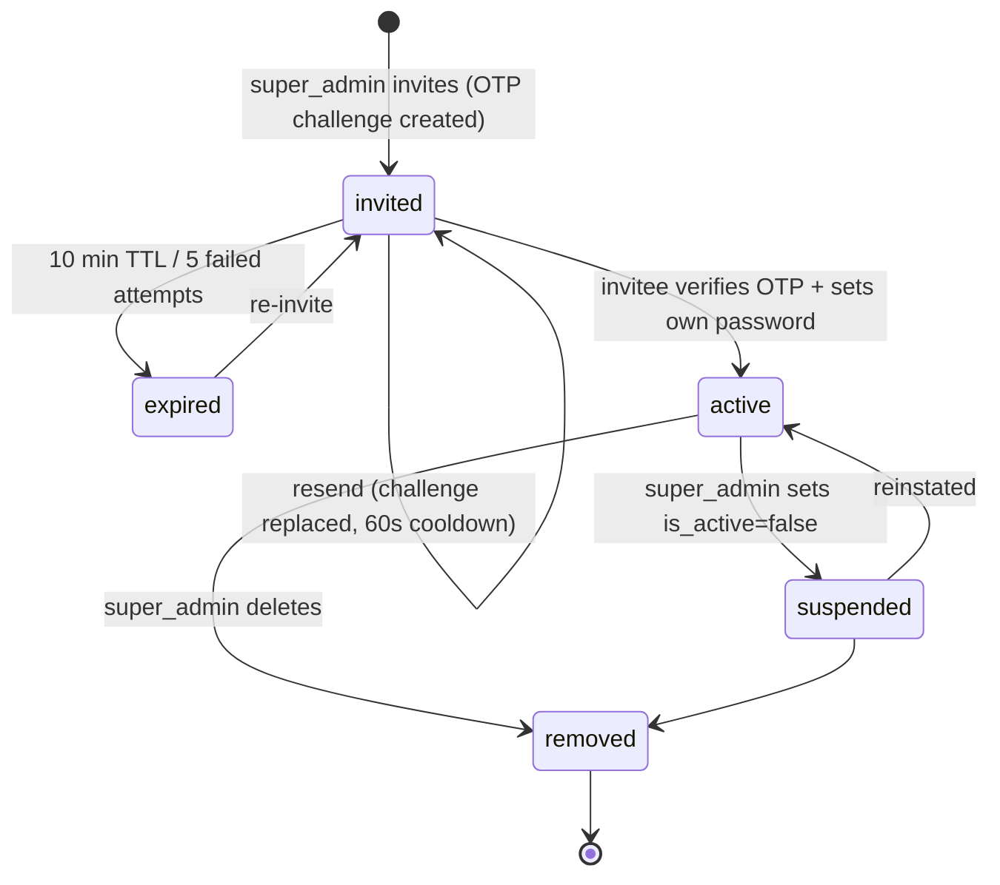
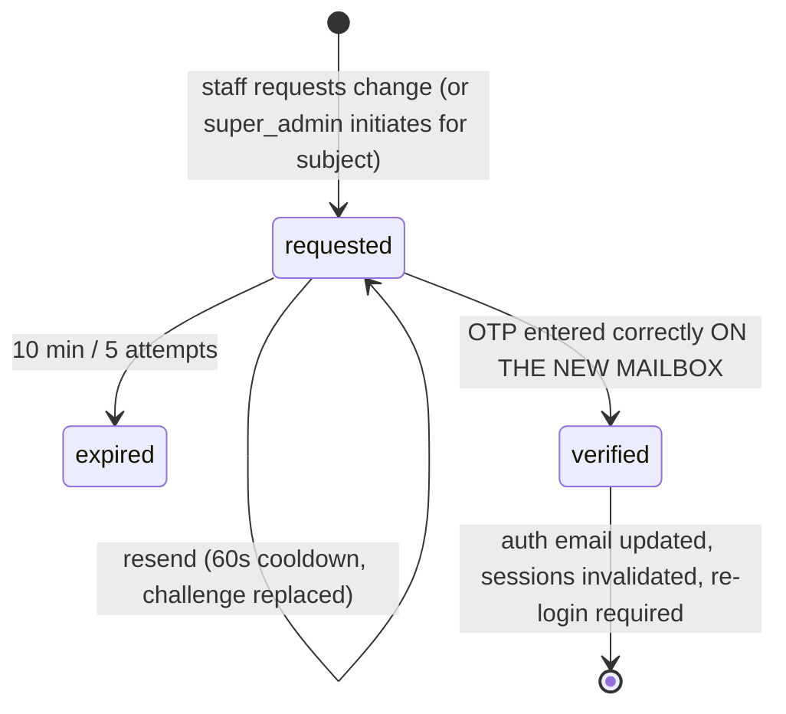

# 04 — Admin Portal State Machines & Business Logic

**Status:** Draft for review
**Owner:** Platform / Backend
**Version:** 1.0 — 2026-07-18
**Cross-refs:** `04_State_Machines_And_Business_Logic.md` (recruiter/company suite — company/membership/verification/job machines; **admin actions invoke those, this doc never redefines them**), `02_Admin_Portal_Schema_And_Database_Design.md` (DDL), `03_Admin_Portal_API_Routes_And_Endpoints.md` (endpoints per transition), `14_Admin_Portal_Rebuild_Architecture.md` §6.

Format per the suite standard: every transition names **actor · guard · side-effects · audit action**.

---

# 1. Staff account lifecycle

`profiles.role ∈ {super_admin, admin, content}` × `is_active` — plus a pre-account `invited` stage that lives in `admin_otp_challenges` (no auth user exists until acceptance).

| From → To | Actor | Guard | Side-effects | Audit action |
|---|---|---|---|---|
| ∅ → invited | super_admin | `team.edit`; email not in use (`409 email_in_use`); no live challenge (`409 challenge_exists`) | challenge row; OTP + accept link emailed | `admin_invited` |
| invited → invited (resend) | super_admin | ≥60 s since `created_at` (`429 resend_cooldown`) | challenge replaced (new OTP; old code dead instantly) | `admin_invite_resent` |
| invited → expired | system | `expires_at` passed or `attempts = 5` | challenge dead (unique index frees the email) | — (`otp_locked` audited on the 5th failure) |
| invited → active | invitee | OTP matches; password ≥ 12 chars | auth signup with invitee's own password → profiles upsert (role from `payload`) → challenge consumed | `admin_activated` |
| active ↔ suspended | super_admin | **not the last active super_admin** (DB trigger `trg_guard_last_super_admin` → `422 last_super_admin`) | next request denied everywhere (layout + `requireStaff` + `withApi` all check `is_active`) | `admin_suspended` / `admin_reinstated` |
| any → removed | super_admin | same last-super_admin guard; cannot remove self (client blocks; server 422 via guard when last) | profile deleted; sessions deleted; `admin_users` row removed by trigger | `admin_removed` |
| role change | super_admin | last-super_admin guard on demotion; self-demotion of last super_admin blocked | `profiles.role` update (trigger syncs `admin_users`) | `admin_role_changed` |

**Business rules:**
- **No password custody:** no staff password is ever typed by anyone but its owner (closes AD-11). The invite carries an OTP, not a credential.
- **Suspension is immediate-on-next-request**, not session-revoking by itself; removal *does* delete `user_sessions` rows.
- **`content` scope:** may draft content (`content.edit`) but announcements **publish** requires `content.approve` (an `admin`) — publishing fans out platform-wide notifications and is treated as a broadcast privilege.

# 2. Email-change lifecycle (OTP to the new address)

Applies to all staff; also the mechanism that moves the primary account to `admin@talentmeshsolutions.com` (doc 08 Phase 5).

| From → To | Actor | Guard | Side-effects | Audit action |
|---|---|---|---|---|
| ∅ → requested | staff (self) / super_admin (for subject) | new email not in use; no live challenge | challenge `{purpose:'email_change', target_email:new}`; OTP → **new** mailbox | `admin_email_change_requested` |
| requested → verified | mailbox owner | OTP match within TTL/attempts | InsForge Admin API email update (**UUID unchanged** — verified per 01 §3.6); `profiles.email` update; challenge consumed; subject's `user_sessions` deleted | `admin_email_changed` |

**Why OTP to the *new* address:** the risk being controlled is pointing a privileged account at a mailbox the requester doesn't control. Proving control of the new mailbox is the control. The old mailbox gets a courtesy notification (`send-email`), giving the real owner a detection path if a hijacked session initiated the change.

**[SUGGESTION]** For super_admin accounts, additionally require the *acting* session to re-verify with an OTP to the **old** address before the change takes effect (two-mailbox confirmation). Trade-off: breaks the "old mailbox lost" recovery case — which then needs the `/admin/setup` bootstrap path; defer until there are ≥2 super_admins.

# 3. Impersonation — REMOVED for launch (decision 2)

No impersonation feature ships. The route, mock page, banner, and the three `document.cookie` readers are deleted (03 §5.4). There is no impersonation state machine to maintain, and the AD-3 escalation primitive ceases to exist. Should impersonation return post-launch, its intended machine (server-side session row is the authority; cookie is a pointer never an authz claim; targets restricted to non-staff; super_admin-only; force-expirable) is preserved in doc 14 R-10 Option B for that work.

# 4. Job approval lifecycle (admin-owned, orthogonal to `jobs.status`)

`jobs.approval_status ∈ {pending, approved, rejected}` (migration 054). The recruiter-owned `status` machine (draft/active/paused/closed + entitlement) is defined in the recruiter suite doc 04 §4 and **unchanged**.

| From → To | Actor | Guard | Side-effects | Audit action |
|---|---|---|---|---|
| ∅ → pending | system | job published by recruiter | appears in admin approvals queue | (recruiter-side `job_published`) |
| pending → approved | admin | `jobs.approve` | public-visible iff `status='active'` AND company `verified` (defense-in-depth rule, recruiter doc 04 §4) | `job_approved` |
| pending → rejected | admin | `jobs.approve`; **reason required** | recruiter notified with reason | `job_rejected` |
| rejected → pending | recruiter | edits + resubmits | re-enters queue | `job_resubmitted` |

**MVP rule (decision 4): editing an approved job does NOT re-trigger approval.** An `approved` job stays `approved` through edits — there is no `approved → pending` transition for the MVP. (The auto-re-review idea remains a parked post-MVP [SUGGESTION]; do not build it now.)

**Admin lifecycle help (on-behalf transitions):** admin may drive the recruiter-side `status` machine for a stuck company — same transition table, same guards (incl. the `enforce_active_job_limit` entitlement trigger: **admin help does not bypass plan limits**), plus mandatory `reason`, `on_behalf_of = company_id`, and a company notification. An admin publish still lands in `approval_status='pending'` unless the admin also approves — two separate audited acts.

# 5. Application stage changes by staff

The stage set and transitions belong to the recruiter pipeline. Admin constraint set:

- Allowed: any transition the owning recruiter could make; **plus** terminal corrections (`hired→offered` style rollbacks) that recruiters cannot — flag: `correction: true` required in the request.
- Required always: `reason` (10–500 chars) → `audit_log` + `application_status_history` row (actor = admin id) + company notification.
- Forbidden: bulk stage changes across companies in one call (per-application only — no mass-override primitive).

# 6. Platform controls (made real per AD-9)

**Maintenance mode** — `platform_settings['maintenance'] = {enabled, message}`:

| Transition | Actor | Effect |
|---|---|---|
| off → on | super_admin (`settings.edit`) | `proxy.ts` (30 s cache) rewrites non-staff, non-`/api/auth/*` traffic → `/maintenance` (renders `message`); staff traffic + login exempt; audit `maintenance_enabled` |
| on → off | super_admin | cache expiry ≤30 s restores traffic; audit `maintenance_disabled` |

Business rules: the settings page **must not** claim effects that don't exist (current copy does — AD-9); the 30 s cache is the accepted propagation delay and is stated in the UI ("takes effect within 30 seconds"); `/maintenance` returns 503 + `Retry-After` for crawlers.

**Registration flags** — checked in `auth-signup` at account-creation time (server), not at page render: closing candidate signups stops account creation immediately even on already-loaded forms (`403 registration_closed` surfaced as a friendly message).

# 7. Consolidated edge cases

| Case | Resolution |
|---|---|
| Last active super_admin self-suspends / self-demotes / is removed | DB trigger rejects → `422 last_super_admin`; UI says "promote another super admin first" |
| Invite sent to an existing user's email | `409 email_in_use` before any challenge exists |
| OTP brute force | 5 attempts → challenge dead (`429 otp_locked`), audited; new invite/resend required |
| Invitee loses the email | resend (60 s cooldown) replaces the challenge; old OTP dead |
| Email change initiated by hijacked session | courtesy notice to old mailbox + all-session invalidation on completion caps the window; see §2 [SUGGESTION] for the stricter variant |
| Admin helps a free-plan company publish a 2nd job | entitlement trigger rejects — admin sees the same `422 job_limit` the recruiter would; the fix is a plan change, not an override |

# Failure recovery

- OTP/invite sequences are compensating: signup failure leaves the challenge unconsumed (retryable); profile-upsert failure after signup deletes the auth user (no orphan) — mirror of the recruiter-side rule "a failed approval leaves company pending, never half-verified".
- Audit writes are never fire-and-forget: a failed audit insert fails the mutation (single place to enforce: the R-2 kit's `withAudit` helper).

# Implementation checklist

- [ ] Every transition above maps to an endpoint in `03` and (where DB-guarded) a constraint/trigger in `02`
- [ ] `trg_guard_last_super_admin` exercised by a W9 spec (attempt self-demotion of sole super_admin)
- [ ] OTP invariants (TTL, attempts, cooldown, single live challenge) covered by unit tests against 055
- [ ] Maintenance rewrite verified on a non-staff session within 30 s of toggle
- [ ] Grep confirms no impersonation route/page/banner/cookie-reader remains (decision 2)
