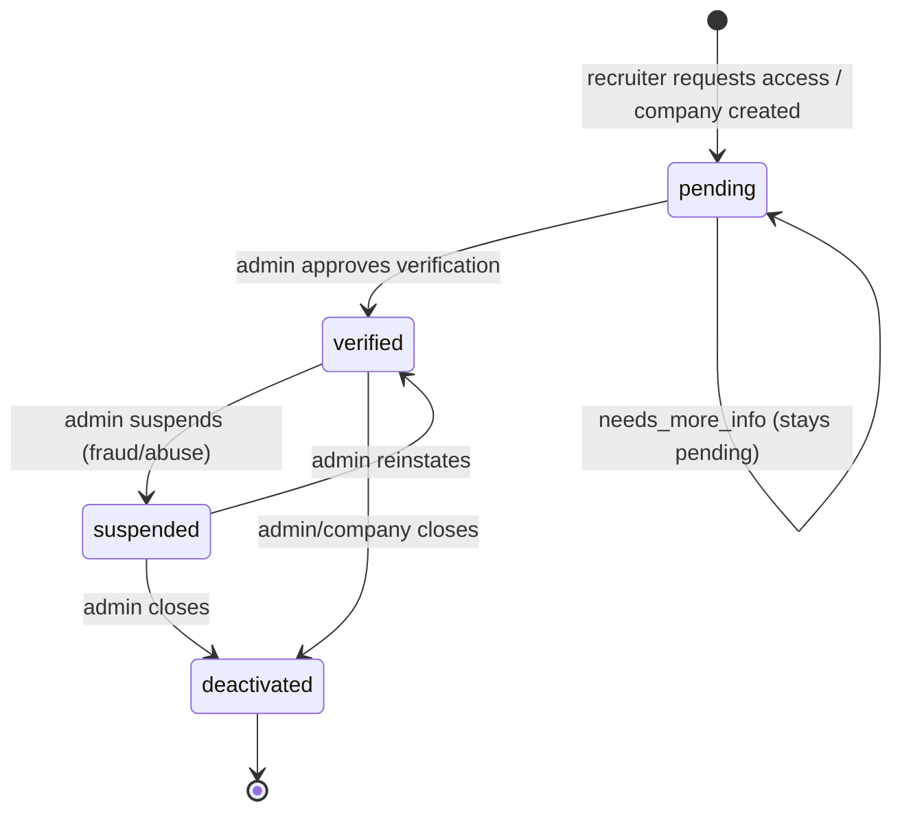
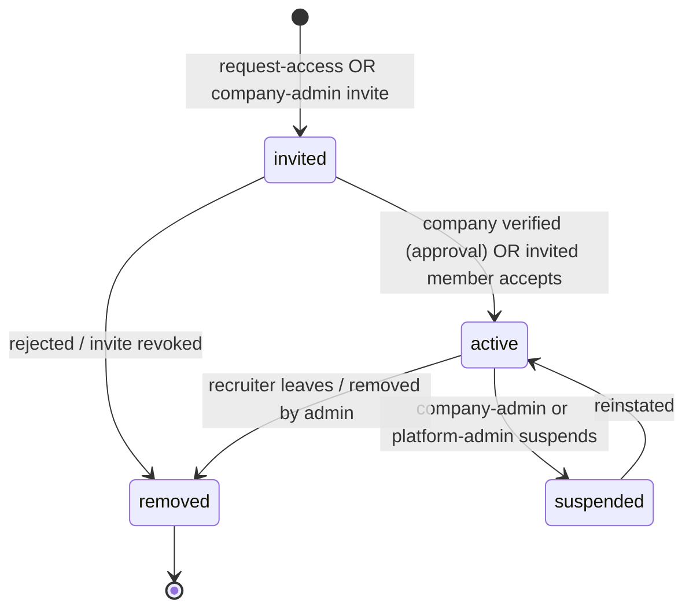
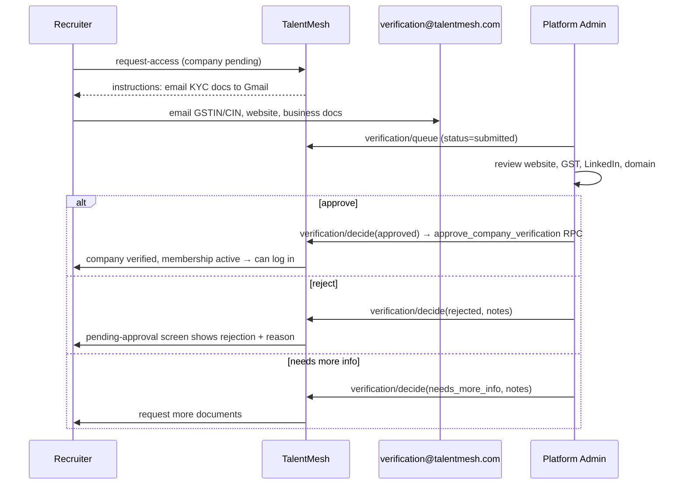
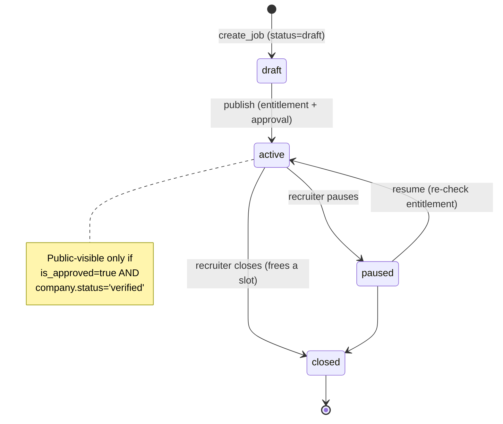

# 04 — State Machines & Business Logic

**Status:** Draft for review
**Owner:** Platform / Backend
**Version:** 1.1 — named the concrete RPCs/trigger behind the membership + verification transitions (reject / needs_more_info / accept-invite / last-admin guard, all 02 migration 051); removed the "enforced in the members RPC/handler" vagueness.
**Last Updated:** 2026-07-16

Cross-refs: `02_Schema_And_Database_Design.md` (columns/RPCs), `03_API_Routes_And_Endpoints.md` (endpoints that trigger transitions), `07_Company_Management_Architecture.md`.

---

# Purpose

Define the authoritative state machines for company, recruiter membership, verification, and jobs — with transition tables (actor · guard · side-effects · audit event) so the DB constraints (`02`) and endpoints (`03`) implement exactly one agreed behavior. Every transition names the actor allowed to trigger it and the audit record it writes (rough-idea §8 "Audit Everything").

---

# 1. Company lifecycle

`companies.status ∈ {pending, verified, suspended, deactivated}`



| From → To | Actor | Guard | Side-effects | Audit action |
|---|---|---|---|---|
| ∅ → pending | recruiter | valid company data; GSTIN not already `verified` elsewhere | insert `companies`, `company_members(admin,invited)`, `company_verification_requests` | `company_created` |
| pending → verified | platform admin | request exists | `approve_company_verification` RPC: company `verified`, members `invited→active`, `verified_at/by` set | `approved` |
| pending → pending | platform admin | — | request `needs_more_info`, notify recruiter | `needs_more_info` |
| verified → suspended | platform admin | — | portal access denied (guard in `06`); jobs hidden from public (see §4 guard) | `company_suspended` |
| suspended → verified | platform admin | — | restore | `company_reinstated` |
| verified/suspended → deactivated | platform admin / company admin | — | soft-close; jobs `closed`; members `removed` | `company_deactivated` |

**Business rule — one company per organization:** dedupe on GSTIN (`companies_gstin_key` unique, `02` migration 046). On collision, `request-access` returns `409 company_exists` and offers "attach to existing" (creates a member row against the existing company instead of a new company).

---

# 2. Recruiter membership lifecycle

`company_members.status ∈ {invited, active, suspended, removed}` (× `member_role ∈ {admin, recruiter, coordinator}`)



| From → To | Actor | Guard | Side-effects | Audit action |
|---|---|---|---|---|
| ∅ → invited | recruiter (self) / company admin | single active membership (`company_members_one_active_per_user`) | insert row (RLS `company_members_admin_write`, 02/047) | `member_invited` |
| invited → active | platform admin (via `approve_company_verification`) / member self-accept | company `verified` | approval RPC flips all invited→active; self-accept via `accept_company_invite` RPC (02/051) sets `joined_at=now()` | `member_activated` |
| invited → removed | platform/company admin | — | row `removed`; partial unique index frees the user to re-apply | `member_removed` |
| active → suspended | company admin / platform admin | last-admin guard (below) | portal guard denies (`06`) | `member_suspended` |
| active → removed | company admin / self | **last active admin cannot be removed/demoted** (below) | jobs keep `recruiter_id` (data-loss-safe); `profiles.company_id` cleared | `member_removed` |

**Business rules:**
- **Recruiter leaves → jobs stay with company** (rough-idea §Recruiter Platform Philosophy). `jobs.company_id` unchanged; `jobs.recruiter_id` retained (SET NULL only on profile delete). Candidate history intact.
- **Last-admin guard:** a company must always have ≥1 active `admin` member. Removing/suspending/demoting the last active admin is rejected. Enforced at the DB by the **`guard_last_company_admin` BEFORE UPDATE/DELETE trigger** (02 migration 051) — it fires on every path (RLS write, `admin_bypass`, RPC), raising `check_violation`; the members PATCH handler surfaces it as `422 last_admin`. To hand off, promote another member to `admin` (active) first, then demote/remove.
- **Rejected recruiter re-application:** allowed — old row is `removed`, partial unique index only covers `invited/active/suspended`.

---

# 3. Verification workflow (manual Gmail-KYC, Phase 1)

`company_verification_requests.status ∈ {submitted, under_review, approved, rejected, needs_more_info}`



| From → To | Actor | Guard | Side-effects | Audit action |
|---|---|---|---|---|
| ∅ → submitted | recruiter | membership `invited` | insert request | `verification_submitted` |
| submitted → under_review | platform admin | — | (optional) assign `reviewer_id` when queue item opened | `verification_review_started` |
| submitted/under_review → approved | platform admin | request pending | `approve_company_verification` RPC (§1, §2 cascades) | `approved` |
| submitted/under_review → rejected | platform admin | — | `reject_company_verification` RPC (02/051): request `rejected`, `review_notes`; company stays `pending`; member stays `invited` | `rejected` |
| submitted/under_review → needs_more_info | platform admin | — | `request_more_info_for_verification` RPC (02/051): status `needs_more_info`, notify recruiter | `needs_more_info` |
| needs_more_info → submitted | recruiter | — | recruiter re-submits via `/api/company/verification/submit` → **new** request row (RLS `cvr_insert_own`); queue shows latest per company | `verification_submitted` |

All three decisions go through admin-gated `SECURITY DEFINER` RPCs (approve in `02` migration 049; reject + needs_more_info in migration 051) so each multi-table cascade + audit write is atomic. `under_review` is optional bookkeeping — the decision RPCs accept a request in `submitted` **or** `under_review`, so a separate "start review" step is not required.

---

# 4. Job lifecycle (with free-plan entitlement guard)

`jobs.status ∈ {draft, active, paused, closed}` (existing enum, `001`) + `is_approved` gate for public visibility.



| From → To | Actor | Guard | Side-effects | Audit action |
|---|---|---|---|---|
| ∅ → draft | recruiter/company-admin (not coordinator) | active company membership | `create_job` RPC (derives company_id/recruiter_id) | `job_created` |
| draft → active | recruiter/company-admin | **active-job count < plan limit** (`enforce_active_job_limit` trigger) | `is_approved` stays false → needs admin approval to show publicly | `job_published` |
| active → paused | recruiter/company-admin | — | frees nothing until closed; hidden from public | `job_paused` |
| paused → active | recruiter/company-admin | entitlement re-checked | — | `job_resumed` |
| active/paused → closed | recruiter/company-admin | — | **frees one active slot** (enables "close one to open another") | `job_closed` |
| any → is_approved=true | platform admin | existing job-approval flow (`app/dashboard/admin/job-approvals`) | public-visible if company verified | `job_approved` |

**Free-plan business rule (rough-idea):** free plan = **1 active job**. The rule "if you have a live posting and want a second, close the active one and post another" is exactly the `active → closed` (frees slot) then `draft → active` sequence. Enforced in the DB by `enforce_active_job_limit` trigger + `create_job` RPC (`02` migration 050) — **never frontend-only**. Limit source: `plan_limits.max_active_jobs` joined via the company's active `subscriptions` row (default 1 when no paid plan).

**Public visibility (defense in depth):** the public read policy `jobs_select_approved` should be amended to also require the owning company `status='verified'` (`02` edge-cases `[SUGGESTION]`), so suspending a company immediately hides its jobs.

---

# 5. Candidate visibility rule (company-scoped)

Not a state machine but the core authorization invariant. A recruiter can see a candidate's profile/resume **only** when that candidate has an application to a job owned by the recruiter's company, in an allowed status:

```
candidate → application → job.company_id == recruiter's active company_id
            AND application.status IN (applied,reviewing,shortlisted,interviewing,offered,hired)
```

Enforced by the company-level RLS policies (`028` originals, re-scoped to `authz.company_id_of()` in `02` migration 050). The frontend never decides this. Every resume view writes `resume_access_log` (existing).

---

# Edge cases (consolidated, rough-idea §12)

| Case | Resolution |
|---|---|
| Recruiter joins existing company | dedupe by GSTIN → `attach_company_id` → member row `invited` against existing company |
| Duplicate company requests | unique GSTIN blocks second company; `409` + attach path |
| Recruiter rejected | verification `rejected`; member stays `invited`; can resubmit |
| Recruiter leaves company | member `removed`; jobs stay; `profiles.company_id` cleared |
| Company deactivated | company `deactivated`; jobs `closed`; members `removed` |
| Suspended recruiter | member `suspended` → portal guard denies; can be reinstated |
| Company name change | update `companies.name`; audit `company_updated`; slug/GSTIN unchanged (identity stable) |
| Last admin leaves | rejected (`422 last_admin`) — must transfer admin first |

# Failure recovery
- All lifecycle mutations are single-RPC atomic (`02`); a failed approval leaves company `pending` (retryable), never a half-verified state.
- Backfill (`049`) is idempotent (`ON CONFLICT DO NOTHING`) — safe to re-run.

# Implementation checklist
- [ ] Each transition maps to an endpoint in `03` and a guard in `02`
- [ ] Every state-changing endpoint writes the named audit action to `verification_audit_log`
- [ ] Last-admin guard implemented as `guard_last_company_admin` trigger (02/051); members PATCH surfaces `422 last_admin`
- [ ] Reject / needs_more_info / accept-invite RPCs (02/051) wired to `03` endpoints
- [ ] `jobs_select_approved` amended to require company `verified` (recorded decision, 09-T6)

# References
`docs/RecruiterAndCompanyRoughIdea.md` §§ Recruiter Activation, Login Flow, Candidate Privacy, Edge Cases; `insforge/migrations/001,028`; `02`, `03`.
