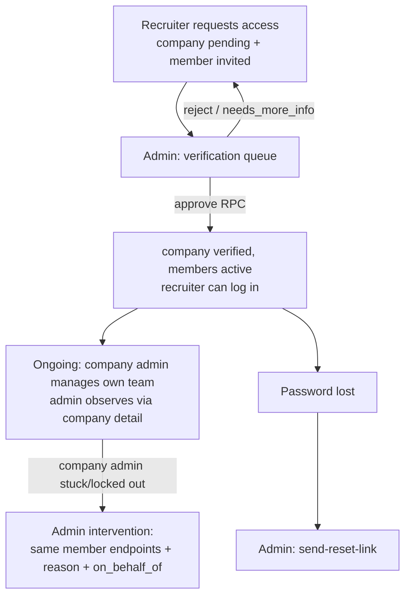

# 06 — Admin Portal ↔ Recruiter Portal Architecture

**Status:** Draft for review
**Owner:** Backend + Admin tooling
**Version:** 1.0 — 2026-07-18
**Cross-refs:** `06_Recruiter_Portal_Architecture.md` (the recruiter-facing half — lifecycle, server guard, collaboration rules), `04_State_Machines_And_Business_Logic.md` (membership machine §2), `14_Admin_Portal_Rebuild_Architecture.md` R-7, `01_Admin_Portal_Auth_Security_Audit_Report.md` AD-5.

# Purpose

Define how the **admin side** manages recruiters now that recruiters are `company_members` under a company — and what replaces the legacy per-recruiter pipeline. Principle: **the admin portal has no recruiter model of its own.** It reads and drives the same `company_members` lifecycle the recruiter portal lives under. Every admin capability here is "the company-admin capability, plus audit, minus nothing."

# What is deleted (and why it cannot be fixed in place)

The legacy `admin-recruiters` pipeline encodes the pre-Company-First world:

| Legacy action | Defect | Replacement |
|---|---|---|
| `approve-setup` | delete-and-recreates the auth user → UUID change orphans every FK; company matched **by name**; non-atomic (D-5) | verification queue approval (`approve_company_verification` RPC — company `verified`, members `invited→active`, atomic) |
| `send-credentials` | plaintext password in email + `mailto:` (D-7) | `send-reset-link` — single-use, 1 h, hash-stored token (03 §5.3) |
| `update-password` | no-op returning `success:true` (D-6) | deleted; reset link is the only path |
| `verify-otp` (admin verifies recruiter's email) | bypasses the recruiter's own mailbox proof | deleted; verification email belongs to the recruiter |
| `admin-recruiter` / `access_requests` | second intake path, drifts from the first (D-22) | single intake: request-access → verification queue |

# Recruiter lifecycle, admin view

The full machine is recruiter-suite doc 04 §2 (`invited → active → suspended → removed`). Admin's touchpoints:



# Directory (`/dashboard/admin/recruiters`)

**Backend:** `admin-recruiters` GET rebuilt (03 §7):

```
profiles(role='recruiter')
  ⟕ company_members (status, member_role, company_id, joined_at)
  ⟕ companies (name, gstin, status)
filters: search (name/email, escaped) · membership_status · company_id · sort
```

Columns: name · email · company (`EntityLink` → company detail) · member_role · membership `StatusBadge` · joined. A recruiter with **no** membership row shows `no company` — reachable state (removed member; profile-only account) and filterable, since these accounts can't use the portal (recruiter-suite guard denies) and are candidates for cleanup.

**Detail drawer** (replaces 3,062-line page sprawl): profile fields · membership history (all `company_members` rows incl. `removed`) · jobs authored (`jobs.recruiter_id`) · actions below.

# Admin actions on a recruiter

| Action | Mechanism | Guard | Audit |
|---|---|---|---|
| Suspend / reinstate membership | member PATCH (same endpoint the company admin uses) | last-admin trigger (`422 last_admin` when target is the only active company admin) | `member_suspended` / `member_reinstated` + `on_behalf_of` |
| Remove from company | member PATCH → `removed` | same last-admin guard; jobs stay with company (`recruiter_id` retained) | `member_removed` + `on_behalf_of` |
| Change member role (admin/recruiter/coordinator) | member PATCH | last-admin guard on demotion | `role_changed` + `on_behalf_of` |
| Password reset | `send-reset-link` (03 §5.3) | `recruiters.edit` | `reset_link_sent` (never the token) |
| Platform-level suspend (account, not membership) | `profiles.is_active=false` via `admin-recruiters` PATCH | — | `account_suspended` |
| Edit profile fields | PATCH allowlist `['job_title','about','phone']` | — | `recruiter_updated` |
| Delete account | super_admin only (`recruiters` has no `delete` for `admin` — R-4 matrix); cascades per existing fn but **audited** (D-3) | membership must be `removed` first (else 409 `active_membership`) | `recruiter_deleted` |
| Custom proposal (INR) | `/api/admin/send-proposal` (fixed D-23/D-24) | `recruiters.edit` | via `withApi auditLog` |

**Membership vs account suspension — deliberate split:** membership suspension (company-scoped, the company admin could also do it) blocks portal access for that company; account suspension (platform-scoped, admin-only) blocks login entirely. The drawer shows both switches with distinct copy.

# Create-recruiter-on-behalf (admin-assisted onboarding)

One code path with self-serve (doc 14 R-7e): the admin form submits the same **request-access** shape — company resolve-or-create **by GSTIN** (409 → attach), member `invited`, verification request created — then the admin approves it in the queue immediately. `RecruiterRegisterForm` becomes a thin wrapper over that flow; the invitee receives a set-password link (`password_setup_tokens`, purpose `staff_invite` pattern but recruiter-scoped), never an admin-typed password.

**PAN/Aadhaar — CONFIRMED not collected (decision 3).** Phase-1 KYC is manual through the verification Gmail mailbox (company-suite doc 07), so no PII identity numbers are gathered anywhere in intake. This removes the D-12 exposure entirely — there are no PAN/Aadhaar columns to protect because nothing writes them. Applies to admin create-on-behalf **and** the public signup form (next section).

# Signup form alignment — `/signup/recruiter?variant=application` (decision 3)

The public recruiter application form (`components/auth/RecruiterRegisterForm.tsx`, rendered by `app/(auth)/signup/recruiter/page.tsx` for `variant=application`) predates Company-First and still collects PII + KYC uploads that the manual-Gmail Phase-1 flow makes redundant. It must be brought in line with the recruiter-side model — the same alignment already applied elsewhere.

**Verified current state (source, 2026-07-18):** the form gathers `panNumber`, `aadhaarNumber`, a **KYC document upload** (`kycBase64`), a company verification document upload (`documentBase64`), plus emergency-contact name/phone/address, and POSTs all of it to the `recruiter-request` edge function with `request_type: 'access_application'` (`RecruiterRegisterForm.tsx:566-598`). It validates PAN/Aadhaar/GSTIN/TAN client-side.

| Field | Detail |
|---|---|
| **Server-side changes** | `recruiter-request` edge fn: stop accepting/persisting `pan_number`, `aadhaar_number`, `kyc_document_base64/name`, and the emergency-contact fields. Align the intake with the request-access contract (company resolve-or-create **by GSTIN**, member `invited`, `company_verification_requests` row). GSTIN becomes **required** (it is the company key — company-suite doc 04 §1); the KYC *documents* are no longer uploaded through the app — the success screen instructs the applicant to email them to `verification@talentmesh.com` (Phase-1 manual flow). Keep: full name, work email, phone (+91 format), company name/website/industry/size/address, **GSTIN** (required), CIN (optional), role in company, hiring intent (num_roles/timeline/categories), company logo (optional). |
| **Client-side changes** | `RecruiterRegisterForm.tsx`: delete the PAN, Aadhaar, KYC-upload, and emergency-contact fields and their `validatePAN`/`validateAadhaar` calls and step; make GSTIN required with the existing `validateGSTIN`; update the success screen copy to "email your KYC documents to verification@talentmesh.com — we'll verify and activate your account" (mirrors the manual Phase-1 wording in doc 07). Remove the now-dead company-verification-document upload too (KYC is entirely email-based in Phase 1) unless product wants to keep one optional doc — default: remove, since the mailbox is the channel. |
| **Impact if changed** | Signup stops collecting sensitive identity numbers the platform has no lawful basis to hold in Phase 1 (DPDP minimization); intake matches the single GSTIN-keyed path admin and recruiter both use; no duplicate-tenant-by-name risk from this form. |
| **Impact if not changed** | The public form keeps harvesting PAN/Aadhaar into `recruiter_profiles` (the exact D-12 exposure decision 3 exists to eliminate), and it feeds the legacy name-keyed intake that R-7 is deleting — leaving two contradictory front doors. |
| **Reason for change** | Decision 3; consistency with Company-First intake (doc 06 recruiter suite) and manual Phase-1 KYC (doc 07). |
| **Deploy priority** | **P1** — ships with R-7 (same intake path); the PII removal itself is **P0** (stop collecting before any real signups). |

**Note on `variant=call`** (`BookACallForm`): unaffected — it books a call, collects no KYC/PII identity numbers. Only the `application` variant changes.

# Interaction with the recruiter portal guard

The recruiter-suite server guard (their doc 06: `role='recruiter'` ∧ membership `active` ∧ company `verified`) is the enforcement point for everything above — admin actions *cause* state, the guard *applies* it on the recruiter's next request. Admin never toggles portal access directly; it only moves lifecycle state. This is why there is no "grant portal access" button anywhere in the admin UI — access is always a derived fact.

# Edge cases

| Case | Resolution |
|---|---|
| Admin removes the last active company admin | `422 last_admin` → UI: "Promote another member first" (works for admin exactly as for company admins) |
| Recruiter with membership in company A applies to join company B | single-active-membership partial unique index rejects; admin resolves by removing A first (recruiter-suite doc 04 §2 rule) |
| Reset link requested twice | `pst_live_uidx` — new token replaces old (old dead); 60 s cooldown |
| Admin-created recruiter never sets password | token expires (24 h); account exists but can't log in; directory filter `never_activated` surfaces them; re-send available |
| Orphan recruiter (profile, no membership, no company) | visible under `no company` filter; deletable (no `active_membership` block) |

# Implementation checklist

- [ ] Legacy actions deleted from `admin-recruiters`; `admin-recruiter` fn deleted; e2e proves no plaintext-credential path remains (grep + spec)
- [ ] Directory GET joins `company_members`/`companies`; `no company` + `never_activated` filters work
- [ ] All membership actions round-trip through the shared member endpoints with `on_behalf_of` + reason
- [ ] `send-reset-link` end-to-end: email → set → login; token single-use verified
- [ ] Create-on-behalf lands as `invited` + verification request; approval activates through the queue
- [ ] `/signup/recruiter?variant=application` no longer sends/persists PAN, Aadhaar, KYC upload, or emergency contacts; GSTIN required; success screen points to verification@talentmesh.com (grep `RecruiterRegisterForm.tsx` + `recruiter-request` fn for the removed fields)
- [ ] W9 spec: admin hitting last-admin guard gets 422, not 500
