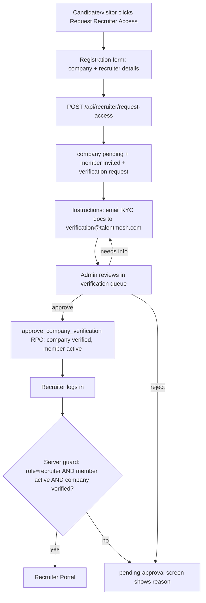

# 06 — Recruiter Portal Architecture

**Status:** Draft for review
**Owner:** Frontend + Backend
**Version:** 1.0
**Last Updated:** 2026-07-16

Cross-refs: `01` (H-9 guard gap), `02` (schema/RPCs), `03` (APIs), `04` (states), `05` (UI), `07` (company management).

---

# Purpose

Define the end-to-end recruiter experience — from requesting access to operating inside the portal — and the **server-side enforcement** that makes it safe. The portal is currently disabled behind a `coming-soon` rewrite in `proxy.ts` (`app.*` non-auth paths → `/portals/coming-soon`); this doc specifies what must be true to un-gate it.

---

# Background

- Scaffold exists: `app/dashboard/recruiter/[role_id]/*` (`05`).
- **Critical gap (audit H-9):** `app/dashboard/recruiter/[role_id]/layout.tsx` returns a pass-through client wrapper and **never calls `getServerUser()`** — recruiter routes are effectively unprotected server-side, contradicting `proxy.ts`'s "all authz in layout RSCs" design. Fixing this is P0-2 and the centerpiece of this doc.

---

# Recruiter lifecycle (end to end)



This implements rough-idea "Recruiter → Request Access → Registration → Pending → KYC email → Activation → Login gate (status==active)".

---

# The server guard (P0-2 — the fix for H-9)

Replace the pass-through recruiter layout with an authoritative RSC guard, mirroring `app/dashboard/admin/layout.tsx`:

```tsx
// app/dashboard/recruiter/[role_id]/layout.tsx  (server component)
import { redirect } from 'next/navigation';
import { getServerUser } from '@/lib/server-auth';
import { getServerInsforgeClient } from '@/lib/server-insforge';
import RecruiterLayoutClient from './RecruiterLayoutClient';

export default async function RecruiterDashboardLayout({ children }) {
  const user = await getServerUser();                 // authoritative boundary (01)
  if (!user) redirect('/login');
  if (user.role !== 'recruiter') redirect('/dashboard'); // wrong portal

  // Resolve ACTIVE company membership + company status server-side (never trust client)
  const db = await getServerInsforgeClient();
  const { data: member } = await db.database
    .from('company_members')
    .select('company_id, member_role, status, companies(status)')
    .eq('user_id', user.id)
    .eq('status', 'active')
    .maybeSingle();

  if (!member) redirect('/pending-approval');                 // invited/suspended/none
  if (member.companies?.status !== 'verified') redirect('/pending-approval');

  return (
    <RecruiterLayoutClient companyId={member.company_id} memberRole={member.member_role}>
      {children}
    </RecruiterLayoutClient>
  );
}
```

**Why this closes H-9:** every recruiter route now requires, on the server, a real session (`getServerUser`), the recruiter platform role, an **active** membership, and a **verified** company. The parent `app/dashboard/layout.tsx` still applies authentication/suspension/onboarding/MFA gates on top. Client code (`RecruiterLayoutClient`) becomes UX-only; disabling JS or hitting RSCs directly cannot bypass it.

**Un-gate condition:** once this guard ships (and P0-1/3/4/5 from `01`), remove the `app.*` → `/portals/coming-soon` rewrite in `proxy.ts` for authenticated recruiter paths.

---

# Information architecture / navigation

`OpsDarkSidebarShell` sections (map to existing routes):

```
Overview        → /dashboard/recruiter/[role_id]
Jobs            → .../jobs            (list, post-job, edit, publish/close)
Pipeline        → .../pipeline        (application stages)
Candidates      → .../candidates      (company-scoped; PII gated by RLS)
Interviews      → .../interviews
Offers          → .../offers
Invitations     → .../nvite
Messages        → .../messages
Reports         → .../reports
Team*           → .../settings/team   (company-admin only)
Company*        → .../settings/company (company-admin only)
Settings        → .../settings
```
`*` company-admin-only sections hidden via `company_members.member_role` (`05` matrix).

---

# Data fetching

- Use TanStack Query with keys under `lib/queries/queryKeys.ts` (extend with `recruiter`/`company` namespaces). Reads go through the `insforge` proxy client (RLS scopes them to the company automatically — no client-side `company_id` filtering needed, which is also the safe pattern per `01`).
- Mutations call the `03` endpoints / `02` RPCs. Never write `jobs`/`company_members` directly from the client.
- `companyId`/`memberRole` come from the server guard via `RecruiterLayoutClient` props (or a small context), so client components don't re-derive trust.

---

# Collaboration rules (multi-recruiter, rough-idea §8)

- Recruiter A and Recruiter B in the same company both see all **company** jobs and applicants (RLS `jobs_select_company`, `apps_company_view`).
- A recruiter can **edit only their own** jobs (`recruiter_id = auth.uid()`); a company-admin can edit any (`jobs_update_company`, `02`).
- Coordinators: view assigned applicants, assist scheduling/messaging, **cannot** post/publish jobs (`create_job` RPC rejects).

---

# Notifications

Reuse the existing notification stack (`notification_*` tables, `lib/hooks/useRealTimeNotifications`). New event types to emit: `verification_approved`, `verification_rejected`, `member_invited`, `job_approved`. Fire from the RPCs/endpoints that own those transitions (`04`).

---

# Edge cases
- **Pending recruiter reaches a portal URL:** guard redirects to `/pending-approval` (membership not `active`).
- **Company suspended mid-session:** next RSC render re-checks `companies.status` and redirects; jobs also drop from public (`04` §4).
- **Recruiter removed:** membership `removed` → `authz.company_id_of` null → guard denies; jobs remain with company.

# Implementation checklist
- [ ] Server guard replaces pass-through layout (P0-2); verified by direct RSC hit + JS-off test
- [ ] Sidebar sections gated by member_role
- [ ] Query keys namespaced; no client company_id filtering for authorization
- [ ] Notifications wired to lifecycle events
- [ ] proxy.ts coming-soon rewrite removed only after Phase 0 P0s land

# References
`app/dashboard/recruiter/[role_id]/layout.tsx`, `app/dashboard/admin/layout.tsx`, `lib/server-auth.ts`, `lib/server-insforge.ts`, `proxy.ts`, `lib/queries/queryKeys.ts`, `lib/hooks/useRealTimeNotifications.ts`; `01`, `02`, `03`, `04`, `05`.
