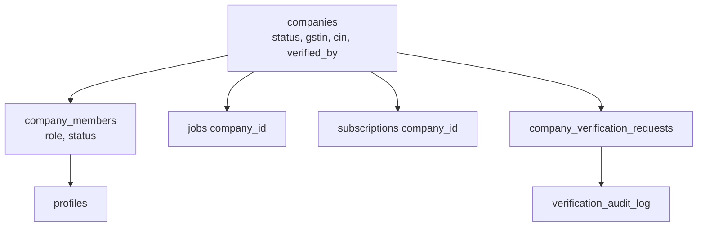
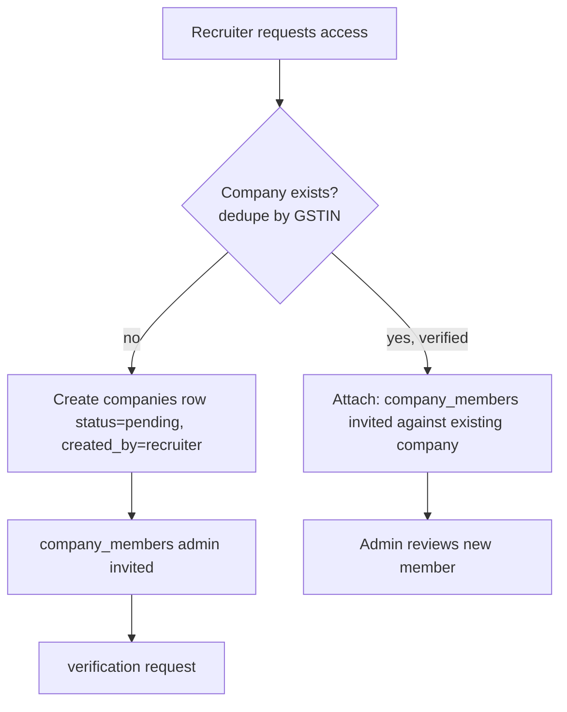

# 07 — Company Management Architecture

**Status:** Draft for review
**Owner:** Backend + Admin tooling
**Version:** 1.0
**Last Updated:** 2026-07-16

Cross-refs: `02` (companies/company_members/verification schema), `03` (admin verification APIs), `04` (company lifecycle), `06` (recruiter portal).

---

# Purpose

Define the **company as the root business entity** — its creation, verification, membership/team management, billing scope, and the admin-side tooling that operates it. This is the "Company" half of the Company-First architecture; `06` is the recruiter-facing half.

---

# Company as root entity

Per rough-idea §1: companies own jobs, candidate pipelines, subscriptions, branding, and recruiter teams. Recruiters are members. The schema (`02`) encodes this: `companies` (root), `company_members` (recruiter↔company + role + status), `jobs.company_id`/`subscriptions.company_id` → `companies`.

---

# Company creation & attach flow

From rough-idea "Company Creation" (create if not found; attach if exists — one record per organization):

- **Uniqueness** enforced by `companies_gstin_key` (`02`). Second request for the same GSTIN → `409` + attach path (`03` `request-access`, `attach_company_id`).
- **First member becomes company admin** (`member_role='admin'`), backfilled for existing data in migration 049.

---

# Verification (manual, Phase 1)

Owned by platform admins. Full state machine in `04` §3. Key points:

- Recruiter emails KYC docs to `verification@talentmesh.com` (Gmail-based, no upload portal in Phase 1).
- Admin reviews: company website, GSTIN/GST details, CIN, LinkedIn, email domain, business documents (rough-idea checklist).
- Decision via `/api/admin/verification/decide` → `approve_company_verification` / `reject_company_verification` / `request_more_info_for_verification` RPCs (02 migrations 049+051; admin-gated, atomic, audit-logged).
- Approval cascade: company `verified`, members `invited→active`, recruiter can log in (`06` guard passes).

**[SUGGESTION]** Future automated assists (GST API validation, domain/email-match, duplicate detection, OCR) are explicitly Phase 2 (rough-idea "Automated Verification Assistance") — they *assist*, never replace human approval. Keep the manual RPC path as the authority.

---

# Admin dashboard responsibilities

Map to existing `app/dashboard/admin/*` (extend, don't rebuild — `05`):

| Responsibility | Existing surface | Add |
|---|---|---|
| Verification queue | `admin/recruiter-requests`, `admin/companies/register` | `VerificationDecisionModal`, wire to `/api/admin/verification/*` |
| Company management | `admin/companies` | company detail: status, members, jobs, audit trail |
| Recruiter management | `admin/recruiters` (`RecruiterRegisterForm`) | suspend/reinstate via member status |
| Audit history | `admin/audit-logs` | surface `verification_audit_log` per company |
| Job approvals | `admin/job-approvals` | unchanged (existing `is_approved` flow) |
| Plans/billing | `admin/plans`, `admin/billing` | tie to `plan_limits` + `subscriptions` |

---

# Team management (by company admin)

Inside the recruiter portal (`06`), a company admin manages their own team:

- **Invite** (`inviteMemberSchema`) → `company_members(status='invited')` → invitee gets access on accept/approval.
- **Change role** (admin/recruiter/coordinator) → PATCH member.
- **Suspend / remove** → member status; **last-admin guard** (`04` §2) prevents removing the only admin.
- All actions write `verification_audit_log` (`member_invited`/`role_changed`/`member_removed`).

RLS (`02`): `company_members_admin_write` restricts writes to company-admins of that company; `company_members_read_own_company` lets any member read the roster.

---

# Billing scope (Phase 1)

Reuse existing billing (`subscriptions`, `subscription_events`, `custom_proposals`, Razorpay + INR already integrated — `01`/`02` inventory). Company-scoped:

- `subscriptions.company_id → companies` (FK enforced in `02` migration 049).
- **Free plan = 1 active job** (`plan_limits.max_active_jobs=1`), DB-enforced (`04` §4). Paid plans raise the limit; the "close one to open another" rule falls out of the entitlement check.
- **India billing:** invoices carry company GSTIN, INR amounts, GST line (IT Act / GST compliance). `custom_proposals` covers enterprise custom pricing (existing `send-proposal` — **must be secured first**, audit C-3 / P0-3).
- **[SUGGESTION]** international readiness: `companies.country_code` (`02`) lets billing branch currency/tax later without schema change.

---

# Talent Pool (future, flagged off)

Resdex/Indeed-style active sourcing is a **paid, Phase-2** feature. `lib/features.ts` already has a disabled `TALENT_POOL` flag and `plan_limits.talent_pool` boolean (`02`). Phase 1: no AI, no sourcing DB — keep the flag off. Document only; do not build.

---

# Audit everything (rough-idea §8)

Every company/verification/member action writes `verification_audit_log` (append-only, member-readable for own company, admin-readable all — `02`). This gives support/compliance a complete history: company created → docs reviewed → approved/rejected → member activated → role changes → suspension.

# Edge cases
- Company name change: identity stays (GSTIN/slug fixed); audit `company_updated`.
- Company suspended: portal denied (`06`), jobs hidden (`04`), billing frozen (business call).
- Duplicate GSTIN: blocked at DB; attach flow instead.

# Implementation checklist
- [ ] Admin verification queue + decision modal wired to RPCs
- [ ] Company detail page surfaces members + audit trail
- [ ] Team management (invite/role/remove) with last-admin guard
- [ ] subscriptions/plan_limits tie-in; free-plan limit visible
- [ ] `send-proposal` secured (P0-3) before exposing custom pricing
- [ ] TALENT_POOL flag stays off

# References
`app/dashboard/admin/*`, `app/dashboard/admin/_components/{CompanyRegisterForm,RecruiterRegisterForm}.tsx`, `lib/features.ts`, `app/api/admin/send-proposal/route.ts`; `02`, `03`, `04`, `05`, `06`; rough-idea §§ Company Creation, Verification, Audit Trail, Talentpool.
