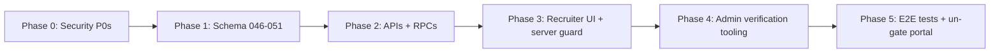

# 08 — Implementation Execution Plan

**Status:** Draft for review
**Owner:** Eng lead
**Version:** 1.2 — P0-6 marked **RESOLVED**: the L-1 policy is absent from the live DB (re-verified 2026-07-16), dropped out-of-band via `run-raw-sql` with no ledger record. No apply is needed. See `01` (L-1).

**Version:** 1.1 — Phase 0 status reconciled with source (P0-1/P0-3 done); added P0-6 (live `companies` RLS hole, L-1); Phase 1 updated for in-place `companies` alter (no rename).
**Last Updated:** 2026-07-16

Cross-refs: all of `01`–`07`. This is the ordered, dependency-aware build plan. Each task uses the CLAUDE.md per-change table.

---

# Purpose

Sequence the Recruiter Portal + Company Management build so it ships safely: **security fixes first** (the portal is a PII/billing surface), then schema, then APIs, then UI, then admin tooling, then tests. Nothing that exposes recruiter routes ships before Phase 0 is verified.

---

# Dependency order

---

# Phase 0 — Security launch blockers (from `01`)

Must be verified before any recruiter route is reachable.

| Task | Priority | Status | Server-side changes | Client-side changes | Impact if not changed | Verify |
|---|---|---|---|---|---|---|
| P0-1 Remove/env-gate mock auth | P0 | ✅ **DONE** (`lib/server-auth.ts:20-42`, `refresh/route.ts:18-36` — both `ALLOW_MOCK_AUTH`-gated, mock cookies httpOnly) | Remaining: add a prod env-lint asserting `ALLOW_MOCK_AUTH!=='true'` when `NODE_ENV==='production'`; unify with `lib/auth/server-auth.ts`'s `ENABLE_MOCK_AUTH` flag | none | Cookie `mock-admin-token` = free super-admin (C-2) | Prod build: mock cookie → no session |
| P0-3 Secure admin APIs | P0 | ✅ **DONE** (`send-proposal/route.ts:16-17` withApi-wrapped; `auth/session` no longer trusts body role) | Remaining: audit every other `/api/admin/*` route for the same `withApi` wrapper | none | Unauth service-key write + self-set admin cookie (C-3) | Non-admin → 403; self-set cookie ineffective |
| P0-6 Fix live `companies` RLS | P0 | ✅ **RESOLVED — no apply needed** | Policy absent from live DB (re-verified 2026-07-16); `insforge/migrations/045b_fix_companies_rls_L1.sql` now committed for provenance; drop stays folded idempotently into mig 046. No interim policy required — RLS is on and no non-admin write policy exists, so recruiter writes are already denied | none | — (hole already closed) | Recruiter A can't UPDATE company of B |
| P0-4 Server-derive job ownership | P0 | ❌ **OPEN** | `create_job` RPC (`02` mig 049); remove client `company_id`/`recruiter_id` from `jobs` edge fn (`insforge/functions/jobs/index.ts:28-29,55-61`) | job form drops company_id/recruiter_id fields | Cross-tenant job creation (C-4) | Recruiter can't post under another company_id |
| P0-5 Lock `profiles` privileged cols | P0 | ❌ **OPEN** (verify live policy first, `01` C-1) | `guard_profile_privileged_cols` trigger (`02` mig 047) | none | Self-escalation to super_admin (C-1) | Candidate PATCH role → rejected |
| P0-2 Recruiter server guard | P0 | ❌ **OPEN** | (implemented in Phase 3 with the layout) | — | Unprotected recruiter routes (H-9) | see Phase 3 |

**Phase 0 note:** P0-1 and P0-3 are already implemented in the working tree (verified in source 2026-07-16). **P0-6 is RESOLVED** — the L-1 policy is absent from the live DB (re-verified 2026-07-16); it was applied out-of-band and needs no gate or apply. Still open: P0-2, P0-4, P0-5.

**Trust warning (from the P0-6 investigation):** P0-6 was written from a live inspection that a later live re-check contradicted, because production DDL is reaching the DB without `system.custom_migrations` recording it (the ledger is empty). **Re-verify every remaining live-state claim in `01` against the live DB before acting on it** — including L-2's 16 policies on `jobs`, which is the next-highest live-state finding and has not been re-checked.

P1 hardening (L-2 dedupe live `jobs` policies/triggers/index, L-4 password length ≥8 + OAuth redirect allow-list, H-6 MFA signature, H-7 crypto OAuth state + hard-fail, H-8 remove JS-readable token, M-10 approval RPCs) — schedule alongside Phase 2–3, before GA.

---

# Phase 1 — Schema (migrations 046–051)

Apply in order (`02`). Each is idempotent; register in `insforge/migrations/`.

| Task | Priority | Verify |
|---|---|---|
| 046 **in-place alter of live `companies`** + lifecycle/KYC cols + `is_verified→status` map + drop L-1 policy (already a no-op — dropped out-of-band, keep the idempotent `DROP ... IF EXISTS`) + drop empty `company_profiles` | P0 | 6 companies keep correct status; `"Recruiters manage company"` gone (already true as of 2026-07-16); `company_profiles` dropped |
| 047 `company_members` + `authz` helpers + profile guard trigger | P0 | C-1 test passes |
| 048 verification + audit tables + RLS | P0 | recruiter can insert own request; can't read others |
| 049 `created_by` backfill (from earliest job's recruiter) + member backfill + FKs + `approve_company_verification`/`create_job` RPCs | P0 | every recruiter with a job/company_id has a member row; RPCs execute |
| 050 drop the 14 user-reachable live `jobs` policies by name (`admin_bypass`/`project_admin_policy` retained — 09 decision 2026-07-17) + company-scoped RLS + dedupe triggers/index + `plan_limits` + limit trigger | P0 | 2nd active job rejected; recruiter sees company applicants; blanket owner-update paths gone — update requires company membership (L-2 closed). Note: owners can still edit their own approved job's content (live #12 always allowed this); a re-approval-on-edit trigger is a **P1 follow-up**, needs 04/05 flow design |
| 051 verification reject/needs_more_info RPCs + `guard_last_company_admin` trigger + `accept_company_invite` RPC | P0 | reject/needs-info flip state atomically; removing sole admin → `last_admin`; invitee can accept into a verified company |

**Verify method:** run each migration against a staging InsForge branch **restored from a live snapshot** (git migrations do not reflect live state); grep for bare `auth.uid()` (must be zero in new files); run the RLS checks in `02` checklist. See `09` runbook T1 for capturing the live baseline first.

---

# Phase 2 — APIs + RPCs (`03`)

| Task | Priority | Notes |
|---|---|---|
| `lib/validation/company.ts` (schemas + India regexes) | P0 | extends `lib/validation/recruiter.ts` |
| `recruiter/request-access`, `recruiter/status` | P0 | dedupe + attach; role bump server-side |
| `company/*` (profile, members invite/patch) | P1 | company-admin scoped |
| `company/verification/submit`, `admin/verification/{queue,decide}` | P0 | decide → RPC |
| `jobs` (create via RPC, publish/close, patch) | P0 | entitlement error contract |
| `applications` (company view, status via existing RPC) | P1 | reuse `update_application_status` |

**Verify:** integration test each route for 401/403/409 paths; confirm `company_id` never authorizes from body.

---

# Phase 3 — Recruiter UI + server guard (`05`, `06`)

| Task | Priority | Server-side | Client-side | Verify |
|---|---|---|---|---|
| P0-2 Recruiter layout server guard | P0 | rewrite `app/dashboard/recruiter/[role_id]/layout.tsx` (getServerUser + active member + verified company) | `RecruiterLayoutClient` takes companyId/memberRole props | Direct RSC hit w/o recruiter role → redirect; JS-off blocked |
| Overview, Jobs list, Post/Edit job | P0 | — | reuse ops kit; PlanUsageCard; RPC submit | publish at limit → 409 flow |
| Candidates/Pipeline | P1 | — | company-scoped (RLS) | PII only for allowed statuses |
| Team + Company settings | P1 | — | company-admin gated | last-admin guard error surfaces |
| pending-approval wiring | P0 | — | `/api/recruiter/status` | shows correct state |

---

# Phase 4 — Admin verification tooling (`07`)

| Task | Priority | Notes |
|---|---|---|
| Verification queue + `VerificationDecisionModal` | P0 | extend `admin/recruiter-requests` |
| Company detail (members + audit trail) | P1 | surface `verification_audit_log` |
| Recruiter suspend/reinstate | P1 | via member status |

---

# Phase 5 — Tests + un-gate

| Task | Priority | Notes |
|---|---|---|
| Playwright e2e per flow | P1 | follow `e2e/*.spec.ts` conventions: `recruiter-onboarding.spec.ts`, `company-verification.spec.ts`, `job-entitlement.spec.ts` |
| Security regression tests | P0 | mock-auth gone; self-escalation blocked; cross-tenant job blocked |
| Remove `app.*`→coming-soon rewrite in `proxy.ts` | P0 | **only after** Phase 0 verified in prod build |

**Test conventions:** Vitest for unit (validators/RPC input shaping), Playwright for flows. Current coverage is thin (2 unit tests) — add at least the security regressions and the onboarding happy-path.

---

# Model assignment (who executes what)

This build is executed by a mix of models, with **Claude Fable 5 as the standing advisor/architect** and stronger/faster models doing the hands-on work. Assign by **blast radius**, not by preference: the more irreversible or security-critical a task, the stronger the model — and the harder the Fable review gate after it.

## The loop (run for every task)
1. **Plan / advise — Fable 5.** Fable confirms the task's intent, preconditions, and the exact acceptance check *before* code is written (it already holds this doc set as context).
2. **Execute — an execution model** (below) writes the code/SQL against the task spec.
3. **Review — Fable 5 (parallel session).** After each execution, a fresh Fable session reviews the diff against the task's Verify criteria and this doc set. It does **not** rubber-stamp: it re-checks RLS house rules, `(SELECT auth.uid())` usage, no client-trusted `company_id`, and the state-machine guards. Only a green Fable review advances to the next task.

## Capability tiers → your models

| Tier | Use for | Your models |
|---|---|---|
| **T-Advisor** | Planning, architecture calls, post-execution review, security-regression interpretation, gate go/no-go | **Fable 5** (primary + parallel review session) |
| **T-High** | Security-critical & hard-to-reverse work: SECURITY DEFINER RPCs, RLS policies, the gated live migration apply, the C-1/C-4/L-1 fixes, auth-boundary code | **Opus** or **Gemini Pro 3.1** — always followed by a Fable review |
| **T-Mid** | Deterministic transcription & boilerplate: copying verbatim DDL into migration files, `withApi` route handlers from the exact specs in `03`, Zod schemas, wiring RPC calls | **Sonnet** or **Gemini Flash 3.5** |
| **T-Read** | Read-only exploration, reference audits, live-baseline capture (no writes) | **Gemini Flash 3.5** or **Sonnet** |

**Rule of thumb:** if getting it wrong silently corrupts data, escalates privilege, or can't be reverted without a snapshot restore → **T-High + Fable review**. If the spec is exact and the model is transcribing → **T-Mid**. If nothing is being written → **T-Read**.

## Per-phase assignment

| Phase | Work | Execute with | Fable review depth |
|---|---|---|---|
| 0 — Security P0s | mock-auth lint (done), remaining `/api/admin/*` audit, ~~P0-6 companies RLS~~ (resolved), P0-4 job RPC, P0-5 profiles trigger | **T-High** (RLS/auth/privilege) | **Deep** — these are the audit findings; re-verify each against `01` **and against the live DB** (P0-6 showed `01` can be stale) |
| 1 — Schema 046–051 | writing migration files from `02` verbatim | **T-Mid** to author files; **T-High** to author/verify the RPC + RLS logic (049/050/051) and to run the **gated live apply (T10/T11)** | **Deep** on 046 (in-place alter + is_verified→status), 049/050/051 (RPCs, policies, triggers); **Light** on 047/048 transcription |
| 2 — APIs + RPCs | `withApi` routes from `03` specs | **T-Mid** (specs are exact) — **T-High** for any handler deriving company scope / calling RPCs | **Medium** — confirm `company_id` never authorizes from body |
| 3 — Recruiter UI + guard | pages/components; **P0-2 server guard** | **T-Mid** for UI; **T-High** for the layout server guard (auth boundary) | **Medium**; **Deep** on the guard |
| 4 — Admin tooling | verification queue, decision modal, member mgmt UI | **T-Mid** | **Light** |
| 5 — Tests + un-gate | Playwright/Vitest; **removing the coming-soon rewrite** | **T-Mid** for tests; **T-Advisor sign-off** required before un-gating | **Deep** — the security regressions are the launch gate |

**Non-negotiables regardless of model:** the RLS house rules in `02` (§RLS house rules), no bare `auth.uid()`, no client-trusted `company_id`, and every gated live-DB step (runbook T10–T11) needs explicit human go-ahead plus a Fable review of the applied result.

---

# Rollout gates

1. Phase 0 verified in a production build → 2. Phases 1–2 on staging branch → 3. Phase 3–4 behind the existing coming-soon rewrite (internal QA) → 4. Phase 5 green → 5. remove rewrite, enable for a pilot company, monitor `authorization_events`/audit log → 6. GA.

# Success criteria (goal-driven, CLAUDE.md §4)
- [ ] All open P0s (P0-2, P0-4, P0-5) have a passing regression test; P0-1/P0-3 regression tests confirm they stay fixed
- [ ] P0-6 (resolved) has a regression test pinning the live `companies` policy set — it was closed out-of-band with no ledger entry, so nothing currently prevents the policy being re-added the same way
- [ ] Recruiter can onboard → verified → post 1 job → blocked on 2nd active → close → post again
- [ ] Recruiter cannot see another company's candidates or create a job under another company
- [ ] Candidate cannot self-promote role
- [ ] Every lifecycle action produces an audit row

# References
All of `01`–`07`; `insforge/migrations/`, `e2e/`, `vitest.config.ts`, `proxy.ts`.
