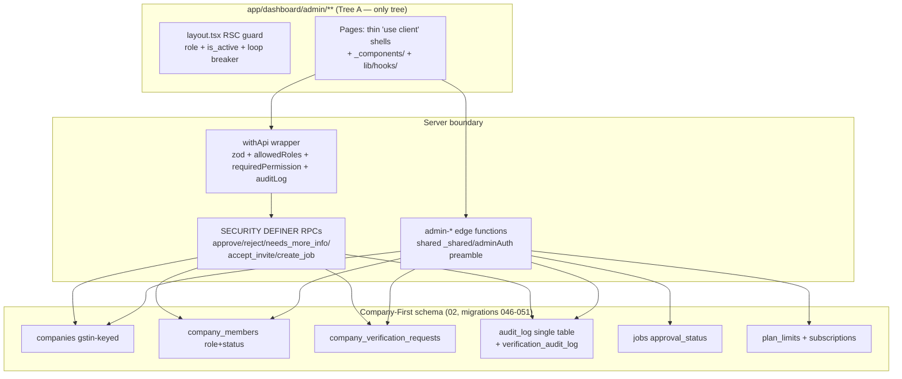
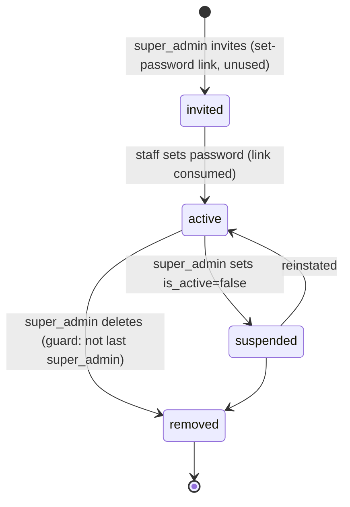
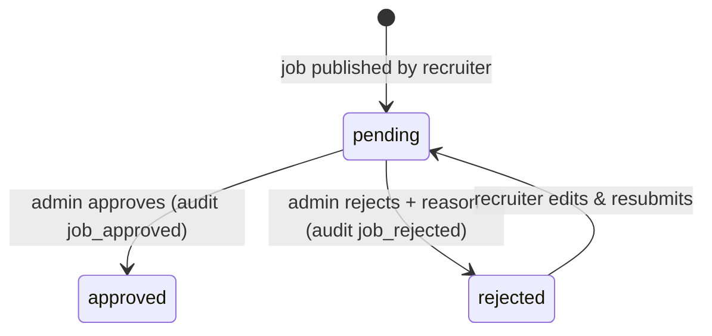

# 14 — Admin Portal Rebuild Architecture (Company-First Alignment)

**Status:** Draft for review
**Owner:** Platform / Admin tooling
**Version:** 1.1 — product decisions folded in (2026-07-18)
**Last Updated:** 2026-07-18

**Confirmed product decisions (2026-07-18):** (1) permission split ships as §4.2 specifies; (2) **impersonation is removed for launch** — R-10 becomes a deletion, not a rebuild; (3) **PAN/Aadhaar are not collected** (Phase-1 KYC is manual Gmail) — this also changes the public `/signup/recruiter?variant=application` form, see `06_Admin_Portal_Recruiter_Portal_Architecture.md`; (4) editing an approved job does **not** re-trigger approval (MVP). The detailed 8-doc spec derived from this architecture lives in `01_Admin_Portal_…` through `08_Admin_portal_…` of this suite.
**Input docs:** `13_Admin_Portal_System_Documentation.md` (verified current state — the defect IDs D-1…D-35 and FR-1…FR-13 referenced below come from there), `12_Admin_Production_Readiness_Execution_Plan.md` (W1–W10), `docs/currentAdminSideandimproventsuggestions.md` (product intent), `02_Schema_And_Database_Design.md` (migrations 046–051), `04_State_Machines_And_Business_Logic.md`, `06_Recruiter_Portal_Architecture.md`, `07_Company_Management_Architecture.md`.

**Repo root for all paths:** `Talentmesh-demo/`

---

## Table of Contents

1. [Purpose](#1-purpose)
2. [Why Rebuild Instead of Starting Fresh](#2-why-rebuild-instead-of-starting-fresh)
3. [Target Architecture Overview](#3-target-architecture-overview)
4. [Admin Role Management (RBAC)](#4-admin-role-management-rbac)
5. [Rebuild Tasks R-1 … R-14](#5-rebuild-tasks)
6. [State Machines](#6-state-machines)
7. [API Contracts](#7-api-contracts)
8. [UX System](#8-ux-system)
9. [Execution Phases & Launch Gate](#9-execution-phases--launch-gate)
10. [[SUGGESTION] Ideas Beyond Spec](#10-suggestion-ideas-beyond-spec)
11. [Must Be Verified Against the Live Backend](#11-must-be-verified-against-the-live-backend)

---

## 1. Purpose

The recruiter and company sides were redesigned around the **Company-First** model (docs 02/04/06/07): the company is the root entity, recruiters are `company_members` under it, verification is a company-level KYC workflow, and jobs/subscriptions hang off the company. The admin portal was built **before** that model and still manages recruiters as free-standing accounts (`recruiter_profiles.approve-setup`), matches companies by name string, and carries the defects catalogued in doc 13.

This document specifies how to rebuild the admin portal so that:

- Admin operates on the **same entities and state machines** as the new recruiter/company side (`companies`, `company_members`, `company_verification_requests`, the 049/051 RPCs) — never a parallel model.
- Every lifecycle the platform has (company, membership, verification, job, application) is **manageable end-to-end from admin**, including "admin acts on behalf of a stuck company/recruiter" (the product intent in `currentAdminSideandimproventsuggestions.md`).
- Admin role management becomes a **real server-enforced privilege model** (super_admin / admin / content / future finance), not sidebar cosmetics (D-4).
- The P0 defects (D-1…D-12) are structurally impossible in the rebuilt surface, not just patched.

---

## 2. Why Rebuild Instead of Starting Fresh

The question was considered explicitly. Verdict: **rebuild in place on Tree A** (`app/dashboard/admin/**`), not a greenfield rewrite. Reasons, each grounded in verified source:

| Dimension | Why rebuild wins over starting fresh |
|---|---|
| **Better architecture** | The correct architectural skeleton already exists and is proven in one endpoint: `POST /api/admin/verification/decide` (doc 13 §6) — zod at the boundary, caller-token client feeding `SECURITY DEFINER` RPCs that check `authz.is_admin()`, precise error mapping (409 on already-decided), audit on. The rebuild is "make every admin surface look like that one," not "invent a new architecture." A fresh start would re-derive this pattern and re-make the mistakes that produced three parallel route trees (D-28). |
| **Better maintainability** | ~2,900 LOC of *working* code (plans editor 390, billing 586, team 471, impersonation console 209, email-templates editor) already exists in orphaned trees (doc 13 §2.2). Rebuilding = porting + hardening it behind server boundaries. Starting fresh = throwing away working UI and re-writing it. The maintainability problem is duplication and dead trees, which deletion fixes — not the code quality of Tree A's guard, `withApi`, or the loading/error coverage, which are good (doc 13 §12 "patterns worth keeping"). |
| **Better performance** | The slow paths are known and localized: browser-side CSV export duplicated in two pages (D-19), unbounded synchronous notification fan-out (D-14), O(all-messages) conversation load (doc 12 F-10), double metric computation (D-21). Each moves to existing server infrastructure (`export_jobs` + `claim_export_job`, `notification_jobs` + `notification-worker`). No framework change is needed for performance — a rewrite would buy nothing here. |
| **Security improvements** | Every P0 (D-1…D-12) has a targeted fix that lands inside existing files (`lib/server-auth.ts`, `withApi`, a shared edge-function preamble). The double gate (layout RSC + edge-function re-authorization, doc 13 §1) is sound and must be **kept**; a rewrite risks losing hardening that took three audit cycles to accumulate (loop breaker, `is_active` checks, cookie-only token read). |
| **Scalability** | The multi-tenant data model underneath admin is being migrated by 046–051 regardless. Admin only needs to *follow* that migration (query `company_members` instead of `recruiter_profiles`, key companies on GSTIN). The scalability work is schema-side and already specified in doc 02 — a fresh admin app would sit on the same schema. |
| **Improved developer experience** | One route tree, one shared edge auth module (instead of 15 copy-pasted preambles), one audit table, one permission model enforced in one place (`withApi`), pages decomposed under `_components/` (W10). Every future admin feature then has exactly one obvious place to go. A rewrite resets team knowledge of `withApi`, `OpsDarkSidebarShell`, the query-key conventions, and the e2e harness. |

**The one thing that must die rather than be rebuilt:** the `admin-recruiters` `approve-setup` delete-and-recreate pipeline (D-5/D-6/D-7) and the `access_requests`/`admin-recruiter` duplicate intake path (D-22). These encode the pre-Company-First model and are replaced wholesale by the 049/051 RPC flow — see R-7.

---

## 3. Target Architecture Overview

### 3.1 One route tree, one data model



Rules that define the architecture (each maps to a rebuild task):

1. **Tree A is the only tree.** `app/portals/admin/**` and `app/(dashboard)/admin/**` are deleted after porting (R-1, W3).
2. **All admin mutations cross a server boundary** — a `withApi` route or an `admin-*` edge function. No direct `insforge.database.insert/update/delete` from admin client pages (R-2, W7). Direct client *reads* allowed only where W2 confirms RLS coverage.
3. **Lifecycle transitions go through the doc-04 RPCs**, never hand-rolled multi-table writes. Admin "help" actions (change a job stage, remove a member on behalf) call the *same* RPC/endpoint the recruiter side calls, plus an `on_behalf_of` audit annotation (R-5, R-6, R-7).
4. **One audit spine.** All admin writers target `audit_log`; `verification_audit_log` stays as the company-lifecycle ledger and is *surfaced* in admin, not duplicated (R-3).
5. **Roles are enforced server-side** via one permission matrix consulted by both `withApi` and the shared edge preamble (R-4).

### 3.2 Navigation (rebuilt sidebar — `components/dashboard/OpsDarkSidebarShell.tsx`)

```
Overview                      /dashboard/admin
Companies                     /dashboard/admin/companies          ← promoted: company is the root entity
  ├ Directory                 /dashboard/admin/companies
  ├ Verification Queue        /dashboard/admin/verification       ← FIXES D-9 (was unreachable)
  └ Register Company          /dashboard/admin/companies/register
Jobs & Applications           /dashboard/admin/jobs
  ├ All Job Postings          /dashboard/admin/jobs
  ├ Job Approvals             /dashboard/admin/job-approvals
  └ Applications              /dashboard/admin/applications
Users                         /dashboard/admin/candidates
  ├ Candidates                /dashboard/admin/candidates
  └ Recruiters                /dashboard/admin/recruiters
Content                       /dashboard/admin/announcements       [content, admin, super_admin]
  ├ Announcements             /dashboard/admin/announcements
  ├ Blog Posts                /dashboard/admin/blogs
  └ Email Templates           /dashboard/admin/email-templates     ← real editor, ported (R-1)
Billing & Plans               /dashboard/admin/plans               [super_admin; finance when added]
  ├ Subscription Plans        /dashboard/admin/plans               ← ported Tree-B editor behind edge fn (R-12)
  └ Billing & Invoices        /dashboard/admin/billing
Reports                       /dashboard/admin/reports             ← promoted into nav
System & Audit                /dashboard/admin/audit-logs          [super_admin for settings/team]
  ├ Audit Logs                /dashboard/admin/audit-logs
  ├ Admin Team                /dashboard/admin/team                ← ported Tree-B page (R-1)
  └ System Settings           /dashboard/admin/settings
Messages                      /dashboard/admin/{roleId}/messages
```

Sidebar filtering remains **UX only**; the same visibility rules are enforced server-side by R-4. `/dashboard/admin/notifications` (ops console) and `/dashboard/admin/search` (command palette) stay out of nav deliberately (FR-12).

---

## 4. Admin Role Management (RBAC)

Product requirement (from `currentAdminSideandimproventsuggestions.md`): roles for **super admin**, **admin**, **content** (a person who manages only content), and **future billing/subscription** management. Current state: `admin` ≡ `super_admin` at the API layer (D-4), `lib/permissions.ts` is dead code, and three admin registries drift (D-18).

### 4.1 Design decisions

**One registry.** `profiles.role` is already the only store that grants access (doc 13 §5.6). Keep it authoritative. Drop `admin_members` and `admin_users` writes from `admin-settings`; migrate the Tree-B team page to CRUD `profiles` rows with staff roles. (`admin_users` also serves as an RLS anti-recursion lookup table per the 02 house rules — keep the *table* for that purpose, but it is maintained by trigger from `profiles`, never written directly by application code.)

```sql
-- Migration 052 (follows 051; human-applied per the standing DDL rule)
ALTER TABLE public.profiles DROP CONSTRAINT IF EXISTS profiles_role_check;
ALTER TABLE public.profiles ADD CONSTRAINT profiles_role_check
  CHECK (role IN ('candidate','recruiter','admin','super_admin','content'));
-- future: add 'finance' in the migration that ships billing write APIs

-- keep authz lookup in sync (house rule: flat lookup table, no app writes)
CREATE OR REPLACE FUNCTION authz.sync_admin_users() RETURNS trigger
LANGUAGE plpgsql SECURITY DEFINER AS $$
BEGIN
  IF NEW.role IN ('admin','super_admin','content') THEN
    INSERT INTO public.admin_users(user_id) VALUES (NEW.id) ON CONFLICT DO NOTHING;
  ELSE
    DELETE FROM public.admin_users WHERE user_id = NEW.id;
  END IF;
  RETURN NEW;
END $$;
DROP TRIGGER IF EXISTS trg_sync_admin_users ON public.profiles;
CREATE TRIGGER trg_sync_admin_users AFTER INSERT OR UPDATE OF role ON public.profiles
  FOR EACH ROW EXECUTE FUNCTION authz.sync_admin_users();
```

**Extend `profiles.role` rather than adding a second `staff_role` column.** Rationale: every existing guard (`layout.tsx`, `withApi allowedRoles`, all 15 edge preambles) already switches on `role`; a second column would require touching every one of them *and* leave two places to get out of sync. Trade-off: `role` mixes platform roles (candidate/recruiter) with staff roles — acceptable because the value set is small and closed, and the CHECK constraint documents it.

### 4.2 The permission matrix (server-enforced — replaces dead `lib/permissions.ts` content)

```ts
// lib/permissions.ts — becomes the single authority, consulted server-side (R-4)
export type StaffRole = 'super_admin' | 'admin' | 'content'; // + 'finance' later
export type Resource =
  | 'dashboard' | 'companies' | 'verification' | 'jobs' | 'applications'
  | 'candidates' | 'recruiters' | 'content' | 'reports'
  | 'billing' | 'plans' | 'settings' | 'team' | 'audit_logs';
  // ('impersonation' resource removed — feature cut for launch, decision 2)
export type Action = 'view' | 'edit' | 'delete' | 'approve' | 'export';

export const PERMISSIONS: Record<StaffRole, Partial<Record<Resource, Action[]>>> = {
  super_admin: { /* every Resource: all five Actions */
    dashboard:['view'], companies:['view','edit','delete','approve','export'],
    verification:['view','approve'], jobs:['view','edit','delete','approve','export'],
    applications:['view','edit','delete','export'],
    candidates:['view','edit','delete','export'], recruiters:['view','edit','delete','approve','export'],
    content:['view','edit','delete','approve'], reports:['view','export'],
    billing:['view','edit','export'], plans:['view','edit','delete'],
    settings:['view','edit','delete'], team:['view','edit','delete'],
    audit_logs:['view','export'],
  },
  admin: { // platform operations, NOT billing writes, NOT team/settings
    dashboard:['view'], companies:['view','edit','approve','export'],
    verification:['view','approve'], jobs:['view','edit','delete','approve','export'],
    applications:['view','edit','export'],
    candidates:['view','edit','export'], recruiters:['view','edit','approve','export'],
    content:['view','edit','approve'], reports:['view','export'],
    billing:['view'], audit_logs:['view'],
  },
  content: { // content-only staff
    dashboard:['view'], content:['view','edit'], reports:['view'],
  },
};

export function canPerform(role: string, resource: Resource, action: Action): boolean {
  return (PERMISSIONS as any)[role]?.[resource]?.includes(action) ?? false;
}
```

Deliberate calls (confirm before implementing — W8's human gate):

- `admin` keeps `delete` on jobs (moderation) but **loses** `delete` on candidates and companies — destructive PII operations become super_admin-only. Rationale: DPDP blast radius; a single ops admin should not be able to erase users.
- `content` gets `content: view+edit` but **not** `approve`/`delete` — publishing an announcement (which fans out notifications platform-wide) requires an `admin`. Rationale: fan-out is effectively a broadcast to every user.
- `impersonation` resource is gone — the feature is cut for launch (decision 2).
- **[SUGGESTION]** `finance` role (billing/plans/reports only) ships together with the Razorpay-backed billing APIs, not before — adding a role with nothing real to gate creates false structure. Trade-off: until then, plan editing is super_admin-only.

### 4.3 Enforcement points (exactly two)

```ts
// 1. lib/api/handler.ts — withApi gains:
type WithApiOptions = {
  // ...existing
  requiredPermission?: { resource: Resource; action: Action };
};
// after the allowedRoles check:
if (opts.requiredPermission &&
    !canPerform(user.role, opts.requiredPermission.resource, opts.requiredPermission.action)) {
  return json({ error: 'forbidden', code: 'permission_denied' }, 403);
}
```

```ts
// 2. insforge/functions/_shared/adminAuth.ts — the shared edge preamble (R-2) gains:
export async function requireStaff(req: Request, perm?: { resource: string; action: string }) {
  // token → verifyClient.auth.getCurrentUser() → service-key read of profiles.role,is_active
  // 401 no/invalid token · 403 not staff · 403 is_active !== true
  // if perm: 403 unless PERMISSIONS[role][perm.resource] includes perm.action
  // returns { userId, role }
}
```

Every admin edge function declares its permission at the top (e.g. `admin-plans` → `{resource:'plans', action:'edit'}` for mutations). Client-side `canPerform` calls remain purely to hide/disable UI.

### 4.4 Admin team management screen (`/dashboard/admin/team`)

Port the Tree-B page (471 LOC) and repoint it:

| Operation | Backend | Rule |
|---|---|---|
| List staff | `admin-settings` GET `?section=admins` (already returns `profiles`) | any staff with `team: view` |
| Invite admin/content | `admin-settings` POST `add_admin` → writes **`profiles` only** + audit | super_admin only; invite email carries a single-use set-password link (same primitive as R-7, never a password) |
| Change staff role | `admin-settings` POST `update_role` | super_admin only; **cannot demote yourself if you are the last active super_admin** (mirror of the doc-04 last-admin guard, enforced in the edge fn: `SELECT count(*) FROM profiles WHERE role='super_admin' AND is_active AND id <> target`) |
| Suspend / remove staff | `admin-settings` PATCH `is_active` / DELETE | super_admin only; last-super_admin guard applies; audit `admin_suspended`/`admin_removed` |

| Field | Detail |
|---|---|
| **Server-side changes** | Migration 052 (above). `admin-settings/index.ts`: drop `admin_members`/`admin_users` writes; add last-super_admin guard; write audit to `audit_log` (R-3). `lib/permissions.ts` rewritten as §4.2. `lib/api/handler.ts` + `_shared/adminAuth.ts` enforcement as §4.3. |
| **Client-side changes** | Port `app/portals/admin/dashboard/team/page.tsx` → `app/dashboard/admin/team/page.tsx` (replaces the 23-line stub). Sidebar gating switches from `isSuperAdmin` boolean to `canPerform(role, resource, 'view')`. |
| **Impact if changed** | admin/super_admin/content become real privilege levels; least-privilege staffing (content editors, future finance) becomes possible; access reviews reflect reality. |
| **Impact if not changed** | D-4 persists: any `admin` can perform every super_admin action by direct API call; a compromised content-editor account equals a super_admin compromise. |
| **Reason for change** | Highest-privilege surface in the product; also the explicit product ask (role management). |
| **Deploy priority** | **P0** (enforcement) / P1 (team screen port) |

---

## 5. Rebuild Tasks

Ordered. Each assumes the previous. R-1…R-4 are structural; R-5…R-14 are the functional domains.

### R-1 — Collapse to one route tree, complete the navigation

| Field | Detail |
|---|---|
| **Server-side changes** | None (route files only). |
| **Client-side changes** | Per doc 13 §12 Step 0 and W3: port `plans`, `billing`, `team`, `email-templates` real implementations into Tree A over the stubs; delete `app/portals/admin/**` and `app/(dashboard)/admin/**`; rebuild the sidebar per §3.2 (adds `verification` — D-9, `reports`). **Delete** the mock impersonate page and the Tree-B console — impersonation is cut (R-10, decision 2), not ported. |
| **Impact if changed** | One tree, one guard; ~2,900 LOC of orphaned code either live or gone; KYC queue reachable by operators. |
| **Impact if not changed** | Every guard fix must land twice and will drift (this produced D-29); KYC silently does not happen (D-9). |
| **Reason for change** | Root cause of the Coming-Soon inversion (D-28/D-30) and prerequisite for everything below. |
| **Deploy priority** | **P0** |

**Verify:** `next build` passes; every §3.2 nav link resolves to a real page; `grep -r "portals/admin" app components` returns nothing.

### R-2 — Shared edge-function kit (`insforge/functions/_shared/`)

The §3.4 preamble is copy-pasted 15×. InsForge functions deploy separately, so "shared" means a build-time include: keep one source of truth in `_shared/` and inline it via the existing function-deploy script (or duplicate-by-generation — never by hand).

| Field | Detail |
|---|---|
| **Server-side changes** | Create `_shared/adminAuth.ts` (`requireStaff`, §4.3), `_shared/cors.ts` (explicit origin allowlist from `ALLOWED_ORIGINS` env, comma-separated; **no** `localhost:3000` fallback when `DENO_ENV==='production'` — D-10), `_shared/query.ts` (`escapeOrFilter(term)` that strips `,()."` before interpolation into `.or()` — D-13; `capLimit(raw, max=100)` — D-17), `_shared/idempotency.ts` (reserve key **before** work via `INSERT … ON CONFLICT DO NOTHING RETURNING` — loser of the race polls/409s; store the full response body for replay — D-20), `_shared/errors.ts` (uniform `{error, code}` JSON, no stack leak). Refactor all admin functions onto the kit. Also W7's A-12 fix: service key read from env only, fail loudly if unset. |
| **Client-side changes** | None. |
| **Impact if changed** | CORS, filter-injection, limit caps, idempotency, and error shape are fixed once and stay fixed for every future function. |
| **Impact if not changed** | D-10/D-13/D-17/D-20 each need 7–15 hand-edits now and again on every new function. |
| **Reason for change** | The copy-paste preamble is why F-7 had to be patched six times. |
| **Deploy priority** | **P0** (CORS, injection) / P1 (idempotency, errors) |

### R-3 — One audit spine

| Field | Detail |
|---|---|
| **Server-side changes** | Standardize on **`audit_log`** (the table the viewer reads). Migration 053: copy `audit_logs` rows into `audit_log` (map columns; keep original timestamps), then drop `audit_logs`. Rewrite `admin-settings` + `admin-audit` writers/readers to `audit_log` (D-2). Add audit writes to every destructive path: `admin-jobs` DELETE + `bulk-delete`, `admin-candidates` deletes, recruiter removals, PII exports (`export_started` with filter + row count), universal search (`admin_search` with query) (D-3, D-27, FR-4). Append-only at DB level: `REVOKE UPDATE, DELETE ON public.audit_log FROM authenticated, project_admin;` (service role keeps INSERT/SELECT). All rows carry `{ actor_id, action, target_type, target_id, on_behalf_of?, reason?, metadata }`. |
| **Client-side changes** | `/dashboard/admin/audit-logs` gains filters for `action`, `target_type`, `on_behalf_of` presence. Company detail (R-6) surfaces `verification_audit_log` per company — the two ledgers stay separate (platform actions vs company lifecycle) but are both visible. |
| **Impact if changed** | Every admin action is reconstructible; DPDP incident response becomes answerable. |
| **Impact if not changed** | Settings/team actions invisible (D-2); deletions untraceable (D-3); the audit log gives false assurance (doc 13 FR-7: "worse than none"). |
| **Reason for change** | Compliance-grade defect. |
| **Deploy priority** | **P0** |

### R-4 — RBAC enforcement

Specified fully in §4. Priority **P0** (enforcement paths) — listed here to fix its place in the ordering: it must land before R-5…R-12 so new endpoints declare permissions from day one.

### R-5 — Jobs & Applications: posting-centric lifecycle management

Product intent: an admin opens a job posting and sees *everything* — what the company is looking for, who posted it, which candidates applied and where each application stands — and can **help** the company move things when they are stuck.

| Field | Detail |
|---|---|
| **Server-side changes** | (a) **W5 migration first**: `jobs.approval_status ∈ {pending, approved, rejected}` NOT NULL DEFAULT 'pending' + backfill (product decision needed on historical `is_approved=false AND status='closed'` rows — default them to `'pending'` so nothing is falsely labeled rejected). (b) `admin-jobs` gets `get-detail` (job + company(name,gstin,status) + posting recruiter + `approval_status` + application stats per stage) and rejects unknown columns via an explicit PATCH allowlist `['title','description','requirements','location','salary_min','salary_max','experience','department','skills','status']` (D-16). (c) `admin-applications` PATCH gains mandatory `reason: z.string().min(10)` when the actor is staff, and emits a notification to the owning company's admins (`notification_jobs` insert) — this is the "admin changed your applicant's stage" trail. (d) Both write `audit_log` with `on_behalf_of: company_id`. Status transitions must respect the doc-04 §4 machine (e.g. cannot `active→active`); reuse the same transition table, do not fork it. |
| **Client-side changes** | New `app/dashboard/admin/jobs/[id]/page.tsx`: header (title, company link → R-6 company page, recruiter, `approval_status` badge, plan-slot note), **Details tab** (full requirement fields, edit-on-behalf via the allowlisted PATCH, with a required reason field), **Applicants tab** (list of applications for this job with stage, links to candidate application detail, stage-change action reusing the existing `admin-applications` drawer), **History tab** (audit + `application_status_history` for this job). `job-approvals/page.tsx` re-filters on `approval_status` and fixes the optimistic-count arithmetic (W5). Jobs list rows link to the detail page. |
| **Impact if changed** | Admin sees a posting's whole life in one place and can unblock companies (the requested "lifecycle management help"); rejected vs closed stops being conflated; every on-behalf intervention is audited and notifies the company. |
| **Impact if not changed** | Admin can only see jobs and applications in two disconnected flat lists; helping a company means raw DB edits with no trail; the Rejected tab stays wrong (A-11). |
| **Reason for change** | Core product ask; also carries W5 (P1) and D-16 (P1). |
| **Deploy priority** | **P1** (detail page + approval_status) / **P0** for the PATCH allowlist |

### R-6 — Company-First admin: the company profile page

Product intent: company is the entity; the company's own admin manages their recruiters; platform admin **sees** that management and can step in when the company can't.

| Field | Detail |
|---|---|
| **Server-side changes** | New edge fn `admin-companies` v2 (extends existing): `get-detail` returns `companies` row + members (`company_members` joined `profiles`: name, email, member_role, status, joined_at) + jobs summary (count per status/approval_status) + latest `company_verification_requests` + subscription (`subscriptions` + `plan_limits`). Member interventions **reuse the recruiter-portal endpoints/RPCs** (doc 07 team management): invite → `company_members(status='invited')` insert; role change / suspend / remove → member PATCH which the `guard_last_company_admin` trigger already protects (surfaces `422 last_admin`); accept on behalf → `accept_company_invite` RPC. Each staff-initiated call passes `on_behalf_of: company_id` + required `reason` into `audit_log`; company lifecycle events still land in `verification_audit_log` via the RPCs. Company edit PATCH gets an allowlist `['name','website','industry','size','location','description','logo_url','country_code']` — **`gstin`, `cin`, `status` are never editable via generic PATCH**; status changes only via the lifecycle actions (`suspend`/`reinstate`/`deactivate`, each its own action with its own audit event per doc 04 §1). Create-company (register form) validates: `name` (2–120 chars), `gstin` **required**, regex `^[0-9]{2}[A-Z]{5}[0-9]{4}[A-Z][1-9A-Z]Z[0-9A-Z]$`, `cin` optional regex `^[ULF][0-9]{5}[A-Z]{2}[0-9]{4}[A-Z]{3}[0-9]{6}$`, `website` optional URL, `country_code` default `'IN'`; on GSTIN conflict return `409 company_exists` with the existing company id (attach path, doc 04 §1 rule — **name matching is gone**, killing D from FR-3). |
| **Client-side changes** | New `app/dashboard/admin/companies/[id]/page.tsx` with tabs: **Overview** (status, GSTIN/CIN, plan + active-job usage vs `plan_limits.max_active_jobs`, lifecycle action buttons), **Members** (roster with role/status badges; intervention actions with reason modal; `422 last_admin` surfaced as "promote another admin first"), **Jobs** (company's postings, linking to R-5 detail), **Applications** (per-company funnel), **Verification** (request history + the existing `VerificationDecisionModal` — same `/api/admin/verification/*` routes), **Audit** (`verification_audit_log` for this company + `audit_log` rows where `on_behalf_of = company_id`). Directory page rows link here; directory search covers name + GSTIN. `CompanyRegisterForm` updated to the field set above. |
| **Impact if changed** | The admin console finally mirrors the Company-First model: one page answers "what is the state of this tenant"; admin can rescue a company whose only admin is locked out — safely, because the last-admin guard and RPC atomicity hold for staff too. |
| **Impact if not changed** | Companies remain a flat name-keyed list; member management is invisible to admin; duplicate tenants keep accruing from name typos; interventions happen as raw `recruiter_profiles` edits with no trail. |
| **Reason for change** | Core product ask; aligns admin with docs 02/04/07. |
| **Deploy priority** | **P1** (page) / **P0** (GSTIN-keyed create + status-edit lockout, because R-7 depends on it) |

### R-7 — Recruiter management: replace the legacy pipeline

The most consequential change. The current `admin-recruiters` `approve-setup`/`send-credentials`/`update-password` pipeline (D-5/D-6/D-7, FR-3) predates Company-First and must be **removed, not fixed**.

| Field | Detail |
|---|---|
| **Server-side changes** | (a) **Delete** actions `approve-setup`, `update-password`, `send-credentials`, `verify-otp` from `admin-recruiters`; delete `admin-recruiter` (singular) and the `access_requests` path (D-22) after confirming `/admin/recruiter-requests` traffic is nil — the verification queue is the single intake. (b) Directory GET re-based on the new model: `profiles(role='recruiter')` joined `company_members(status, member_role, company_id)` joined `companies(name, gstin, status)`; filters: `search` (escaped, R-2), `membership_status`, `company_id`. (c) Remaining admin actions map 1:1 to membership lifecycle (doc 04 §2): suspend/reinstate/remove member → same endpoints as R-6 Members tab. (d) **Password reset**: new action `send-reset-link` — calls InsForge auth's password-reset (or mints a single-use token in a `password_reset_tokens` table: `token_hash` (SHA-256), `user_id`, `expires_at = now()+'1 hour'`, `used_at`), emails a set-password **link**. Plaintext passwords never leave the system; the auth user id **never changes**. (e) Admin "create recruiter on behalf" → thin wrapper over the recruiter `request-access` flow (doc 06): creates/attaches company by GSTIN, member `invited`, verification request — then admin immediately approves through the normal queue. One code path for intake whether self-serve or admin-created. (f) PATCH allowlist: `['job_title','about','phone']` on recruiter profile data; membership fields only via lifecycle actions. |
| **Client-side changes** | `recruiters/page.tsx` (3,062 LOC) is rebuilt as part of this work (absorbs W10 for this page): thin list page + `_components/` (RecruiterDetailDrawer, MembershipActions, ResetLinkButton) + `lib/hooks/useAdminRecruiters.ts`. Columns: name, email, company (link → R-6), member_role, membership status, joined. `RecruiterRegisterForm` re-pointed at (e). The custom-proposal flow stays (with D-23/D-24 fixed: `price: z.number().nonnegative()`, and the insert failure returns 500 instead of silently skipping). |
| **Impact if changed** | Password change stops destroying identities (D-5); no plaintext credentials (D-7); no lying success (D-6); one intake path; recruiter admin actions become company-membership actions consistent with what company admins themselves do. |
| **Impact if not changed** | Every password change orphans FKs across applications/jobs/messages/audit; credentials keep traveling in plaintext; two intake paths drift; the 3,062-line page keeps hiding direct-DB writes (the A-7 root cause). |
| **Reason for change** | FR-3 is P0 ×4; and the recruiter-side redesign (doc 06) lands on this module. |
| **Deploy priority** | **P0** |

### R-8 — Candidate administration

| Field | Detail |
|---|---|
| **Server-side changes** | Keep `admin-candidates` (it is the healthiest function — capped limits, idempotency) but move it onto the R-2 kit. **CSV export moves server-side**: new edge fn `admin-export` (`start` → inserts `export_jobs`, claims via existing `claim_export_job` RPC, streams batched rows to the `export-candidates` bucket, updates progress; `status` → poll). Emits `audit_log` `export_started`/`export_completed` with filters + row count (FR-4 P0). Serves both candidates and recruiters exports — deletes the ~250-line duplicated browser block from both pages (D-19). |
| **Client-side changes** | `candidates/page.tsx`: replace the inline export orchestration with `start`/poll UI; decompose per W10 (list + `_components/` + hook). |
| **Impact if changed** | A closed tab no longer abandons an export; bulk PII egress is audited; one export implementation. |
| **Impact if not changed** | D-19 persists; PII exports leave no trail (DPDP exposure). |
| **Reason for change** | FR-4. |
| **Deploy priority** | **P0** (export audit) / P1 (server-side move) |

### R-9 — Dashboard & reports: one metric truth

| Field | Detail |
|---|---|
| **Server-side changes** | Extract shared `_shared/metrics.ts` used by both `admin-dashboard` and `admin-reports` (D-21). Replace `Promise.allSettled` + zero-degradation with per-metric `{value} \| {error: true}` so failures render as errors (D-15). Add Company-First KPIs: pending verifications count (feeds the Review Queue alert panel — links to `/dashboard/admin/verification`), companies by status, active-job slots used vs plan. Remove remaining fabricated values (`avgTimeToHire` literal, "Operational" banner — F-5): compute from `application_status_history` or drop the tile. |
| **Client-side changes** | Overview alert panel adds the verification queue card; `StatCard` gets an error state (distinct from 0). Remove the `window` `'dashboard:invalidate'` event bus; use React Query invalidation only (D-34). |
| **Impact if changed** | Operators can trust the console; the KYC queue becomes impossible to miss. |
| **Impact if not changed** | "0 pending" continues to mean either "nothing pending" or "query broken" (FR-1). |
| **Reason for change** | Operator trust. |
| **Deploy priority** | **P1** |

### R-10 — Impersonation: REMOVED for launch (W4 Option A — CONFIRMED)

| Field | Detail |
|---|---|
| **Server-side changes** | **Delete** `app/api/impersonate/route.ts`. No replacement, no `impersonation_sessions` table (dropped from migration 055). |
| **Client-side changes** | Delete the mock page `app/dashboard/admin/impersonate/`, `components/admin/ImpersonationBanner.tsx`, and the three broken cookie readers (`AuthContext.tsx:327-329`, `DashboardLayoutClient.tsx:345`, `lib/insforge.ts:175`). The Tree-B console is **not** ported. |
| **Impact if changed** | The AD-3 / D-8 escalation primitive ceases to exist; nothing that appears to work but doesn't ships. |
| **Impact if not changed** | A visibly broken security feature ships and the escalation activates the moment someone "fixes" the cookie read. |
| **Reason for change** | FR-10; product chose removal over rebuild for launch. |
| **Deploy priority** | **P0** (removal) |

**Post-launch backlog — Option B (rebuild), if support ever needs it:** `withApi({ allowedRoles:['super_admin'], auditLog:true })`; body `{ userId: uuid, reason: min(10) }` with **no `userRole`** (role read from the target's `profiles` row); 404 unknown / 403 staff-target / 403 self; a server-side `impersonation_sessions` row is the authority (cookie is a pointer, never an authz claim); force-expirable from Settings → Sessions; banner rendered server-side from the row. This design is retained here only as the reference for that future work — it is **not** in scope for launch.

### R-11 — Content: announcements, blogs, email templates

| Field | Detail |
|---|---|
| **Server-side changes** | Announcement fan-out moves to the queue: POST inserts the announcement + one `notification_jobs` row (audience descriptor, not N rows); `notification-worker` expands it in batches with progress (D-14). `admin-announcements`/`admin-blogs` mutations require `{resource:'content', action:'edit'}`; announcement **publish** (fan-out trigger) requires `action:'approve'` (so `content` staff can draft, `admin` publishes — §4.2). Email-templates editor (ported in R-1) keeps its `audit_log` writes. |
| **Client-side changes** | Announcements page gains a draft→published distinction and shows fan-out job progress from `notification_jobs`. |
| **Impact if changed** | Platform broadcast can't time out half-delivered; the content role becomes usable day one. |
| **Impact if not changed** | D-14: at scale the fan-out times out with unknown partial delivery and no resume. |
| **Reason for change** | FR-6; enables the `content` role. |
| **Deploy priority** | **P1** |

### R-12 — Billing & plans (free tier now, subscriptions later)

| Field | Detail |
|---|---|
| **Server-side changes** | New edge fn `admin-plans` (GET list; POST/PATCH/DELETE mutations, `{resource:'plans', action:'edit'}` → super_admin only for now): validates INR paise integers (`price_monthly_inr: z.number().int().nonnegative()`), quotas (`max_active_jobs ≥ 1`, seats, AI calls), popular-flag mutual exclusion server-side. The ported Tree-B plans editor calls this — **no direct `subscription_plans` writes from the browser** (D-11). Billing dashboard reads stay read-only over `subscriptions` (via edge fn `admin-billing` GET, so a client-read RLS gap can't leak revenue data). Free tier stays DB-enforced (`plan_limits.max_active_jobs = 1`, `enforce_active_job_limit` trigger, doc 04 §4) — the admin UI *displays* slot usage (R-6 Overview tab), it never enforces it. GST/GSTIN on invoices per doc 07 billing scope when Razorpay flows ship. |
| **Client-side changes** | Ported `plans`/`billing` pages re-pointed at the edge fns. |
| **Impact if changed** | Pricing gets a server authorization boundary before it is ever exposed. |
| **Impact if not changed** | D-11: pricing integrity depends solely on RLS correctness on `subscription_plans`. |
| **Reason for change** | FR-9; revenue-critical. |
| **Deploy priority** | **P0** (boundary before exposing) / P2 (nav wiring) |

### R-13 — Admin bootstrap & recovery

| Field | Detail |
|---|---|
| **Server-side changes** | Create `app/api/admin/forgot-password/route.ts` via `withApi({ requireAuth:false, schema:{ body: z.object({ email: z.string().email() }) } })` delegating to the existing (currently orphaned) `admin-forgot-password` edge fn logic; always return 200 regardless of account existence (no user enumeration) (D-1). `validateAdminToken` → `crypto.timingSafeEqual` over equal-length buffers (D-25). Move `ADMIN_EMAILS` and the admin secret path to **server-only** env vars; delete the `NEXT_PUBLIC_` variants (D-26). |
| **Client-side changes** | `/admin/forgot-password` + `/admin/reset-password` keep their POST targets (now real). Login page gains the `?reason=suspended` state (open item from A-2/W6). |
| **Impact if changed** | A locked-out sole super_admin can recover; bootstrap secrets stop shipping to the browser. |
| **Impact if not changed** | Admin password reset 404s end-to-end (D-1) — an operational time bomb. |
| **Reason for change** | FR-13. |
| **Deploy priority** | **P0** |

### R-14 — Structural hygiene (absorbed workstreams)

Carried from the W-plan without change, listed for completeness: **W1** mock-auth three-condition gate (P0, launch blocker), **W2** live RLS/metadata verification (P0, human-gated), **W6** redirect-loop mechanism (`?rd` param, delete the dead header read; shared 403 component; `/unauthorized` page) (P1), **W9** authz regression suite extended to cover: `content` role blocked from non-content resources, forged-cookie denial, suspended-staff denial on every function, `admin` blocked from super_admin actions (P1 — promoted from P2 because R-4 adds a third role worth locking in), **W10** decomposition for the pages R-5/R-7/R-8 don't already rebuild (P3).

---

## 6. State Machines

### 6.1 Staff account lifecycle (new — governs §4.4)

`profiles.role ∈ {super_admin, admin, content}` × `is_active`



| Transition | Actor | Guard | Audit action |
|---|---|---|---|
| ∅ → invited | super_admin | valid email; role ∈ staff set | `admin_invited` |
| invited → active | invitee | token unexpired + unused | `admin_activated` |
| active ↔ suspended | super_admin | **not the last active super_admin** | `admin_suspended` / `admin_reinstated` |
| any → removed | super_admin | same last-super_admin guard | `admin_removed` |
| role change | super_admin | cannot self-demote if last super_admin | `admin_role_changed` |

Suspension takes effect on next request: layout guard (`is_active === false` → redirect) + every edge fn (`requireStaff`) + `withApi` — all three already check or will via R-2/R-4.

### 6.2 Impersonation — removed (decision 2)

No impersonation state machine ships. The design that *would* apply if it is rebuilt post-launch is retained in R-10's backlog note. (For the authoritative staff/OTP/email-change machines see `04_Admin_Portal_State_Machines_And_Business_Logic.md`.)

### 6.3 Job approval (admin view — after W5/R-5)

`jobs.approval_status ∈ {pending, approved, rejected}` — **orthogonal** to `jobs.status` (draft/active/paused/closed, owned by the recruiter side, doc 04 §4).



Public visibility = `approval_status='approved' AND status='active' AND company.status='verified'` (doc 04 §4 defense-in-depth rule). Admin *lifecycle help* (R-5) may also drive `status` transitions on behalf of the company — those reuse the doc-04 §4 table verbatim and are audited with `on_behalf_of`.

Company, membership, and verification machines are **not redefined here** — admin actions invoke the doc-04 §§1–3 transitions through the 049/051 RPCs.

---

## 7. API Contracts

Key new/changed contracts (zod, exact). All are `withApi`-wrapped routes or R-2-kit edge functions; every mutation writes `audit_log`.

```ts
// admin-companies get-detail (edge fn, GET ?id=&action=get-detail)
type CompanyDetail = {
  company: { id: string; name: string; gstin: string; cin: string | null;
             status: 'pending'|'verified'|'suspended'|'deactivated';
             website: string|null; industry: string|null; size: string|null;
             location: string|null; country_code: string; logo_url: string|null;
             created_at: string; verified_at: string|null; verified_by: string|null };
  members: Array<{ user_id: string; name: string; email: string;
                   member_role: 'admin'|'recruiter'|'coordinator';
                   status: 'invited'|'active'|'suspended'|'removed'; joined_at: string|null }>;
  jobs: { total: number; byStatus: Record<string, number>; byApproval: Record<string, number> };
  verification: Array<{ id: string; status: string; review_notes: string|null;
                        created_at: string; decided_at: string|null }>;
  subscription: { plan_name: string; max_active_jobs: number; active_jobs_used: number } | null;
};

// company create (edge fn admin-companies POST)
const companyCreateSchema = z.object({
  name: z.string().min(2).max(120),
  gstin: z.string().regex(/^[0-9]{2}[A-Z]{5}[0-9]{4}[A-Z][1-9A-Z]Z[0-9A-Z]$/),
  cin: z.string().regex(/^[ULF][0-9]{5}[A-Z]{2}[0-9]{4}[A-Z]{3}[0-9]{6}$/).optional(),
  website: z.string().url().optional(),
  industry: z.string().max(80).optional(),
  size: z.enum(['1-10','11-50','51-200','201-500','501-1000','1000+']).optional(),
  location: z.string().max(120).optional(),
  country_code: z.string().length(2).default('IN'),
  logo_url: z.string().url().optional(),
});
// 409 { error:'company_exists', code:'gstin_conflict', existing_company_id } → attach flow

// staff-intervention envelope — REQUIRED on every on-behalf mutation (R-5/R-6/R-7)
const interventionSchema = z.object({ reason: z.string().min(10).max(500) });
// merged into audit_log.metadata; on_behalf_of = company_id

// application stage change by staff (admin-applications PATCH)
const staffStageChangeSchema = z.object({
  id: z.string().uuid(),
  status: z.enum(['applied','reviewing','shortlisted','interviewing','offered','hired','rejected','withdrawn']),
  reason: z.string().min(10).max(500),
});

// recruiter reset link (admin-recruiters POST action:'send-reset-link')
const resetLinkSchema = z.object({ userId: z.string().uuid() });
// → 200 { success: true }  (never returns the link or any credential)

// (impersonation contract removed — feature cut for launch, decision 2)

// staff invite (admin-settings POST add_admin)
const staffInviteSchema = z.object({
  email: z.string().email(),
  name: z.string().min(2).max(80),
  role: z.enum(['admin','content','super_admin']),
  phone: z.string().regex(/^\+91[0-9]{10}$/).optional(), // Indian format; relax per-country later
});

// plan editor (admin-plans POST/PATCH — R-12; INR stored as paise integers)
const planSchema = z.object({
  name: z.string().min(2).max(60),
  price_monthly_inr: z.number().int().nonnegative(),
  price_annual_inr: z.number().int().nonnegative(),
  max_active_jobs: z.number().int().min(1),
  max_seats: z.number().int().min(1),
  max_ai_calls: z.number().int().min(0),
  is_popular: z.boolean().default(false),   // server clears the flag on all others when true
  is_active: z.boolean().default(true),
  display_order: z.number().int().min(0),
});
```

Uniform error shape from R-2: `{ error: string, code: string, fieldErrors?: Record<string,string[]> }`; never a stack trace outside development.

---

## 8. UX System

Design guidance source: the repo's **`UI Skill/`** folder (`DESIGN_SKILL_ROUTER.md`). For this rebuild:

- **`family-values-design`** sets direction: the admin console optimizes for *operator trust and speed* — dense but calm, zero decorative motion, every number either real or visibly errored (R-9), destructive actions always behind `BulkConfirmModal` with typed confirmation for bulk delete.
- **`apple-hig` / `material-design-3`** (pick one per the router, do not mix): apply to component behavior — focus states, keyboard navigation, drawer/modal semantics.

Concrete conventions (extending what already works in Tree A):

1. **Entity-page pattern everywhere:** Directory (list + filters + bulk bar) → Detail (tabs: Overview / related entities / History). R-5 job detail and R-6 company detail establish it; candidates and recruiters follow.
2. **Every entity name is a link** to its detail page (company name on a job row → company page; recruiter name → recruiter drawer). The admin should reach any related record in one click — this is the "easy to find things" requirement.
3. **Command palette** (`CommandPalette.tsx`, exists) becomes the primary nav accelerator: entity search re-pointed at a server-audited search endpoint (D-27) with results grouped by type.
4. **Intervention affordances are visually distinct:** any on-behalf action (R-5/R-6/R-7) uses one shared `InterventionModal` (`_components/`) that requires the reason and states "the company's admins will be notified."
5. **Status = colored badge with fixed palette** shared across all pages (one `StatusBadge` component; today each page re-implements colors).
6. **Skeletons + error states** stay mandatory per route (`loading.tsx`/`error.tsx` coverage is a doc-13 "pattern worth keeping").
7. Styling stays **CSS Modules**; the inline-style layout-403 page is converted on port (D-35); the inline-style impersonate page is deleted (decision 2).

---

## 9. Execution Phases & Launch Gate

Dependencies: R-1 → R-2 → (R-3, R-4) → everything else. Migrations (052, 053, W5's approval_status) are **human-applied** — never agent-applied — per the standing live-DDL rule (out-of-band drift is documented on this project).

| Phase | Tasks | Gate |
|---|---|---|
| **0 — Structural (P0)** | W1 (mock-auth), R-1 (tree collapse), R-2 (edge kit: CORS/injection/caps), W2 (live verification, human) | `next build`; curl forged-cookie test; grep for orphaned trees |
| **1 — Trust (P0)** | R-3 (audit spine, migration 053), R-4 (RBAC, migration 052), R-13 (bootstrap), R-12 boundary (`admin-plans`), R-10 (impersonation **removal**), R-8 export-audit events | W9 suite green incl. new role matrix cases |
| **2 — Company-First (P0/P1)** | R-6 (company page + GSTIN create), R-7 (recruiter pipeline replacement), R-5 (job detail + W5 migration) | e2e: create→verify→member-intervene→job-approve round trip through the new pages |
| **3 — Operations (P1)** | R-9 (metrics), R-11 (fan-out queue + content role in use), R-8 server-side export, W6 (redirect/`/unauthorized`) | dashboard error-state test; announcement to 10k-user fixture completes via worker |
| **4 — Polish (P2/P3)** | remaining W10 decomposition, nav/billing wiring, UX pass per §8 | — |

**Launch is blocked until:** W1 ✅ · W2 ✅ · R-3 ✅ · R-4 enforcement ✅ · R-7 ✅ (no plaintext-credential path reachable) · R-10 **removed** (impersonation gone) · R-13 ✅. This supersedes the doc-12 gate list by adding R-3/R-4/R-7/R-13 (previously P0-rated findings without gate entries).

---

## 10. [SUGGESTION] Ideas Beyond Spec

Kept separate per the suggestion protocol — none of these are required for the rebuild.

1. **[SUGGESTION] Maker-checker for irreversible actions.** Company deactivation, candidate bulk-delete, and plan price changes could require a second staff approval (a `pending_actions` row another admin confirms). *Rationale:* the service-key blast radius (doc 13 §1) means one compromised admin session can do platform-wide damage. *Trade-off:* operational friction; premature before the team has >2 staff. Revisit at ~5 staff.
2. **[SUGGESTION] Verification SLA surfacing.** Add `submitted_at → decided_at` aging to the queue (badge: >48h amber, >7d red). *Rationale:* recruiter activation time is the platform's first-impression metric (doc 06 lifecycle). *Trade-off:* trivial cost; only value once volume exists.
3. **[SUGGESTION] Company health score on the directory** (active jobs, member count, last activity, verification age) to triage which tenants need help proactively — fits the "admin helps companies" intent. *Trade-off:* needs R-9's metrics module first; do after Phase 3.
4. **[SUGGESTION — DEFERRED, decision 4] Approval re-trigger on material job edits:** editing title/salary/requirements on an approved job flips it back to `pending`. *Rationale:* otherwise approval is a one-time gate that content drift defeats. *Trade-off:* re-review load on admins. **Product chose NOT to build this for the MVP** — parked for post-launch; scope to salary/title only if revisited.
5. **[SUGGESTION] Rate-limit staff-facing auth surfaces** (`/admin/forgot-password`, reset-link issuance, OTP invite/verify) with a simple per-IP + per-target counter table. *Rationale:* these are the only unauthenticated/low-friction admin endpoints. *Trade-off:* a few hours' work; InsForge has no built-in limiter, so it's a small custom table.
6. **[SUGGESTION] Delete mock auth entirely** (doc-12 W1's own preferred end-state): seed a real e2e admin and drop the `ALLOW_MOCK_AUTH` branch. The three-condition gate is the fast fix; this is the right one.
7. **[SUGGESTION] `country_code`-aware validation switch** now, even though only `'IN'` ships: wrap GSTIN/phone regexes in a per-country map with `'IN'` as the only entry. *Rationale:* the stated international roadmap; one indirection now avoids grep-and-replace later. *Trade-off:* a small abstraction for a single case — acceptable only because internationalization is explicitly on the roadmap.

---

## 11. Must Be Verified Against the Live Backend

Inherited from doc 13 §11 and doc 12 W2 — the rebuild does not remove these obligations:

1. **Live RLS on every table admin pages still read directly** (post-R-2, reads only): confirm non-admin tokens cannot read `profiles`, `export_jobs`, `user_sessions`, `subscription_plans`, `notifications`. If gaps → those reads also move behind edge fns (W7 escalates to launch blocker).
2. **Migrations 046–053 live state** — committed SQL is not evidence; the migration ledger is empty and prod DDL has drifted out-of-band. Verify with `mcp__insforge__get-table-schema` before and after every human apply.
3. **PAN/Aadhaar column protection** on `recruiter_profiles` (D-12): confirm whether encryption/masking exists live; if not, either add pgcrypto-based column encryption or stop collecting these fields in the admin intake (R-7e currently drops them from the create path — confirm product actually needs them).
4. **Deployed edge functions vs repo** — diff `insforge/functions/` against live before trusting any function-level claim here.
5. **`admin-auth-login` (109 LOC, no caller found)** — confirm dead and delete in R-1, or document its purpose.
6. **`/dashboard/admin/me/messages`** — verify the page tolerates the literal `'me'` segment before keeping the sidebar fallback.

---

**Document status:** Architecture and task spec, grounded in the source-verified doc 13. No live-backend claim is asserted here; §11 lists everything that still requires live verification. Where this document and doc 13 disagree about *current* state, doc 13 wins; where it disagrees with docs 02/04/06/07 about *target* state, those docs win — this document only maps admin onto them.
